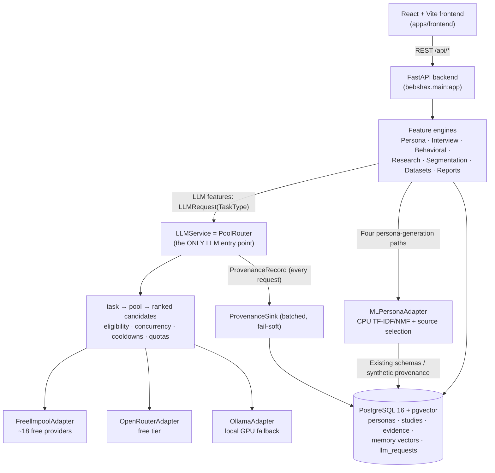

# BebshaX — Complete Project Summary & Showcase Guide

> **Purpose of this document:** a single, self-contained reference for presenting BebshaX at a project showcase — first in plain language (what it is, what a user does, every feature), then in full technical depth (how every subsystem works and why it was designed that way), and finally a Q&A preparation section covering the questions judges are most likely to ask.
>
> Baseline overview: 2026-08-30. Persona ML, runtime/setup, and verification notes were synced on 2026-09-09; this is not a blanket re-verification of every subsystem. The original 15 phase completion dates are unchanged.
>
> **How to read it:** every technical section also has an **"In plain words"** box — a version you can say out loud to a non-technical judge.

---

## The 60-second version (memorize this)

- **What we built (lead with this):** governed free-tier LLM routing for research conversations, plus a separate trained CPU persona selector. Historical unstored failover observations motivated the [cross-route evaluation](scripts/run_cross_route_eval.py); they do not prove paid-API reliability or population validity.
- **What it powers:** describe a business, select a panel of complete synthetic source profiles, interview them, run simulated tests, and assemble a research report. Persona selection makes no LLM call; conversation and report writing still use the router.
- **Why it's hard:** free LLM capacity has latency and availability limits. The router retries infrastructure failures and can use local Ollama without silently truncating identity, memory, or evidence.
- **Why provenance matters:** ML claims are always `SYNTHETIC`, with source/model metadata and no observed-evidence citations. The existing research pipeline retains its separate observed/inferred/synthetic distinction.
- **What it's for:** rehearsing research questions, not validating demand. The USA-only synthetic source does not establish student, Bangladesh, or real-customer fit, and the selected NMF blend loses to lexical TF-IDF on held-out retrieval.

---

# PART 1 — THE PRODUCT (Non-Technical)

## 1.1 One-sentence pitch

**BebshaX is a synthetic research-rehearsal platform: a trained CPU model selects source personas for a business context, then governed free-tier LLMs support interviews, behavioral simulations, and reports. These are synthetic hypotheses, not measured customers or a substitute for real user research.**

## 1.2 The problem

Real user research is the single most skipped step in building a product, because it is:

- **Slow** — recruiting 20 interview participants takes weeks.
- **Expensive** — agencies charge thousands of dollars per study.
- **Inaccessible** — a student founder in Dhaka cannot afford either.

At the same time, "just ask ChatGPT" produces sycophantic, generic answers with no grounding in real data — and no way to know which claims are real and which are invented.

## 1.3 The solution

BebshaX simulates the entire research pipeline:

1. You describe your business idea in a chat.
2. The system researches the market, finds and imports relevant datasets, and segments the population.
3. It selects a panel of **synthetic source personas**. Source age, occupation, location, and narratives are retained; a Dhaka student prompt does not relocate a USA profile, establish student status, or invent a monthly budget.
4. You (or the system) **interview** those personas. They answer in character, remember previous answers, stay consistent, push back on pricing, and refuse things a real customer would refuse.
5. You run **behavioral tests** (pricing tests, feature choices, message A/B tests) against the whole panel.
6. The system synthesizes everything into a **comprehensive validation report**.

**The honesty principle that runs through everything:** generated ML profile claims are `SYNTHETIC`, with empty evidence IDs and zero observed grounding. The wider evidence system also supports `OBSERVED` (verifiably cited) and `INFERRED` claims, but training membership and retrieval scores never promote a source profile to customer evidence. Interview statements remain simulation output.

## 1.4 The research question behind the project

> _Can intelligent multi-model routing aggregate free LLM capacity while preserving synthetic persona quality and user experience?_

The project has essentially **zero API budget**. LLM work uses legitimately accessed free tiers and local Ollama through the existing routing layer. Persona selection instead uses locally fitted TF-IDF/NMF representations and diversity-aware sampling on CPU. It needs no provider, key, or GPU and never falls back to LLM persona writing. Routing reliability and persona usefulness require separate evaluation.

## 1.5 Who the users are (roles)

| Role                                       | What they can do                                                                                                                                                                                                                                                                                                                                               |
| ------------------------------------------ | -------------------------------------------------------------------------------------------------------------------------------------------------------------------------------------------------------------------------------------------------------------------------------------------------------------------------------------------------------------- |
| **Registered user** (founder / researcher) | Everything: create studies, run research, generate personas, interview, test, get reports. Each user sees only their own studies.                                                                                                                                                                                                                              |
| **Anonymous / demo visitor**               | Can explore shared demo content (studies flagged `is_demo` and rows in the shared public pool). Cannot see any registered user's private work.                                                                                                                                                                                                                 |
| **Admin**                                  | **There is deliberately no admin role.** BebshaX is a single-tier research tool; there is no moderation surface, no user management UI, and no privileged API tier. The closest thing is a developer-facing "Model Router" dashboard (visible to any logged-in user) that shows the health of the AI routing engine — it is observability, not administration. |

Data isolation ("tenancy") is enforced per user: every stored row is stamped with an `owner_id`, and three special owner IDs (`usr_system_holder`, `usr_default`, `anonymous`) form a shared public pool for demo content ([apps/backend/bebshax/tenancy.py](apps/backend/bebshax/tenancy.py)).

## 1.6 The end-to-end user workflow

### Signing in

- **Email + password** signup with real email verification (a 6-digit OTP is sent via the Resend email service). In production, unverified accounts cannot sign in.
- **Google sign-in** via Neon Auth (a managed identity provider): the backend verifies the identity token server-side and mirrors the user locally — the client can never forge an identity.
- Sessions are JSON Web Tokens with a configurable expiry, one day by default, and a refresh endpoint.

### The 5-step Study Workflow (the heart of the product)

A user clicks **"New Study"**, types their idea (e.g., _"An AI meal-planning app for university students in Dhaka at ৳250/month"_), and enters a guided 5-step wizard ([StudyWorkflowView.tsx](apps/frontend/src/components/dashboard/views/StudyWorkflowView.tsx)):

| Step  | Name           | What happens                                                                                                                                                                                                                                                                                                                                                                                                                                |
| ----- | -------------- | ------------------------------------------------------------------------------------------------------------------------------------------------------------------------------------------------------------------------------------------------------------------------------------------------------------------------------------------------------------------------------------------------------------------------------------------- |
| **1** | **Context**    | A conversational **Study Design Copilot** interviews _you_ about your idea (2–3 turns: target market, key assumption, main risk). It then synthesizes a **Research Goal card** (summary, target audience, core hypothesis) for your approval, and suggests 4–8 **persona roles** relevant to your business (e.g., "HALL RESIDENT STUDENT", "BUDGET-CONSCIOUS PARENT") with adjustable headcounts.                                           |
| **2** | **Personas**   | The shared local ML adapter selects coherent source profiles for role slots. Source demographics, narratives, goals, pain points, and behaviors retain `SYNTHETIC` provenance; income/budget stays unknown and OCEAN/personality is unset. Roles/location are soft retrieval hints, not membership guarantees; explicit age bounds are hard. Unavailable models fail with 503, unsupported/exhausted selection with 422; the multi-role response may include `failed_roles`. |
| **3** | **Script**     | An interview script (question list) is generated from the study goal — editable by the user.                                                                                                                                                                                                                                                                                                                                                |
| **4** | **Interviews** | Interviews run against the personas — either **live one-on-one chat** (you type questions, the persona answers in character, streamed token-by-token) or a **batch run** across the whole panel (fire-and-forget job with progress polling). Personas remember earlier turns, keep numeric claims consistent (a persona who said lunch costs ৳120/day will not later claim a ৳500/month food budget), and are deliberately non-sycophantic. |
| **5** | **Report**     | Everything — evidence, dataset signals, segments, personas, interview transcripts, extracted insights, behavioral results — is synthesized into a versioned, multi-section **validation report**: executive summary, key findings, pain points, pricing signals, risks, opportunities, recommendations, limitations.                                                                                                                        |

### Supporting features (accessible from the sidebar / per study)

- **Dashboard** — all your studies, their status, and recent activity.
- **Persona Library** — every persona across studies; save reusable **audiences** (named panels of personas) for future studies.
- **Interviews hub** — all interviews across a study with metrics (turn counts, decision states, insight counts) and per-interview **structured insights** (categorized findings linked to the exact turn number they came from).
- **Behavioral Testing** — define tests (pricing test, feature-choice test, message test, offer test), run them across the panel, view aggregate distributions, per-segment differences, auto-extracted risks and opportunities, and retry failures. Compare tests side-by-side.
- **Evidence Laboratory** — the autonomous research engine's output: the structured research plan, collected evidence sources, extracted claims with a green/amber/red status (supported / inference / unsupported), and a semantic search box over all evidence.
- **Datasets** — attach real datasets (CSV/JSON/XLSX upload or URL), which are parsed, profiled (schema, statistics), and segmented; the research engine can also **discover and auto-import public datasets** relevant to your idea from Kaggle, World Bank Open Data, and Bangladesh Bureau of Statistics catalogs.
- **Segmentation** — cluster attached data into named **market segments** that supply research/interview context and generation hints, not proof that an ML source persona belongs to that population.
- **Model Router** (developer view) — live health of the AI layer: which providers are up, per-pool concurrency, today's quota consumption per provider, cooldowns, and the full provenance log of every AI request.

### Demo mode

For offline demos, a flag (`BEBSHAX_DEMO_MODE`) seeds a complete sample study. Anything served from fixtures is honestly labeled **CACHED** in the UI — pre-seeded content is never passed off as live AI output. This "live vs cached" flag is stored on each row at creation time, so the truth survives even if the flag flips later.

## 1.7 What makes it different (the four honest promises)

1. **Quality is never silently degraded.** If no available model can handle the full persona context, the request _fails loudly_ rather than secretly truncating the persona's memory or identity.
2. **Every LLM answer is traceable.** LLM requests record attempted/serving providers, failures, latency, and tokens. ML selections carry source/revision/record/model metadata instead of provider provenance.
3. **Every persona claim is labeled.** ML claims are always `SYNTHETIC`. Citation checks remain for the wider evidence pipeline; no generated profile gains observed status just by appearing in training data.
4. **Free-tier use is legitimate.** No fake accounts, no rate-limit evasion. The system _drains all free quotas evenly_ and backs off (cooldowns) exactly as providers signal.

---

## 1.8 Sustainable Development Goals (SDG) alignment

BebshaX advances four SDGs — each mapped to a shipped capability, not an aspiration:

| SDG                                               | Target                                                            | How BebshaX contributes (with evidence in this repo)                                                                                                                                                                                                                                                                                                                   |
| ------------------------------------------------- | ----------------------------------------------------------------- | ---------------------------------------------------------------------------------------------------------------------------------------------------------------------------------------------------------------------------------------------------------------------------------------------------------------------------------------------------------------------- |
| **SDG 8 — Decent Work & Economic Growth**         | 8.3: support entrepreneurship and the growth of micro-enterprises | Removes the two barriers that make early-stage founders skip user research entirely — weeks of recruiting and thousands of dollars in agency fees (§1.2). A student founder runs a full research cycle (evidence → personas → interviews → behavioral tests → report) in one afternoon at $0, so ideas get tested _before_ savings are spent building the wrong thing. |
| **SDG 9 — Industry, Innovation & Infrastructure** | 9.b: support domestic technology development and innovation       | The core contribution is _infrastructure_: a routing layer that aggregates ~20 free LLM endpoints plus a local GPU model into one reliable substrate (§2.3), built and documented so any zero-budget team can replicate the approach. Research is grounded in public open data (Bangladesh Bureau of Statistics, World Bank Open Data catalogs — §2.7.1).              |
| **SDG 10 — Reduced Inequalities**                 | 10.2: promote economic inclusion irrespective of economic status  | Zero-budget access is a design goal (§1.4). Local-market research context remains available, but USA-synthetic personas have no validated Bangladesh fit or learned purchasing power. Equal research outcomes have not been measured. |
| **SDG 4 — Quality Education** (co-benefit)        | 4.4: increase skills for employment and entrepreneurship          | The provenance-labeled workflow _teaches_ evidence-based validation: users see which claims are observed, inferred, or synthetic, and every report ends with a limitations section and a push toward real-customer validation — research literacy by construction. Claimed as a co-benefit, not a design goal.                                                         |

**Honesty note (say it before judges ask):** measured impact is prospective — the platform is pre-pilot. What is _not_ prospective is the access barrier it removes, which is priced and documented, and the anti-fabrication layer, which is enforced in code (§3.2).
**Compute-footprint note:** R9 forbids LLM fine-tuning, not the owner-approved synthetic-only non-LLM training exception of 2026-09-08. The four TF-IDF/NMF fits used two CPU threads and took 43.70 s total; the GPU was unused. LLM conversations reuse free-tier capacity or local Ollama. No energy or carbon reduction was measured.

## 1.9 Why this is a Complex Engineering Problem (CEP)

Mapped against the Washington Accord complex-problem attributes (WP1–WP7):

| Attribute                                        | How BebshaX satisfies it                                                                                                                                                                                                                                                                                                                                                                                                                                                                                                                                                                                                                                                                       |
| ------------------------------------------------ | ---------------------------------------------------------------------------------------------------------------------------------------------------------------------------------------------------------------------------------------------------------------------------------------------------------------------------------------------------------------------------------------------------------------------------------------------------------------------------------------------------------------------------------------------------------------------------------------------------------------------------------------------------------------------------------------------- |
| **WP1 — Depth of knowledge required**            | Spans distributed-systems engineering (routing, failover, per-pool concurrency, circuit cooldowns), applied NLP (persona generation, retrieval, pgvector/HNSW memory scored by relevance+recency+importance), and evaluation methodology (GSM8K/MMLU micro-slices, LLM-judge gates, and — since 2026-09-06 — a cross-route persona-consistency evaluation; the RouterArena/xRouteBench offline replay was found unusable due to a column mismatch and is no longer cited) — §2.3, §2.5, §2.15.                                                                                                                                                                                                 |
| **WP2 — Wide-ranging conflicting requirements**  | Zero budget vs. "quality is never silently degraded" (R2); persona fidelity demands full untruncated context vs. small free-tier context windows; legitimate quota use (R5) vs. throughput targets; reliable demos vs. honesty (demo content carries a stored `CACHED` label). Every conflict is resolved by explicit written policy, not ad-hoc code.                                                                                                                                                                                                                                                                                                                                         |
| **WP3 — No obvious solution; depth of analysis** | Decisions were made by recorded experiments, not intuition: the local 3B model won the conversation-pool slot via a quality gate (three runs — 9.65 / 9.05 / 9.2 vs cloud-fast 8.25 / 8.05 / 8.2; n = 1 persona × 5 questions; the judge model overlapped with the cloud arm in runs 1–2; artifacts [data/metadata/local*3b_gate*\*.json](data/metadata/local_3b_gate_20260826_235633.json), table in docs/ROUTING.md); the capacity study fixed the ~100 personas/day target (planned, not yet measured — `scripts/measure_capacity.py` exists, no stored artifact); and the non-obvious ruling that _low answer quality is not an infrastructure failure_ shapes the whole failure taxonomy. |
| **WP4 — Infrequently encountered issues**        | Mid-conversation cross-provider failover with persona identity intact (observed live across 4 providers in an unstored smoke run; formal cross-route consistency evaluation added 2026-09-06 — `scripts/run_cross_route_eval.py`); free embedding APIs silently swapping models and corrupting a vector space (solved with `embedding_space` tagging — §3.4.2). Neither has established prior art to copy.                                                                                                                                                                                                                                                                                     |
| **WP5 — Beyond standards and codes**             | No standard exists for provenance-labeled synthetic research, so the team authored its own binding normative code: RULES.md R1–R12, a closed failure taxonomy (R6), and a test-enforced adapter boundary (R1) — the rules are enforced by the test suite, not by convention.                                                                                                                                                                                                                                                                                                                                                                                                                   |
| **WP6 — Diverse stakeholder involvement**        | Founders needing trustworthy output; LLM providers whose terms must be respected (R5: no account multiplication, no limit evasion); open-data publishers with licenses to honor (R9); the real populations whose statistics ground personas; and downstream customers affected by decisions made on synthetic evidence — with directly conflicting needs (provider limits vs. user throughput).                                                                                                                                                                                                                                                                                                |
| **WP7 — High-level interdependence**             | Fifteen phased subsystems where provenance depends on router attempts, grounding scores on citation verification, interviews on memory + eligibility + context budgeting: a change in any layer propagates through the stack (PROJECT_CONTEXT.md roadmap; §2.2 architecture).                                                                                                                                                                                                                                                                                                                                                                                                                  |

---

# PART 2 — THE TECHNOLOGY (Technical Deep Dive)

## 2.1 Stack at a glance

| Layer               | Technology                                                                                                                                      | Where                                                                        |
| ------------------- | ----------------------------------------------------------------------------------------------------------------------------------------------- | ---------------------------------------------------------------------------- |
| Frontend            | **React 18 + TypeScript + Vite**, Tailwind-assisted CSS with a custom design-token theme system (dark/light), GSAP for motion, Vitest for tests | [apps/frontend](apps/frontend/package.json)                                  |
| Backend             | **Python 3.12 + FastAPI (fully async)**, Pydantic v2, SQLAlchemy 2 async ORM, Alembic migrations                                                | [apps/backend](apps/backend/pyproject.toml)                                  |
| LLM engine          | **freellmpool** (MIT, ~18 free providers) + **OpenRouter** free tier + **Ollama** local — all behind a custom policy layer                      | [apps/backend/bebshax/llm](apps/backend/bebshax/llm/service.py)              |
| Persona selection   | CPU-only fitted TF-IDF/NMF with diversity-aware source-prototype selection; no LLM or GPU | [ml_persona/README.md](ml_persona/README.md) |
| Database            | **PostgreSQL 16 + pgvector** (Docker, port 5433) — SQLite in unit tests                                                                         | [docker-compose.yml](docker-compose.yml)                                     |
| Auth                | JWT (HS256, one-day default), Resend for verification email, Neon Auth for federated identity | [apps/backend/bebshax/auth](apps/backend/bebshax/api/auth.py) |
| Rate limiting       | slowapi (per-endpoint limits)                                                                                                                   | [apps/backend/bebshax/api/limiter.py](apps/backend/bebshax/api/limiter.py)   |
| Payments (scaffold) | Stripe checkout/portal/webhook endpoints                                                                                                        | [apps/backend/bebshax/api/payments.py](apps/backend/bebshax/api/payments.py) |

**Verification scope:** 15 delivered implementation phases plus ML maintenance, not phase 16. Current recorded pre-sync suite counts and their limits are in §2.15; the old module/test inventory is not a current measurement.

## 2.2 Architecture overview



> **In plain words:** the website talks to one Python server. Persona selection runs on a separate trained CPU model, then saves profiles in the existing database. Whenever a feature needs an LLM, it goes through `LLMService` for routing and provenance. The selector does not replace the copilot, interviews, or memory.

Three hard boundaries make this architecture defensible:

1. **R1 — adapter boundary:** provider SDKs may be imported _only_ inside `bebshax/llm/adapters/`. A test walks the whole codebase and fails if any other module mentions a provider SDK. Swapping or adding a provider can never leak into business logic.
2. **R3 — single entry point:** every LLM call in the entire application goes through `LLMService.complete(LLMRequest)` with an explicit `TaskType`. There are no ad-hoc `openai.chat(...)` calls anywhere.
3. **R2 — no silent degradation:** nothing between the persona engine and the model is allowed to truncate context to "make it fit". The only legal outcome for an oversized request is the explicit `ContextWindowExceeded` error.

## 2.3 The LLM policy layer (the routing engine)

This is the core intellectual contribution. Files: [types.py](apps/backend/bebshax/llm/types.py), [pools.py](apps/backend/bebshax/llm/pools.py), [router.py](apps/backend/bebshax/llm/router.py), [service.py](apps/backend/bebshax/llm/service.py), [failures.py](apps/backend/bebshax/llm/failures.py), [estimator.py](apps/backend/bebshax/llm/estimator.py), [quota.py](apps/backend/bebshax/llm/quota.py), [provenance.py](apps/backend/bebshax/llm/provenance.py).

> **In plain words:** each LLM request declares its work, such as answering an interview question or writing a report. The router picks an eligible pool, skips routes that cannot serve it, tries the remaining candidates, and records the attempts. Persona selection does not enter this routing path.

### 2.3.1 Task types (18, fixed)

The application always _knows_ what it is doing, so callers declare one of 18 enum task types (`PERSONA_GENERATION`, `PERSONA_INTERVIEW`, `EVIDENCE_EXTRACTION`, `MEMORY_SUMMARIZATION`, `CRITIC`, `REPORT_GENERATION`, `STRUCTURED_OUTPUT`, `BEHAVIORAL_SIMULATION`, `EMERGENCY_FALLBACK`, …). **No LLM is ever used to classify requests** — classification is free, deterministic, and testable because the caller states its intent.

Legacy persona-generation/refinement task enums and pool mappings remain for compatibility; the four production persona-writing paths now use ML instead.

### 2.3.2 Pools — configuration as data

Seven pools, each an ordered list of adapters plus a concurrency cap — pure data, no code branches:

| Pool           | Adapter order                                       | Max concurrency | Serves                                                                                             |
| -------------- | --------------------------------------------------- | --------------- | -------------------------------------------------------------------------------------------------- |
| `reasoning`    | openrouter → freellmpool → ollama                   | 2               | critic, contradiction check, narratives, behavioral sims; legacy persona task mappings |
| `conversation` | **ollama → freellmpool → openrouter** (local-FIRST) | 5               | interview turns, persona responses                                                                 |
| `long_context` | openrouter → freellmpool → ollama                   | 2               | report generation                                                                                  |
| `structured`   | openrouter → freellmpool → ollama                   | 3               | JSON extraction, tool calling, structured output                                                   |
| `fast`         | ollama → freellmpool → openrouter                   | 5               | memory retrieval/summarization                                                                     |
| `local`        | ollama                                              | 2               | forced-local work                                                                                  |
| `emergency`    | **ollama → freellmpool** (local-first)              | 2               | `EMERGENCY_FALLBACK`                                                                               |

The historical conversation-pool gate scored llama3.2:3b at 9.65 / 9.05 / 9.2 versus cloud-fast 8.25 / 8.05 / 8.2, with ~5–7 s/turn locally versus ~53 s / 2.5 s / 56 s on free tiers. Each run used one persona and five questions; the judge overlapped with the cloud arm in runs 1–2. See the [recorded artifact](data/metadata/local_3b_gate_20260826_235633.json) and [routing table](docs/ROUTING.md). This is a small historical LLM gate, not an ML-generation benchmark.

A dictionary `TASK_POOL_MAP` assigns each of the 18 task types to a pool, and a test enforces total coverage — adding a task type without a pool mapping fails CI.

### 2.3.3 The request lifecycle inside `PoolRouter.complete()`

```
LLMRequest(task, messages, json_mode, tools_required, max_output_tokens, preferred_provider/model)
  1. task → pool (data lookup)
  2. acquire pool semaphore (per-pool concurrency cap)
  3. collect RouteCandidates from each adapter in pool order
  4. rank: quota-aware ranker (drain all free quotas evenly, stable sort)
  5. preference: user-preferred provider/model is stable-partitioned to the FRONT
     (advisory, never exclusive — unavailable preference degrades to Auto)
  6. eligibility filter (pre-flight, per candidate):
       - cooldown active?            → skip, recorded in routing_path
       - json_mode unsupported?      → skip
       - tools unsupported?          → skip
       - context_window < estimate?  → skip
       ⇒ if ONLY context exclusions emptied the list → raise ContextWindowExceeded
       ⇒ if nothing eligible at all → raise AllCandidatesFailed
  7. attempt loop over eligible candidates:
       adapter.complete() → success ⇒ record concrete serving provider/model, return
       AttemptFailed(kind) ⇒ consult FAILURE_POLICIES[kind]:
           retry_same_once?     (e.g. CONNECTION, MALFORMED_RESPONSE)
           try_next_candidate?  (almost all kinds)
           cooldown_route?      (RATE_LIMITED, QUOTA_EXHAUSTED, SERVER_ERROR, …)
  8. every path — success or failure — emits a complete ProvenanceRecord
```

**Pre-flight token estimation** ([estimator.py](apps/backend/bebshax/llm/estimator.py)) is deterministic: `chars/3.5 + 4 tokens per message + expected output`. Slight _over_-estimation is chosen deliberately — its only side effect is steering to roomier models; it can never cause truncation.

### 2.3.4 The failure taxonomy (closed, 13 kinds)

`TIMEOUT, CONNECTION, RATE_LIMITED, QUOTA_EXHAUSTED, SERVER_ERROR, PROVIDER_UNAVAILABLE, AUTH_INVALID, MODEL_UNAVAILABLE, CONTEXT_WINDOW_EXCEEDED, CAPABILITY_UNSUPPORTED, MALFORMED_RESPONSE, CONTENT_REFUSAL, INTERNAL_ERROR` — each mapped to a 3-flag policy (`retry_same_once / try_next_candidate / cooldown_route`).

Two deliberate exclusions define the design:

- **"Low answer quality" is NOT a failure kind** — and a test enforces that it never becomes one. A boring persona answer must never trigger silent infrastructure fallback; quality belongs to the evaluation layer.
- **`INTERNAL_ERROR` never advances the fallback chain** — a bug in our own layer must surface, not burn through provider candidates.

### 2.3.5 Streaming with a commitment rule

`PoolRouter.stream()` yields incremental `StreamDelta` chunks, then a final `LLMResult` with full provenance. Failover only happens **before the first delta**. Once a route has produced visible text, the stream is _committed_ — a mid-answer provider swap would splice two different personas' voices, so the failure surfaces instead. Adapters without native streaming fall back to one-shot delivery through the same interface.

### 2.3.6 Capacity management (the $0 budget machinery)

- **QuotaLedger** ([quota.py](apps/backend/bebshax/llm/quota.py)) — a data table of published free-tier caps per provider (e.g., OpenRouter: 50 requests/day) plus in-memory per-UTC-day counters fed by provenance records, **seeded at startup from the `llm_requests` table** so restarts don't forget today's consumption.
- **Quota-aware ranker** — sorts candidates by `remaining_fraction` (stable sort, pool order as tiebreak): drain all quotas evenly, never hammer a capped provider while others sit idle.
- **Persistent cooldowns** — 60s in-memory cooldowns per (provider, model) on rate-limit/server errors, mirrored to `model_registry.cooldown_until` so they survive restarts.
- **Latency seeding** — freellmpool's "fast" routing ranks by smoothed latency but forgets on restart; measured per-route latencies are replayed from `llm_requests` at boot so the first request already routes on evidence.
- **`GET /api/routing/capacity`** exposes the whole ledger for the dashboard.

All of this is **fail-soft**: capacity features must never take the request path down.

### 2.3.7 Provenance (the audit trail)

Every LLM request produces a `ProvenanceRecord`: request id, task, pool, persona/conversation ids, the ordered `routing_path` (every candidate considered, with skip reasons), every `AttemptRecord` (provider, model, latency, failure kind/detail, fallback reason), the concrete serving provider/model, token counts, total latency, success flag. A batched, fail-soft `ProvenanceSink` persists these to the `llm_requests` table — DB trouble never fails an LLM call. `GET /api/provenance` serves the log to the Model Router view. ML source/model metadata is stored with the persona, not invented as an LLM request.

### 2.3.8 Adapters

- **FreellmpoolAdapter** — wraps the MIT-licensed `freellmpool` AsyncPool (~18 free providers, keyless start, internal circuit breakers). Crucially, it resolves virtual routes: when freellmpool serves "auto" via, say, `llm7/codestral-latest`, the adapter reports the _concrete_ provider/model so provenance stays truthful, and internal failover attempts land in `notes`.
- **OpenRouterAdapter** — direct OpenRouter free tier (50 req/day), used as a first preference for reasoning/structured work.
- **OllamaAdapter** — talks to local Ollama via the **native** `/api/chat` endpoint (not the OpenAI-compat shim) because only the native API can pin `num_ctx` — the compat path _silently truncates_ context, which would violate the no-silent-degradation rule. Discovers installed models from `/api/tags`, orders candidates smallest-first, caps context at 16k. Chosen models for the 4 GB-VRAM dev GPU: llama3.2:3b (primary), qwen3:4b (secondary), benchmarked in [data/metadata/ollama_benchmark.json](data/metadata/ollama_benchmark.json).
- **FakeAdapter** — deterministic test double used for all chaos/failover tests; real providers are never called in CI.
- **Embeddings** — default is a deterministic 384-dim `HashEmbedding` (offline, free, stable); an optional freellmpool embedding backend requires a _pinned_ model. Every stored vector is tagged with its `embedding_space`, and retrieval filters to the query's space — vectors from different models are never compared (they would be geometrically meaningless).

## 2.4 The persona engine

> **In plain words:** training learns a vocabulary, word weights, and topics from approved synthetic profiles. At runtime the model matches business context and selects complete source profiles with a diversity penalty. It does not write a new identity or ask an LLM to fill gaps. Every profile remains synthetic, including its retained source narratives.

All four production generation paths share [MLPersonaAdapter](apps/backend/bebshax/personas/ml_adapter.py). Existing schemas/storage and downstream LLM interviews remain in place.

### 2.4.1 Business-persona pipeline ([persona/generation.py](apps/backend/bebshax/persona/generation.py))

1. Build strict business context and request a batch from the locally loaded model.
2. Apply hard inclusive ages within 18–95, vocabulary overlap, and distinct eligible source selection; role/location are soft hints.
3. Convert whole selections into the existing `GeneratedPersona` / `PersonaProfile` contracts. Keep source occupation/location/documents, label goals/pain points/behaviors `SYNTHETIC`, and leave evidence IDs empty.
4. Persist `bebshax-persona-ml/<model_version>` plus source/revision/record ID, selection metadata, and warnings in existing fields. Unknown income/budget is not inferred; personality is unset.
5. Return 503 `ml_persona_unavailable` for invalid/missing bundles or 422 `ml_persona_unsupported_context` for unsupported/exhausted selections. There is no refinement, template, or LLM-generation fallback.

### 2.4.2 Study-persona pipeline ([personas/generator.py](apps/backend/bebshax/personas/generator.py), [personas/validator.py](apps/backend/bebshax/personas/validator.py))

Study sync, async jobs, and regeneration use the same selector and `GeneratedPersonaDraft` conversion. Dataset generation also uses this boundary: supplied dataset/segment context influences retrieval, but uploads and private studies do not enter training or establish observed profile claims.

- Existing 202 + polling and run-audit contracts remain. Structural validation does not prove customer relevance.
- Observed grounding and confidence are zero for these synthetic profiles; selection scores are retrieval similarity, not confidence or purchase probability.
- Sequential requests exclude active source IDs/names in their owner scope. There is no transactional identity lock across overlapping requests.
- A model call returns a complete supported batch or fails. Existing multi-role workflow responses may retain successful roles alongside `failed_roles`.
- The bundle is lazy-loaded and cached from the processed-data root, with `BEBSHAX_ML_PERSONA_ARTIFACT_DIR` override. Restart after replacing a trusted validated bundle; fresh checkouts do not include weights.

### 2.4.3 The Study Design Copilot ([api/copilot.py](apps/backend/bebshax/api/copilot.py))

Step 1 of the workflow is its own small engine:

- A system prompt scripts a **3-turn consultation** (acknowledge the idea → one sharp clarifying question → one follow-up → synthesize), and forces the model to answer in strict JSON: a conversational `reply`, plus — when ready — a `research_goal_card` (summary, target audience, core hypothesis) and 4–8 `suggested_roles` with counts.
- **Explicit LLM failures** — the copilot uses the existing governed JSON-completion path; an unparseable reply raises `copilot_reply_unparseable`. `fallback_reason = "retried_after_unparseable_reply"` means a real model reply needed a retry, not that canned dialog was substituted.
- Approved-role persona generation uses the shared ML adapter. Source occupation/location is retained even when a role label asks for a different population; failures are surfaced, not replaced by skeleton personas. Copilot chat/role suggestions still use the existing LLM path.
- **Study titles are deterministic** ([utils/title_generator.py](apps/backend/bebshax/utils/title_generator.py)): filler prefixes ("I want to build…") are stripped by regex tables and the result is title-cased, with canonical per-study-type fallbacks — no LLM call for a string the user immediately edits anyway.

> **In plain words:** the copilot gathers context through an LLM consultation and reports a coded error when that fails. Once supported context is available, profile selection is a separate local operation; the model is not a backup chatbot.

### 2.4.4 Training and measured limits

The independent `ml_persona` dataset profile uses NVIDIA Nemotron-Personas-USA, CC-BY-4.0, revision `5b4cd35ab46490c1da1bd2b5a2324d6f871be180`. Of 6,000 sampled rows, 4,694 pass schema validation; completeness/deduplication leaves 3,594, split 2,516/539/539 with seed 42. The four-fit grid selected 32 topics and lexical weight 0.7. Held-out MRR is 0.432654 versus lexical TF-IDF 0.751621: the NMF blend is worse on this proxy.

All 160 generation-probe profiles passed structural checks, with intentional 100% source reuse, diversity 0.877963, age JS divergence 0.030183, and 72/160 `not_in_workforce` selections. Warm five-profile p95 is 34.3 ms, not cold-load/API/DB latency. No real business-labelled relevance, population validity, demand, income, or OCEAN accuracy has been established. See [MODEL_CARD.md](ml_persona/MODEL_CARD.md) and [EXPERIMENTS.md](ml_persona/EXPERIMENTS.md).

## 2.5 Memory (pgvector)

> **In plain words:** after each interview exchange, an observation can be saved to memory. Retrieval supplies relevant prior context to later prompts. Remembering a simulated statement does not make it real customer evidence or supply a missing source budget. Cross-conversation retrieval was not exercised in the ML live check.

[memory/service.py](apps/backend/bebshax/memory/service.py) gives each persona an episodic memory stream:

- **Write** (`remember`) — observations from interviews are embedded (384-dim) and stored in `memory_items` with an importance weight.
- **Retrieve** — top-k by a weighted score: **0.60 · cosine relevance + 0.25 · recency (exponential decay, 48h half-life) + 0.15 · importance**. Postgres uses a native pgvector HNSW cosine index; unit tests fall back to Python-side scoring on SQLite.
- **Reflect** — periodically summarizes accumulated observations into higher-level insights (stored at importance 0.8), mimicking the reflection mechanism from the Stanford "Generative Agents" line of work.
- **Space consistency** — every row is tagged with its `embedding_space`; retrieval only ever compares vectors from the same space.

## 2.6 The interview engine

> **In plain words:** every time you ask a persona a question, the system rebuilds its "character sheet" from scratch — identity, the business being researched, its market segment, real evidence facts, and its relevant memories — then attaches the _entire_ conversation so far and asks the AI to answer in character. Nothing is ever secretly cut to make it fit; if it can't fit, you get a clear error. After the answer, cleanup code strips AI formatting junk, checks the numbers don't contradict earlier answers, and writes the exchange into the persona's memory.

[interview/engine.py](apps/backend/bebshax/interview/engine.py) — the most safety-critical composition in the system. Per turn:

1. **Immutable identity card** — the persona's identity/grounding block is rebuilt deterministically each turn and asserted byte-identical across the conversation (a test proves identity cannot drift while the conversation evolves).
2. **Layered system prompt**: identity card + grounded-behavior instructions + business context + study context (goal, audience, pricing hypothesis) + market-segment traits + top-3 evidence citations (trimmed at word boundaries) + interview objective + top-k **retrieved memories** ("stay strictly consistent").
3. **Full history, never truncated** — every prior turn goes into the message chain. If the total exceeds every eligible model's window → explicit `ContextWindowExceeded`. The user is told; the persona is never quietly lobotomized.
4. **Turn generation** — `PERSONA_INTERVIEW` task → conversation pool (local-first). Streaming variant yields deltas over SSE to the UI.
5. **Deterministic post-processing per turn:**
   - **Reply format cleanup** ([interview/normalization.py](apps/backend/bebshax/interview/normalization.py)) — free models drift in _format_: reasoning models leak `<think>…</think>` blocks, some wrap answers in markdown fences, some answer as a script ("Alex: …"). These artifacts are stripped by regex, deterministically. Content is never rewritten (format ≠ quality), and if stripping would empty the reply, the original is kept.
   - **Topic classification** — keyword tables map each exchange onto 9 research topics (pain points, current behavior, alternatives, unmet needs, motivations, pricing/budget, objections, feature reactions, purchase decision) to drive coverage tracking and suggested next questions.
   - **Numeric self-consistency guard** — money amounts are extracted with per-country currency cue tables (৳/tk/BDT for BD, $, £, €, ₹), normalized to monthly rates (daily × 30), and compared against the persona's earlier claims; contradictions are flagged.
   - **Memory write-back** — the exchange is stored as an episodic observation (importance 0.4).
6. **Completion** — `complete()` extracts categorized, turn-linked **structured insights** (`interview_insights` table) and a decision-state evaluation.

Historical unstored smoke observations reported mid-conversation provider failover; they are not a reproducible quality benchmark. The 2026-09-09 ML continuation exercised two real interview turns and four stored 384-dimensional memories through the unchanged LLM engine, not a long-conversation or cross-route consistency trial.

## 2.7 The autonomous research engine

> **In plain words:** when you start a study, a robot researcher goes to work: it writes a research plan for your idea, turns it into search queries, collects sources, cuts them into paragraphs it can search by meaning, hunts public datasets that match your market, imports the good ones, and distills everything into claims — each colored green (proven by a source), amber (reasonable guess), or red (unverified assumption). You watch its progress live, step by step.

[research/service.py](apps/backend/bebshax/research/service.py) orchestrates a 7-step pipeline, with per-step progress persisted so the UI can render a live progress checklist:

```
understanding_idea → building_research_plan → searching_evidence → discovering_datasets
→ evaluating_datasets → importing_datasets → extracting_evidence
```

1. **Research plan** ([planner.py](apps/backend/bebshax/research/planner.py)) — `STRUCTURED_OUTPUT` LLM call produces target market, problem areas, and four question banks (behavioral, economic, competition, market) plus **dataset requirement specs** (category, target variables, geographic/population scope). Deterministic domain templates (SaaS/food/edtech/health/commerce, Bangladesh-first) serve as fallback when no LLM is reachable.
2. **Query generation** — 5–7 high-signal search queries across Problem / Competition / Pricing / Behavior / Complaints.
3. **Source collection** ([search_provider.py](apps/backend/bebshax/research/search_provider.py)) — a `SearchProvider` abstraction with URL canonicalization (tracking-param stripping) and content-hash deduplication. The default provider is a **curated, clearly-labeled illustrative corpus** (`source_type="curated_sample"`, publisher "BebshaX Illustrative Sample") — sample content is never attributed to real publishers. A live search provider can be plugged in behind the same interface.
4. **Chunk + embed** ([chunker.py](apps/backend/bebshax/research/chunker.py)) — HTML-stripped text is split into ~400-char sentence-boundary chunks with 40-char overlap, embedded, and stored in `evidence_chunks` (pgvector).
5. **Dataset discovery** ([datasets/discovery/engine.py](apps/backend/bebshax/datasets/discovery/engine.py)) — a `DatasetSourceAdapter` interface with three concrete catalog adapters — **Kaggle**, **World Bank Open Data**, and **Bangladesh Bureau of Statistics (BBS) open data** — searched against the plan's dataset-requirement specs. A `DatasetEvaluator` scores each candidate's relevance/quality; the best are auto-imported (parse → profile → segment) and every accept/reject decision is recorded as a `dataset_candidates` row.
6. **Claim extraction** ([claim_extractor.py](apps/backend/bebshax/research/claim_extractor.py)) — `EVIDENCE_EXTRACTION` call over the top chunks yields claims classified **supported / inference / unsupported**. Verification mirrors the persona rule: a "supported" claim citing chunk ids the model was not actually shown is **downgraded to inference with an explanatory note**. The deterministic fallback extractor only ever emits hypotheses (max confidence 0.5) — a keyword matcher cannot verify anything, so it never claims "supported".
7. **Semantic search** — `POST /studies/{id}/evidence/search` runs pgvector cosine search over the study's chunks (Python-side fallback for SQLite tests).

### 2.7.1 The dataset toolchain ([bebshax/datasets](apps/backend/bebshax/datasets/service.py))

Every dataset — user-uploaded, URL-fetched, or auto-discovered — passes through the same five tools:

| Tool                                                       | What it does                                                                                                                                                                                                                                                           |
| ---------------------------------------------------------- | ---------------------------------------------------------------------------------------------------------------------------------------------------------------------------------------------------------------------------------------------------------------------- |
| [security.py](apps/backend/bebshax/datasets/security.py)   | Validates URLs before fetching: scheme allowlist, DNS resolution check that **blocks private/loopback/link-local/reserved IPs**, `follow_redirects=False` (a public URL can't 302 into internal address space), and a size cap on downloads. This is the SSRF defense. |
| [parser.py](apps/backend/bebshax/datasets/parser.py)       | Parses CSV / JSON / XLSX / TSV bytes into rows.                                                                                                                                                                                                                        |
| [profiler.py](apps/backend/bebshax/datasets/profiler.py)   | Infers the schema and computes per-column statistics (types, distributions, ranges).                                                                                                                                                                                   |
| [segmenter.py](apps/backend/bebshax/datasets/segmenter.py) | Discovers population segments in the profiled data and computes how many personas each segment deserves (proportional distribution).                                                                                                                                   |
| [validator.py](apps/backend/bebshax/datasets/validator.py) | Checks generated personas against the dataset's real constraints (a persona can't claim a budget outside the observed distribution).                                                                                                                                   |

Dataset rows carry a `content_hash`, so re-fetching unchanged data is detected, and a per-dataset status machine (`idle → fetching → parsing → profiling → analyzing → ready | error`) drives the UI.

> **In plain words:** the dataset pipeline parses and profiles spreadsheets and exposes segments and validation signals. ML generation uses context from that workflow but does not train on uploads or guarantee that a selected USA-synthetic profile represents the uploaded population.

## 2.8 Segmentation engine

> **In plain words:** "segmentation" means finding the natural customer groups hiding in the data — like "hall-resident students on tight budgets" vs "working professionals who order out". The grouping itself is pure math (same input → same clusters every time). The AI is only allowed to do the _writing_ — naming each group and describing it. Math you can rerun; prose you can regenerate; they never contaminate each other.

[segmentation/service.py](apps/backend/bebshax/segmentation/service.py) — four sub-stages, deliberately separating _math_ from _language_:

1. **Pre-check** — is there enough profiled dataset data to segment? (readiness endpoint drives UI gating).
2. **Variable selection** — chooses clustering variables from profiled dataset schemas.
3. **Deterministic clustering** — the actual population clustering is classical, reproducible computation over dataset distributions (no LLM involved in the math).
4. **LLM interpretation** — only the _naming and narrative_ of each cluster ("Hall-resident budget optimizers", characteristics, opportunities) is delegated to the LLM, linked back to evidence claims.

Results persist as `segmentation_runs` + `market_segments`; segments supply generation hints/allocation and interview context, not validated population membership for ML-selected profiles.

## 2.9 Behavioral testing engine

> **In plain words:** behavioral tests ask synthetic personas to make simulated choices and aggregate their answers. The resulting votes and probabilities are not observed demand; the ML profiles have no learned income or budget to validate purchasing power.

[behavioral/engine.py](apps/backend/bebshax/behavioral/engine.py) simulates panel-wide decisions:

- **Test types via simulator classes** (pricing, feature choice, message/copy, offer) — each parses its scenario parameters and builds a type-specific decision directive.
- **Context composition** — simulated decisions reuse available identity, segment, interview, and study-evidence context. Legacy commercial fields may exist, but ML generation does not fill missing budgets or purchasing attributes.
- **Prompt-injection defense** — the user's scenario text is wrapped in an explicit _untrusted input_ block with delimiter escaping; scenario content cannot rewrite the persona's instructions.
- **Structured output** — decision, probability, confidence, decision factors, motivators, objections, rationale — schema-validated per persona.
- **Real aggregation** — response distributions, per-segment differences, and auto-extracted insights (risks/opportunities) are computed in Python from the actual results, not asked from an LLM.
- **Partial-failure resilience** — one persona's failed simulation never kills the run; failed items are retryable (`/retry-failed`).

## 2.10 Report generation

[research/report_service.py](apps/backend/bebshax/research/report_service.py) gathers _everything_ stored for a study (evidence sources/claims, datasets, segments, personas, conversations, interview insights, behavioral tests/runs/results), then issues one `REPORT_GENERATION` call (long-context pool) with strict rules: _use only the provided data, never invent, label simulation signals vs empirical evidence_. Reports are **versioned** (`study_reports.version` auto-increments) and include an honest `limitations` section. Metrics like confidence/demand scores are `None` unless actually computed from study data — the earlier "85% demand index" style of hardcoded theater was audited out.

> **In plain words:** the final report is written like a strict term paper: the writer may only use the material in the folder we hand it — this study's evidence, this panel's interviews, these test results. Anything it can't back up must go in the "limitations" section. And every regeneration is saved as version 1, 2, 3… so you can compare how conclusions changed as more research came in.

## 2.11 Data model (30+ tables, single SQLAlchemy `Base`)

> **In plain words:** one PostgreSQL database holds everything, organized by feature: who you are, your studies, the personas, every interview turn, every piece of evidence, every AI request ever made. Tables are owned by the feature that uses them, and the database structure only ever changes through numbered migration scripts — never by hand.

| Domain       | Tables                                                                                                                                                                                                                                             |
| ------------ | -------------------------------------------------------------------------------------------------------------------------------------------------------------------------------------------------------------------------------------------------- |
| LLM infra    | `llm_requests` (provenance; JSONB attempts; no FK on persona_id so failed generations stay loggable), `model_registry` (capabilities + `cooldown_until`)                                                                                           |
| Identity     | `users`, `email_verification_tokens`                                                                                                                                                                                                               |
| Studies      | `studies` (workflow state: step, status, roles, script, copilot transcript, personas payload, findings), `saved_audiences`, `study_reports` (versioned)                                                                                            |
| Personas     | `personas` (demographics, Big Five, claim groups, commercial/tech profiles, evidence citations, grounding_score, confidence, `data_source` live/cached), plus additive detail tables `persona_details` / `persona_attributes` / `persona_evidence` |
| Research     | `research_runs`, `research_plans`, `evidence_sources`, `evidence_chunks` (Vector(384) + embedding_space), `evidence_claims`, `dataset_candidates`                                                                                                  |
| Datasets     | `dataset_sources` (schema/statistics/segments JSONB, content_hash), `dataset_persona_runs` (audit)                                                                                                                                                 |
| Segmentation | `segmentation_runs`, `market_segments`                                                                                                                                                                                                             |
| Interviews   | `conversations`, `conversation_turns`, `interview_insights`                                                                                                                                                                                        |
| Behavioral   | `behavioral_tests`, `behavioral_test_scenarios`, `behavioral_test_runs`, `behavioral_test_results`, `behavioral_insights`                                                                                                                          |
| Memory       | `memory_items` (Vector(384), HNSW cosine index)                                                                                                                                                                                                    |

ML generation reuses existing JSON/nullable fields for source/model provenance; no new migration or schema was introduced. Optional Big Five and commercial fields in legacy schemas are not evidence that the selector learns or populates them.

Conventions that matter: a naming convention on `Base` (deterministic index/constraint names — required for reversible Alembic migrations), `native_enum=False` (VARCHAR + CHECK so enum growth never needs `ALTER TYPE`), timezone-aware timestamps with Python-side defaults (SQLite/Postgres parity in tests), JSON columns with JSONB variant on Postgres. Schema evolution is Alembic-only; startup only auto-creates schema on a **completely empty** database and otherwise **fail-fast refuses to serve if the DB is not at migration head** (one clear error instead of cryptic 500s).

## 2.12 API surface (~117 endpoints, all under `/api`)

| Area              | Representative endpoints                                                                                                                                                                                                         |
| ----------------- | -------------------------------------------------------------------------------------------------------------------------------------------------------------------------------------------------------------------------------- |
| Health            | `GET /api/health`                                                                                                                                                                                                                |
| Auth              | `POST /auth/signup · /verify-email · /resend-verification · /signin · /sync (Neon) · /refresh`, `GET /auth/me · /users`                                                                                                          |
| Studies           | CRUD `GET/POST/PATCH/DELETE /studies…`, `POST /studies/{id}/script/generate`, `POST /studies/{id}/research/run`                                                                                                                  |
| Copilot           | `POST /study/copilot`, `POST /study/suggest-roles`, `POST /study/generate-personas`                                                                                                                                              |
| Personas          | `GET/POST /studies/{id}/personas…`, async job pair `POST …/generate/jobs` + `GET …/jobs/{job_id}`, `POST …/{persona_id}/regenerate`, run audit endpoints; legacy `POST /businesses/{id}/personas`, `GET /personas/{id}/memories` |
| Interviews        | `POST /studies/{id}/personas/{pid}/interviews`, `POST …/interviews/{iid}/messages` (+ `/stream` SSE), `POST …/complete`, `GET …/insights`, batch `POST …/interviews/batch-run` (202) + poll                                      |
| Research/Evidence | `POST/GET /studies/{id}/research…`, `GET …/evidence/summary · /sources · /claims`, `POST …/evidence/search`                                                                                                                      |
| Datasets          | global + per-study `POST …/datasets/url · /upload`, `GET …/preview`, `POST …/refresh · /query · /generate-personas`, candidate `import`/`reject`                                                                                 |
| Segmentation      | `GET …/segmentation/readiness`, `POST …/segmentation`, runs/segments/compare                                                                                                                                                     |
| Behavioral        | test CRUD, `POST …/{test_id}/runs`, run status/results, `retry-failed`, `compare`, `metrics`                                                                                                                                     |
| Reports           | `GET …/reports · /latest · /{report_id}`, `POST …/reports/generate` (+ job variant)                                                                                                                                              |
| Observability     | `GET /api/routes/status`, `GET /api/routing/capacity`, `GET /api/provenance`, OpenRouter diagnostics `GET /api/health/openrouter` + `POST …/test`                                                                                |
| Payments          | `POST /payments/create-checkout-session · /create-portal-session · /webhook`, `GET /payments/subscription`                                                                                                                       |

> **In plain words:** the frontend and backend speak REST/JSON. Existing background operations return job IDs for polling. Persona generation keeps that API pattern but no longer waits for LLM persona writing; chat/interview/report work still depends on provider latency. No message queue is introduced by ML.

**Long-running work pattern:** no message queue (deliberate — R10). An in-memory job registry ([api/jobs.py](apps/backend/bebshax/api/jobs.py)) runs `asyncio.create_task` runners with GC-safe strong references: POST returns **202 + job id**, the UI polls a GET. Jobs persist their _real output_ (rows, reports) as they complete, so a server restart loses only job _status_, never data. Job lookups are bound to kind + scope, so a job id can never be read through another study's poll endpoint. Error redaction: only domain-safe exceptions pass their message to the client; anything else is redacted to a class name with the traceback going to server logs.

## 2.13 Security posture

> **In plain words:** passwords are hashed, logins use signed tokens with a one-day default expiry, identities from Google are verified on the server, reads are owner-scoped, requests are rate-limited, and upload fetching is guarded against private-network targets. Secrets remain outside code.

- **Secrets:** none in code. `BEBSHAX_JWT_SECRET` is _required_, minimum 32 chars, and the config layer **hard-rejects the one secret that was ever burned into git history** — the app refuses to boot with it.
- **JWT:** HS256 with issuer/audience claims, one-day default expiry from `jwt_expire_days` (response lifetime is setting-derived), previous-secret rotation window.
- **Federated identity:** `/auth/sync` verifies the Neon Auth session token **server-side** and takes identity ONLY from Neon's verified response — client-supplied email/name is never trusted. Email verification enforcement is environment-derived (on in production/staging).
- **Tenancy:** every read is row-scoped through one policy module ([tenancy.py](apps/backend/bebshax/tenancy.py)); study access checks return **404 (not 403)** for foreign rows so the API doesn't leak resource existence.
- **Rate limiting:** slowapi on sensitive endpoints; X-Forwarded-For is only trusted behind an explicitly configured proxy (last-hop only).
- **CORS:** explicit origin list (wildcard + credentials is invalid per the Fetch spec and unsafe).
- **SSRF defense** (dataset URL ingestion, [datasets/security.py](apps/backend/bebshax/datasets/security.py)): scheme/host validation with `follow_redirects=False` — a redirect cannot bounce a validated URL to an internal address.
- **Prompt-injection defense:** untrusted user scenario text is delimiter-escaped and isolated in behavioral simulation prompts.
- **Free-tier legitimacy (R5):** the system never multiplies accounts or evades limits — verified experimentally that extra OpenRouter accounts don't raise caps, and rejected that path on principle anyway.

## 2.14 Frontend architecture

> **In plain words:** one React app with four faces — a marketing landing page, the login/signup pages, the main dashboard where all research happens, and a focused interview room. It's honest by design: demo data is badged CACHED, every persona claim shows its provenance chip, and if the backend is down it says so instead of silently showing fakes.

- **Four surfaces:** a full **marketing landing page** (~20 sections in [components/landing](apps/frontend/src/components/landing/LandingPage.tsx): hero with animated dashboard preview, problem/how-it-works/comparison/pricing/FAQ, an interactive demo, and a custom scroll-choreography engine in [scrollEngine.ts](apps/frontend/src/components/landing/scrollEngine.ts)); the **auth flow** (sign-in, sign-up, OTP email verification, forgot/reset password — 6 views sharing one styled component); the **dashboard shell** with path-based tab routing; and a dedicated **InterviewWorkspace** ([components/interview](apps/frontend/src/components/interview/InterviewWorkspace.tsx)) for live one-on-one persona interviews.
- **Single-page React app**, path-based tab routing inside [DashboardLayout.tsx](apps/frontend/src/components/dashboard/DashboardLayout.tsx) (New Study, Dashboard, Persona Library, Interviews, Behavioral Testing, Evidence Lab, Segmentation, Model Router, Study Workflow).
- **One API client** ([services/api.ts](apps/frontend/src/services/api.ts), ~3,750 lines, with the research/evidence slice in [services/researchApi.ts](apps/frontend/src/services/researchApi.ts) and mock fixtures isolated in [services/mockStore.ts](apps/frontend/src/services/mockStore.ts)): typed methods for all ~117 endpoints, per-call `AbortSignal.timeout` budgets from a named `TIMEOUT_MS` map sized to measured backend latencies (300s for LLM-path calls — free-tier LLMs are slow; early 5s timeouts caused "silent mock" bugs that were audited out), a **mock-data layer strictly gated to mock/test mode** (live network failures surface errors — never fixtures), JWT storage with expiry pre-check, and a generic `pollGenerationJob` helper for the 202+poll pattern.
- **Theme system:** semantic CSS design tokens (`--glass-*`, `--text-on-accent`, `--status-*`) with `[data-theme='light']` overrides. A checked-in codemod + `npm run theme:check` drift gate checks for literal-color violations. The post-sync, user-approved correction replaced four declarations in three CSS files with existing tokens; their resolved values vary by theme, with no layout or JavaScript behavior changes.
- **Motion:** GSAP + @gsap/react — central config module, step-transition staggers, count-up stats, scroll reveals — all gated behind `prefers-reduced-motion` (and disabled under tests).
- **Responsive:** desktop sidebar/mobile drawer and fluid layouts remain. The 2026-09-09 check before upstream styling passed at 1440×1000 but found persona-header regenerate/close clipping at 390×844. The later token-only correction does not fix that defect; browser behavior was not reverified after upstream styling. This is not an all-green responsive verdict.
- **Honesty in UI:** ProvenanceChips (OBSERVED/INFERRED/SYNTHETIC with tooltips) on persona claims, CACHED badges on demo content, a "backend unreachable" banner instead of silently serving mocks.

## 2.15 Testing & evaluation

> **In plain words:** offline tests exercise routing with scripted fake providers and ML behavior with controlled inputs. Real-provider smoke checks and retrieval/quality experiments are separate evidence; passing structural tests does not validate customer fit.

- **Post-sync local suites (2026-09-09)**: 1,287 backend tests passed / 3 deselected, 81.64% coverage after the exact third-party warning exemption; 298 ML tests passed after narrowing a Linux-incompatible subprocess fixture. The earlier ML coverage run measured 97%. Full scope, CI findings, and earlier baselines are in the [canonical verification record](ml_persona/IMPLEMENTATION_REPORT.md#post-sync-verification-2026-09-09).
- **Boundary tests as architecture enforcement:** R1 (no provider imports outside adapters), task→pool total coverage, quality-not-a-failure-kind, provenance completeness.
- **Post-sync frontend**: 269 tests passed across 36 files after the user-approved token-only CSS correction, in 45.01 s. The final TypeScript/Vite build and theme check also passed, with zero theme violations.
- **Historical Phase 14 acceptance matrix** mapped 13 criteria to the then-current implementation. Its generation/concurrency results do not establish transactional source-identity uniqueness for the ML selector.
- **Live continuation**: local PostgreSQL persistence/pgvector and two existing integration tests passed; seven Freellmpool responses served copilot/roles/two interview turns. Linux loaded the Windows artifact and generated five profiles with networking disabled. No provider success rate, cross-route benchmark, or full Compose app/web rehearsal is claimed.
- **Evaluation layer** ([bebshax/evaluation](apps/backend/bebshax/evaluation/__init__.py)): `PersonaEvaluator` (schema/grounding/consistency metrics), `RoutingChaosSimulator` + `StrategyRankerFactory` (compare routing strategies under injected provider failures), `OfflineEvaluator` for replaying RouterArena/xRouteBench datasets (its 2026-08 results were withdrawn 2026-09-06 — the replay read non-existent parquet columns, so it produced no usable evidence; kept as scaffolding), and a report generator writing artifacts to [data/metadata](data/metadata).
- **CI:** GitHub Actions, Ubuntu, full backend suite on every push/PR (dev machine is Windows — the suite is deliberately portable).

## 2.16 Developer tooling, scripts, and CI

> **In plain words:** one command sets up a fresh machine, one command starts everything, and every dataset and benchmark decision in the project can be reproduced by running a script — nothing was done by hand and forgotten.

- **One-shot setup** — [scripts/setup.py](scripts/setup.py): checks Python, creates the venv, installs the backend, writes `.env` (generating a real JWT secret), starts the pgvector container with `docker compose up --wait`, runs `alembic upgrade head`, downloads datasets, runs the test suite, and installs the frontend. Flags: `--profile / --skip-docker / --skip-datasets / --skip-frontend`.
- **Dev launcher** — `node scripts/dev.js` (wrapped by [dev.cmd](dev.cmd) / [dev.ps1](dev.ps1)) starts backend (uvicorn, hot-reload) + frontend (Vite) together.
- **Reproducible datasets** — [scripts/setup_datasets.py](scripts/setup_datasets.py) retains the grounding/eval hierarchy `minimal / development / evaluation / full`; the independent `ml_persona` profile is excluded from `full`. It generates [data/DATASETS.md](data/DATASETS.md) from the owning manifest/template.
- **Persona ML lifecycle** — install both packages with `.venv/Scripts/pip.exe install -c ml_persona/constraints.txt -e ml_persona -e "apps/backend[dev]"`, then use `python -m bebshax_persona_ml` with `download`, `prepare`, `validate`, `train`, `evaluate`, `generate`, or `smoke`. Exact options and artifact setup are in [ml_persona/README.md](ml_persona/README.md); there is no installed console entry point. `smoke --backend --input ml_persona/examples/business.json` checks local backend conversions, not a live API/DB.
- **Measurement scripts** — [benchmark_ollama.py](scripts/benchmark_ollama.py), [measure_capacity.py](scripts/measure_capacity.py), [run_evaluation.py](scripts/run_evaluation.py), [judge_local_interview.py](scripts/judge_local_interview.py), and [run_cross_route_eval.py](scripts/run_cross_route_eval.py) retain their separate LLM/evaluation roles. The old authless persona/interview smoke scripts are not current authenticated workflow instructions.
- **Provider catalog** — [providers.toml](providers.toml) customizes freellmpool's provider/model catalog; [main.py](apps/backend/bebshax/main.py) exports it via `FREELLMPOOL_CONFIG` at import time so the repo's routing table is authoritative.
- **Migrations & drift safety** — Alembic owns schema changes ([apps/backend/alembic](apps/backend/alembic.ini)); the app fail-fast refuses to serve if the local DB isn't at migration head; CI re-checks the same invariant.
- **CI** — [.github/workflows/ci.yml](.github/workflows/ci.yml) runs the full backend suite on Ubuntu for every push/PR (dev happens on Windows — portability is enforced, not assumed).
- **Demo seed** — with `BEBSHAX_DEMO_MODE=1`, startup seeds a demo founder account and a complete sample study (all rows stamped `data_source="cached"`); shared-tenant users are ensured at every startup so anonymous flows can't hit foreign-key errors.
- **Deeper documentation** — this file is the overview; the repo carries per-topic deep dives: [docs/ARCHITECTURE.md](docs/ARCHITECTURE.md), [docs/ROUTING.md](docs/ROUTING.md), [docs/FAILOVER.md](docs/FAILOVER.md), [docs/PERSONA_ENGINE.md](docs/PERSONA_ENGINE.md), [docs/EVALUATION.md](docs/EVALUATION.md), [docs/DEMO.md](docs/DEMO.md) (demo walkthrough + offline drill), [docs/SETUP.md](docs/SETUP.md), [docs/API_CONTRACT.md](docs/API_CONTRACT.md), and the phase-by-phase build log in [docs/IMPLEMENTATION_PLAN.md](docs/IMPLEMENTATION_PLAN.md) + [FINAL_IMPLEMENTATION_REPORT.md](FINAL_IMPLEMENTATION_REPORT.md).

---

# PART 3 — DESIGN DECISIONS & WHY (Q&A Preparation)

## 3.1 The big architectural decisions

**Why Python + FastAPI (async) for the backend?**
The routing engine (freellmpool) is Python; the dataset/evaluation ecosystem (HuggingFace, parquet) is Python-first; and the workload is overwhelmingly I/O-bound (waiting on LLM providers), which async FastAPI handles with per-pool semaphores instead of threads. Pydantic v2 gives runtime-validated contracts at every boundary (API bodies, LLM JSON output, config).

**Why build a custom policy layer instead of using LiteLLM / a gateway?**
Evaluated and consciously deferred (decision gate "Gate B"): LiteLLM's proxy is a heavy infrastructure stack, and its SDK would still need everything we actually care about — task typing, pre-flight context budgeting, honest provenance, quality-vs-infra separation — built on top. freellmpool (MIT) already provides multi-provider failover/circuit breaking as a _library_; BebshaX adds the policy brain. Rule of thumb applied throughout: **existing OSS → thin adapter → custom logic only where the research contribution is.**

**Why "configuration as data" for pools/tasks/quotas/currencies?**
Every routing behavior is a table (`POOLS`, `TASK_POOL_MAP`, `FAILURE_POLICIES`, `PROVIDER_QUOTAS`, `_CURRENCY_MARKERS`) rather than code branches. Changing behavior = edit a row + add a test; tests can enforce completeness (every task mapped, every failure kind has a policy); and the tables print nicely in docs and dashboards. Code branches can drift and hide; tables can't.

**Why is there no Kubernetes / Redis / message queue?** (Rule R10)
Dev-scale honesty. The workload is one research team's studies, not a SaaS at scale. `asyncio` background tasks with job persistence-by-output give the same UX (202 + poll) with zero moving parts. Every piece of heavy infrastructure was rejected _in writing_ with the trigger condition that would justify introducing it. Judges respect "we chose boring" more than an idle Kafka cluster.

**Why PostgreSQL + pgvector (and not a dedicated vector DB)?**
One database for relational _and_ vector workloads: personas, provenance, and memory vectors join in SQL; HNSW cosine indexes cover the retrieval needs at this scale; and it's one Docker container. A dedicated vector DB would be a second system to operate with zero added capability at this scale. (Port 5433 because the dev machine's native PG16 lacks the pgvector extension — a container sidesteps polluting the host.)

**Why JWT sessions instead of server-side sessions?**
Stateless verification on every request suits an SPA + API split and avoids session-store infrastructure (R10). Expiry is configurable, one day by default, with a refresh endpoint. Secrets are env-only with rotation support.

**Why React + Vite?**
Team familiarity, instant HMR, TypeScript-first, and Vitest sharing the Vite pipeline. One deliberate simplification: a single client-side app with tab routing rather than a router-heavy multi-page architecture.

## 3.2 The AI-layer decisions (the ones judges will probe)

**"How do you get reliability from free, unreliable providers?"**
Layered failover: 18 task types → 7 pools → ranked candidate lists → per-failure-kind policies (retry once / advance / cooldown) → cross-adapter fallback that terminates on a local model. Plus: quota-aware ranking (drain all free tiers evenly), persistent cooldowns, latency-seeded fast routing, and per-pool concurrency caps. The observed result: interviews surviving mid-conversation failover across 4 providers with persona identity intact (unstored smoke run; the cross-route consistency evaluation added 2026-09-06 measures this formally).

**"Why do you refuse to truncate context instead of just fitting the model?"**
Because for _this_ product, context IS the product. A persona's identity, memories, and evidence are what make it research-grade; silently dropping them produces confident garbage that looks fine in a demo and poisons the research. So the failure mode is explicit (`ContextWindowExceeded`) and the router's only legal adaptation is choosing a _bigger-context_ model. This is the project's most defended invariant (R2) — enforced in the eligibility filter, the native-Ollama-API choice, and the streaming commitment rule.

**"How do you know a persona claim is actually evidence-backed?"**
ML profile claims are not evidence-backed: they are always `SYNTHETIC`, with no observed citations. Source attribution establishes which synthetic record was selected, not its truth. The wider evidence pipeline still checks citation IDs and downgrades invalid claims; even a valid citation does not prove semantic entailment.

**"Why 18 task types instead of letting an LLM classify requests?"**
LLM callers already know their intent, such as an interview or report. Declared task types are deterministic and auditable without a classifier call. Legacy persona-generation enum values remain compatible, but production profile selection no longer calls them.

**"Why is 'bad answer quality' not a failure that triggers fallback?"**
Because conflating them destroys both systems. Infrastructure failures (429s, timeouts) are objective and machine-detectable; quality is a judgment. If low quality triggered infra fallback, a strict judge would burn every provider's quota re-asking the same question, and provenance would lie about why routing happened. Quality lives in the evaluation layer, which _measures_ and _reports_ (persona evaluator, critic pass, local-model quality gates) but never reroutes silently.

**"Why run a local model at all — and why is it FIRST for conversations?"**
Ollama supplies a local LLM option for conversations when configured and running. The historical small-n gate scored it 9.65 / 9.05 / 9.2 at ~5–7 s/turn, versus cloud-fast 8.25 / 8.05 / 8.2; one persona, five questions, and judge overlap in two runs limit that result. Offline persona selection separately needs a staged ML artifact. A complete offline app/web rehearsal was not rerun in this continuation.

**"What about token estimation accuracy?"**
`chars/3.5` is deliberately conservative and deliberately dependency-free. The asymmetry matters: overestimating only pushes requests to roomier models (harmless); underestimating would admit requests that then get truncated by the provider (harmful). A tokenizer dependency would add precision we don't need for a safety margin.

**"How is provenance guaranteed if the DB is down?"**
Reverse priority: the sink is fail-soft _toward the user_ (DB trouble never fails an LLM call) but the record itself is always constructed — and quota counting happens before persistence. Attempts are stored as JSONB to preserve full fidelity without a normalization tax. There is deliberately **no FK from provenance to personas**: the most important rows to keep are the ones for personas that _failed_ to be created.

## 3.3 Product / data decisions

**Why Bangladesh-first?**
The founding team's market. It shows up as data, not hardcoding: BDT currency cue tables (extensible per country with a row + test), bKash/Nagad payment context in research templates, deterministic plan templates for local verticals. `country_code` defaults to BD but is a column, not an assumption.

The current ML corpus is USA-synthetic-only; that product context does not establish Bangladesh fit. Source geography/occupation is preserved, with mismatch warnings.

**What training does R9 allow?**
Existing datasets remain grounding/evaluation only. The owner-approved 2026-09-08 exception permits reviewed public synthetic data for the isolated non-LLM persona model, through `--profile ml_persona` only. It is not part of `full`; uploads, private studies, and conversations are excluded. No LLM fine-tuning is permitted. The pipeline validates canonical source content and identity-disjoint splits rather than accepting rehashed replacement data. Full source narratives are retained; protected-feature filtering is not a claim of complete PII removal or demographic neutrality.

**Why versioned reports?**
Research artifacts must be reproducible and comparable. Regenerating after new interviews yields v2 alongside v1 — provenance for the _conclusions_, matching the provenance for the _claims_.

**Why an in-app "Model Router" dashboard for a research tool?**
It's the thesis made visible. End users never pick model #73 ("one AI system" principle) — but for the research question, the routing behavior _is_ the result, so the platform exposes provider health, quota drain, cooldowns, and the attempt-by-attempt provenance log in the UI. In a showcase, this is the screen that proves the magic is real.

## 3.4 Honest limitations (say these before judges find them)

1. **The default research corpus is illustrative.** Without a live search API configured, evidence collection serves a curated, clearly-labeled sample corpus (`"BebshaX Illustrative Sample"`). The pipeline (dedup, chunking, embedding, claim verification) is fully real; the default _source_ is honest sample data. A live provider drops into the same `SearchProvider` interface.
2. **Default embeddings are deterministic hashes, not semantic.** Chosen for the zero-budget constraint (free embedding APIs vary models per call, which silently corrupts a vector space — worse than being less semantic). The `embedding_space` tag on every row makes upgrading to a pinned semantic model a config change, with old and new vectors never cross-compared.
3. **Synthetic personas do not validate customers.** The model selects whole USA-synthetic prototypes, not new identities; it has no measured student/Bangladesh fit, purchasing power, demand, or population validity. The NMF blend loses to lexical TF-IDF on held-out cross-view retrieval, and `not_in_workforce` is overrepresented in the probe.
4. **OBSERVED means "verifiably cited," not "semantically entailed."** Citation-existence verification is mechanical; verifying that the evidence _supports_ the claim semantically is the roadmap's next step (an entailment-check pass exists in the task-type design: `CONTRADICTION_CHECK`).
5. **Scaling remains unvalidated:** jobs/rate limits/quota accounting have process-local assumptions. The ~100 personas/day figure was an unmeasured LLM-era target, not current ML throughput. Sequential source exclusions do not prevent duplicate selection by independent overlapping requests.
6. **Payments are scaffolding** — real Stripe endpoints, webhook signature verification, and subscription rows exist, but no live keys and no feature gating; it demonstrates the monetization architecture.
7. **No admin role** — see §1.5; `GET /auth/users` currently requires only a valid login and would need a privilege tier before production.
8. **Dataset auto-discovery has one live source; the rest is illustrative.** The World Bank adapter fetches real Bangladesh indicator series live from the free, keyless `api.worldbank.org` API (labeled "World Bank Open Data (live)", `is_sample=false`) and falls back to the clearly-labeled illustrative catalog when offline. The Kaggle and BBS adapters remain illustrative ("BebshaX Illustrative Catalog", modeled on real public sources). The discovery/import/profiling/segmentation pipeline is fully real either way, and imported illustrative datasets carry a SAMPLE badge in the UI.
9. **Deployment needs a compatible artifact.** The ignored ~32.54 MiB model is not bundled in a fresh checkout/image. NumPy 2.5.2, SciPy 1.18.1, and scikit-learn 1.9.0 are exact-load requirements, pinned in [constraints.txt](ml_persona/constraints.txt). Stage or train a trusted bundle and restart after replacement. Warm 34.3 ms p95 selection is not an API SLA.
10. **Verification is scoped.** Post-sync local checks passed as recorded in §2.15. The earlier desktop check passed, but mobile persona-header clipping remains unfixed and was not reverified after upstream styling or the token-only correction. Full Compose app/web and cross-conversation memory retrieval rehearsals were not repeated; Pyright was unavailable. Commit, push, and CI results are tracked separately in the [implementation log](docs/IMPLEMENTATION_PLAN.md), not claimed successful here.

## 3.5 Rapid-fire Q&A cheat sheet

| Likely question                                             | 15-second answer                                                                                                                                                                                                                   |
| ----------------------------------------------------------- | ---------------------------------------------------------------------------------------------------------------------------------------------------------------------------------------------------------------------------------- |
| "What's novel here?"                                        | Treating free-tier chaos as an engineering substrate: a policy router with honest provenance that makes ~20 unreliable free endpoints behave like one reliable API — _plus_ code-enforced claim provenance for synthetic research. |
| "Total AI spend?"                                           | $0. Free tiers used legitimately + local GPU fallback. Quota ledger proves consumption stays inside published caps.                                                                                                                |
| "What if provider X dies mid-demo?"                         | LLM routing records fallback attempts; local Ollama is available when configured. ML selection is independent but requires its local artifact. Whole-workflow offline success is not guaranteed by the ML smoke. |
| "How do you stop the AI from making things up?"             | We can't stop generation from inventing — we stop inventions from being _labeled as facts_: citation verification in code, downgrade-only provenance, grounding score = verified ratio, honest "no evidence" prompts.              |
| "How do personas stay consistent over long interviews?"     | Immutable identity card (byte-identical every turn, test-enforced) + full untruncated history + vector memory retrieval + deterministic numeric-consistency guards + explicit failure if context can't fit.                        |
| "Why not GPT-4 + one API key?"                              | No budget — but also no story. The research question is whether routing can _replace_ the paid tier. A paid key would delete the thesis.                                                                                           |
| "Biggest engineering challenge?"                            | Making failure honest: designing the closed failure taxonomy and keeping quality out of it, then proving via chaos tests that every failure path does exactly what its policy says.                                                |
| "How do you test something built on nondeterministic LLMs?" | Separate fake-provider routing tests, ML integrity/selection/schema tests, and live quality experiments. Post-sync local results are in §2.15; structural passing results do not establish customer validity. |
| "Did you train a model?" | Yes: CPU TF-IDF/NMF representations on approved synthetic profiles. No LLM fine-tuning. It selects source prototypes, and its retrieval score is worse than the lexical baseline. |
| "Multi-user? Security?"                                     | JWT auth, server-side federated identity verification, per-row tenancy with 404-not-403 scoping, rate limiting, SSRF-guarded ingestion, prompt-injection isolation, secret hygiene enforced at boot.                               |
| "What would you build next?"                                | Live search provider, pinned semantic embeddings, semantic entailment for OBSERVED claims, longitudinal drift evals (20+ turn), and the admin/privilege tier.                                                                      |

---

## Appendix A — Where to look in the code (demo map)

| To show...                                       | Open...                                                                                                                                  |
| ------------------------------------------------ | ---------------------------------------------------------------------------------------------------------------------------------------- |
| The single LLM entry point + fallback loop       | [apps/backend/bebshax/llm/service.py](apps/backend/bebshax/llm/service.py), [router.py](apps/backend/bebshax/llm/router.py)              |
| Pools & task mapping as data                     | [apps/backend/bebshax/llm/pools.py](apps/backend/bebshax/llm/pools.py)                                                                   |
| Failure taxonomy + policies                      | [apps/backend/bebshax/llm/failures.py](apps/backend/bebshax/llm/failures.py)                                                             |
| Provenance record                                | [apps/backend/bebshax/llm/provenance.py](apps/backend/bebshax/llm/provenance.py)                                                         |
| Citation verification (the honesty core)         | `coerce_provenance` in [apps/backend/bebshax/persona/schema.py](apps/backend/bebshax/persona/schema.py)                                  |
| ML selection and backend conversion | [ml_persona/src/bebshax_persona_ml/model.py](ml_persona/src/bebshax_persona_ml/model.py), [apps/backend/bebshax/personas/ml_adapter.py](apps/backend/bebshax/personas/ml_adapter.py) |
| Interview context composition                    | `_compose` in [apps/backend/bebshax/interview/engine.py](apps/backend/bebshax/interview/engine.py)                                       |
| Memory scoring formula                           | [apps/backend/bebshax/memory/scoring.py](apps/backend/bebshax/memory/scoring.py)                                                         |
| The 7-step research pipeline                     | [apps/backend/bebshax/research/service.py](apps/backend/bebshax/research/service.py)                                                     |
| App wiring (everything meets here)               | `_lifespan` in [apps/backend/bebshax/main.py](apps/backend/bebshax/main.py)                                                              |
| The 5-step workflow UI                           | [apps/frontend/src/components/dashboard/views/StudyWorkflowView.tsx](apps/frontend/src/components/dashboard/views/StudyWorkflowView.tsx) |
| Tenancy policy                                   | [apps/backend/bebshax/tenancy.py](apps/backend/bebshax/tenancy.py)                                                                       |
| Copilot + honest fallbacks                       | [apps/backend/bebshax/api/copilot.py](apps/backend/bebshax/api/copilot.py)                                                               |
| Reply format cleanup                             | [apps/backend/bebshax/interview/normalization.py](apps/backend/bebshax/interview/normalization.py)                                       |
| SSRF guard on dataset URLs                       | [apps/backend/bebshax/datasets/security.py](apps/backend/bebshax/datasets/security.py)                                                   |
| Public dataset discovery (Kaggle/World Bank/BBS) | [apps/backend/bebshax/datasets/discovery/engine.py](apps/backend/bebshax/datasets/discovery/engine.py)                                   |
| One-shot machine setup                           | [scripts/setup.py](scripts/setup.py)                                                                                                     |

## Appendix B — Glossary for the booth

- **Persona** — a synthetic source profile with retained identity/narratives, labeled claims, and downstream interview memory; missing budget/personality measurements remain unknown.
- **Provenance (LLM)** — the full audit trail of one AI request: every provider tried, why each failed, who answered.
- **Provenance (claim)** — OBSERVED / INFERRED / SYNTHETIC label on each persona/research claim.
- **Pool** — an ordered set of AI providers dedicated to one kind of work, with its own concurrency limit.
- **Cooldown** — temporary removal of a provider route after it rate-limits or errors.
- **Grounding score** — fraction of a persona's claims that are verifiably evidence-cited.
- **Study** — one research project: idea → personas → interviews → tests → report.
- **Segment** — a statistically clustered slice of the target market derived from real datasets.
- **Demo mode / CACHED** — pre-seeded fixture content, always labeled, never passed off as live inference.
