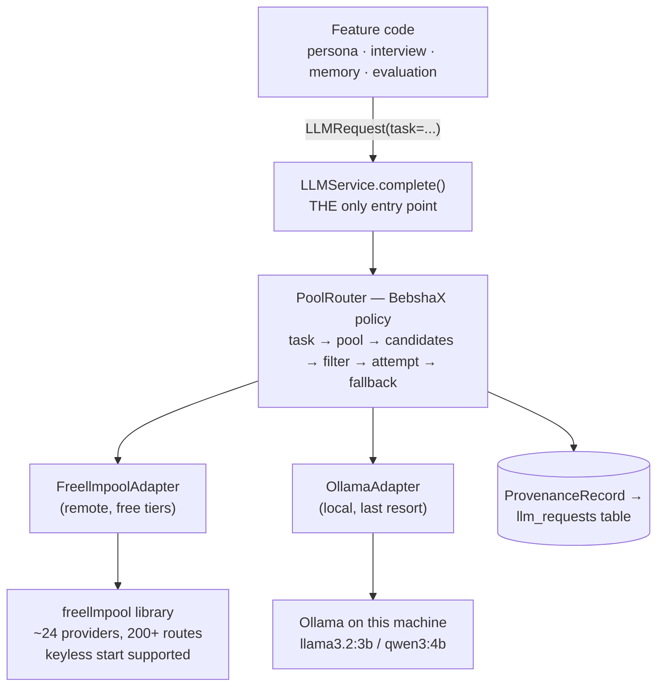
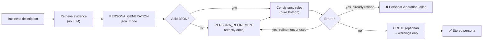

# BebshaX — AI / LLM Implementation Plan (plain-English)

> **The one-sentence answer:** BebshaX uses **aggregation _and_ routing, but not ensembling**. Free providers are **aggregated** into one big pool of models, a **router** picks one model per request based on the task, and if that model fails the router walks down a **fallback ladder** until something answers — ending on the local Ollama model. Exactly **one model answers each request**; we never merge or vote on multiple answers.

Companion docs: [ROUTING.md](ROUTING.md) is the reference (tables, failure codes, dependency reviews). This file explains the _mental model_ — read this first.

---

## 1. Three words people confuse

| Word                                      | Meaning                                                                 | Do we do it?                                                                        |
| ----------------------------------------- | ----------------------------------------------------------------------- | ----------------------------------------------------------------------------------- |
| **Aggregation**                           | Many providers/keys pooled into one usable capacity pool                | ✅ **Yes** — this is the whole point of the project (zero budget → pool free tiers) |
| **Routing**                               | Pick _which_ model handles _this_ request, and what to do when it fails | ✅ **Yes** — `PoolRouter`, task→pool map, fallback ladder                           |
| **Ensembling** (voting / merging answers) | Ask N models the same thing, then combine/vote on the answers           | ❌ **No** — see [§7](#7-why-no-voting-or-answer-merging)                            |

So: **aggregate the supply, route each request, never blend the outputs.**

---

## 2. The layer cake



Two things do the heavy lifting, and they are **different jobs**:

- **freellmpool** (a third-party MIT library) = the **aggregator**. It knows about ~24 free providers, rotates keys, tracks quotas, honours `Retry-After`, trips circuit breakers. We did **not** write this — rule R10 forbids rebuilding routers/gateways.
- **`PoolRouter`** ([apps/backend/bebshax/llm/router.py](../apps/backend/bebshax/llm/router.py)) = **our policy**. It knows about _tasks_, _context budgets_, _capabilities_, _cooldowns_ and _provenance_ — things a generic aggregator can't know.

To BebshaX, the entire remote world is a single virtual route called `freellmpool/auto`. The real provider/model that ended up serving (e.g. `llm7/codestral-latest`) is reported back and stored, so provenance never says "auto".

> **Temporary (2026-08-26):** a third adapter, `OpenRouterAdapter`, currently sits as _first preference_ in the remote pools — **testing only**, per owner decision. Keyless it contributes no routes and everything behaves as documented here. Its position contradicts §10's capacity math (50 req/day at $0) and must be revisited before production.

---

## 3. The single entry point rule

Every LLM call in the codebase — no exceptions — looks like this:

```python
result = await llm.complete(
    LLMRequest(
        task=TaskType.PERSONA_INTERVIEW,   # the caller ALWAYS knows its task
        messages=[...],
        json_mode=True,                    # capability requirement
        max_output_tokens=400,
        persona_id=persona.id,
    )
)
result.text          # the answer
result.provider      # who actually served it
result.provenance    # the full audit trail
```

- No feature file may `import openai` / `import freellmpool` — provider SDKs live **only** in [apps/backend/bebshax/llm/adapters/](../apps/backend/bebshax/llm/adapters/), and a test enforces it (R1/D2).
- **No LLM is used to classify the task.** The 18 `TaskType` values are declared by the caller in code (D7). Cheap, deterministic, debuggable.

---

## 4. What happens on one request — 7 steps

Source: [apps/backend/bebshax/llm/router.py](../apps/backend/bebshax/llm/router.py) + [apps/backend/bebshax/llm/service.py](../apps/backend/bebshax/llm/service.py).

| #   | Step                   | Where                                                                          | In plain English                                                                                                                                                               |
| --- | ---------------------- | ------------------------------------------------------------------------------ | ------------------------------------------------------------------------------------------------------------------------------------------------------------------------------ |
| 1   | **Task → pool**        | [pools.py](../apps/backend/bebshax/llm/pools.py)                               | A lookup table, not `if/else`. `PERSONA_INTERVIEW` → `conversation` pool.                                                                                                      |
| 2   | **Throttle**           | `asyncio.Semaphore` per pool                                                   | Each pool has a concurrency cap (e.g. `reasoning` = 2) so we don't hammer free tiers.                                                                                          |
| 3   | **Collect candidates** | adapter `.candidates()`                                                        | Ask each adapter in the pool what routes it can serve _right now_. Ollama discovers models live from `/api/tags`.                                                              |
| 4   | **Rank**               | `ranker` hook                                                                  | Today = pool order. Pluggable strategies exist in [strategies.py](../apps/backend/bebshax/evaluation/strategies.py) (quality-first, latency-first, round-robin, quota-aware…). |
| 5   | **Pre-flight filter**  | `filter_eligible()` + [estimator.py](../apps/backend/bebshax/llm/estimator.py) | Drop routes that are cooling down, can't do JSON/tools, or whose context window is smaller than our token estimate. **Ineligible routes are never called.**                    |
| 6   | **Attempt loop**       | `attempt_candidates()`                                                         | Try candidate #1. If it fails, look up the failure kind in `FAILURE_POLICIES` → retry once / move on / cool it down / surface immediately. Then candidate #2, #3…              |
| 7   | **Record**             | [provenance.py](../apps/backend/bebshax/llm/provenance.py)                     | Write every candidate considered, every attempt, latencies, tokens, and the final serving model — **on success _and_ on failure**.                                             |

### The critical guarantee (R2)

If **nothing** can fit the prompt, we raise `ContextWindowExceeded`. We **never** trim the persona, memories, or evidence to squeeze into a smaller model. The token estimator deliberately _over_-estimates (chars ÷ 3.5) so a mis-estimate can only push us to a **roomier** model — never toward truncation.

---

## 5. The routing table

Configuration as **data**, so extending it = edit a table + add a test, never add a code branch.

| Pool           | Order                              | Max concurrent | Tasks routed here                                                                                                                 |
| -------------- | ---------------------------------- | -------------- | --------------------------------------------------------------------------------------------------------------------------------- |
| `reasoning`    | openrouter† → freellmpool → ollama | 2              | PERSONA_GENERATION, PERSONA_REFINEMENT, PERSONA_VALIDATION, CONTRADICTION_CHECK, CRITIC, PERSONA_NARRATIVE, BEHAVIORAL_SIMULATION |
| `conversation` | openrouter† → freellmpool → ollama | 5              | PERSONA_INTERVIEW, PERSONA_RESPONSE                                                                                               |
| `structured`   | openrouter† → freellmpool → ollama | 3              | STRUCTURED_OUTPUT, EVIDENCE_EXTRACTION, EVIDENCE_CLASSIFICATION, BROWSER_AGENT, TOOL_CALLING                                      |
| `fast`         | openrouter† → freellmpool → ollama | 5              | MEMORY_RETRIEVAL, MEMORY_SUMMARIZATION                                                                                            |
| `long_context` | openrouter† → freellmpool → ollama | 2              | REPORT_GENERATION                                                                                                                 |
| `local`        | ollama only                        | 2              | reserved for explicit local-only work                                                                                             |
| `emergency`    | **ollama → freellmpool**           | 2              | EMERGENCY_FALLBACK (local **first** — when the internet is the problem)                                                           |

† testing-only first preference — see the note in [§2](#2-the-layer-cake); keyless → contributes no routes.

Two invariants worth memorising:

1. **Every pool ends at the local adapter.** The fallback ladder always terminates on this machine, so "all free providers are down" degrades to _slow_, not _broken_.
2. **All 18 task types must be mapped.** A unit test fails the build if someone adds a `TaskType` without a pool — and a second test fails on references to task types that don't exist.

---

## 6. Fallback: what counts as a failure

Only **infrastructure** problems trigger fallback. Full mapping table in [ROUTING.md](ROUTING.md#failure-classification); the shape of it:

| Failure kind                                                                                                         | Retry same route? | Try next? | Cool the route down?        |
| -------------------------------------------------------------------------------------------------------------------- | ----------------- | --------- | --------------------------- |
| `RATE_LIMITED` (429), `QUOTA_EXHAUSTED`, `SERVER_ERROR`, `AUTH_INVALID`, `MODEL_UNAVAILABLE`, `PROVIDER_UNAVAILABLE` | no                | yes       | **yes** (60 s)              |
| `CONNECTION`, `MALFORMED_RESPONSE` (empty reply)                                                                     | **once**          | yes       | no                          |
| `TIMEOUT`, `CONTEXT_WINDOW_EXCEEDED`, `CAPABILITY_UNSUPPORTED`, `CONTENT_REFUSAL`                                    | no                | yes       | no                          |
| `INTERNAL_ERROR` (our own bug)                                                                                       | no                | **no**    | no — surface it immediately |

### The thing that is deliberately **missing** from that list

There is **no `LOW_QUALITY` failure kind**, and a test enforces that there never will be. A weak-but-valid answer is a **content** problem, handled by:

- the persona pipeline (schema validation → one refinement round → deterministic consistency rules → optional critic), and
- the evaluation layer, [apps/backend/bebshax/evaluation/](../apps/backend/bebshax/evaluation/).

If bad answers could trigger silent re-routing, our research question ("can free capacity preserve quality?") would be unanswerable — the infrastructure would be hiding the very thing we're measuring.

---

## 7. Why no voting or answer merging

The obvious idea is "ask 3 free models and pick the best". We do **not**, for four reasons:

1. **It multiplies free-tier consumption by 3–5×** for the same user action — the opposite of what a zero-budget project needs (R5).
2. **Latency.** Interviews are interactive; the slowest model would set the pace of every turn.
3. **Merging personas is incoherent.** Averaging three personas produces a fourth person nobody described. Persona identity must stay one consistent voice.
4. **Judging needs another LLM call** — and a free judge model grading free worker models is a weak signal we'd then be tempted to trust.

**What we do instead:** a _sequential_ pipeline where each extra call has a distinct, cheap job (validate → refine → critique), plus deterministic Python rules that need no LLM at all.

**Where multi-sampling is legitimate:** offline evaluation runs in [apps/backend/bebshax/evaluation/](../apps/backend/bebshax/evaluation/) and the routing simulator — those _do_ aggregate many runs, but into **metrics and reports**, never into a user-facing answer.

---

## 8. How each feature actually uses the LLM

### Persona generation — up to 4 calls, all sequential

[apps/backend/bebshax/persona/generation.py](../apps/backend/bebshax/persona/generation.py)



Key points:

- Schema-invalid output gets **exactly one** repair round, then an honest failure. No infinite retry loop, no "good enough" fallback.
- The consistency checks (age vs occupation, income vs spending) are **plain Python rules** in [consistency.py](../apps/backend/bebshax/persona/consistency.py) — deterministic, free, testable.
- The critic pass is **advisory**: its findings become `warnings`, never blockers. If the critic's own output is unparseable, we note that and move on.
- Every attribute carries a provenance class: `OBSERVED` (cites an evidence id) / `INFERRED` / `SYNTHETIC`. The model is instructed that this is machine-verified.

### Interview — exactly 1 call per turn

[apps/backend/bebshax/interview/engine.py](../apps/backend/bebshax/interview/engine.py)

The prompt is assembled from: identity card + business context + objective + **retrieved memories** + evidence themes + **the full prior turn history** (never silently dropped). One `PERSONA_INTERVIEW` call → the persona's reply → both turns persisted.

### Memory — retrieval is math, not an LLM

[apps/backend/bebshax/memory/scoring.py](../apps/backend/bebshax/memory/scoring.py)

$$\text{score} = 0.60 \cdot \cos(\text{query}, \text{memory}) + 0.25 \cdot e^{-\ln 2 \cdot \frac{\text{age}_h}{48}} + 0.15 \cdot \text{importance}$$

Relevance dominates, recency keeps conversations fresh (48 h half-life), importance lets reflections outrank chit-chat. **An LLM is used only for `reflect()`** — distilling ≥8 recent episodic memories into ≤3 durable first-person insights via `MEMORY_SUMMARIZATION`. That call is best-effort: unparseable output logs a warning and returns nothing rather than breaking a conversation.

### Evaluation — no LLM judge in the request path

[apps/backend/bebshax/evaluation/](../apps/backend/bebshax/evaluation/) scores schema validity, grounding ratio (share of `OBSERVED`/evidence-linked attributes), rule consistency, and contradiction scans — mostly deterministic, run offline, aggregated into reports.

---

## 9. Provenance: one row per request

Every request produces a `ProvenanceRecord` → the `llm_requests` table:

- `request_id`, `task`, `pool`, `persona_id`, `conversation_id`
- `routing_path` — every candidate **considered**, including skipped ones with the reason (`[skipped: context 8192 < ~12000]`, `[skipped: cooling down for 43s more]`)
- `attempts[]` — per attempt: provider, model, latency, success, failure kind + detail, why we moved on, adapter notes (e.g. freellmpool's own internal failover count)
- `served_by_provider` / `served_by_model` — the **concrete** route, never `auto`
- token counts, total latency, success flag

This is what makes the research question answerable: for any persona or interview turn, we can say exactly which free model produced it and what it cost.

---

## 10. Capacity: making the free tiers last

The worry: _"personas + conversations burn a lot of tokens — will we run out?"_ Decisions recorded 2026-08-25: target ≈ **100 personas + interviews/day** (~2–5M tokens/day ≈ 60–150M/month), **strictly $0 spend**, everything **near-real-time**. That volume is comfortably inside the summed legitimate free tiers — _if_ consumption is spread across providers instead of hammering the first preference.

### We already own the "cycler"

What GitHub gateways like _uni-api_ / _one-api_ offer — rotating across free providers/keys with cooldowns — already exists here as freellmpool + `PoolRouter`. Alternatives were researched (2026-08-25) and rejected:

| Alternative                  | Verdict                    | Why                                                                                                                               |
| ---------------------------- | -------------------------- | --------------------------------------------------------------------------------------------------------------------------------- |
| uni-api (Apache-2.0, active) | ❌ rejected                | An extra proxy deployment duplicating `PoolRouter` + freellmpool; its multi-account rotation features are exactly what R5 forbids |
| one-api (36k★, stale ~1 yr)  | ❌ rejected                | Web-UI gateway in Go; same duplication argument as the Gate B LiteLLM skip                                                        |
| gpt4free-class tools         | ❌ rejected                | Reverse-engineered private endpoints — ToS violation, R5 non-negotiable                                                           |
| OpenRouter free models       | ⚠️ minor extra pool member | Verified: 20 req/min, **50 req/day** at $0; extra accounts do **not** raise limits (capacity is governed globally per their docs) |

### The actual gaps (planned, not yet built)

Capacity comes from **one legitimate key per provider** (Groq, Gemini, Mistral, Cerebras, GitHub Models, Cloudflare, NVIDIA, Cohere, HF, …) plus routing that drains all daily quotas _evenly_:

| Planned piece                 | What it does                                                                  | Builds on                                                                                                       |
| ----------------------------- | ----------------------------------------------------------------------------- | --------------------------------------------------------------------------------------------------------------- |
| `scripts/measure_capacity.py` | Replays a realistic day of traffic; reports tokens/provider/day               | `llm_requests` rows already record tokens per request                                                           |
| Quota ledger (`llm/quota.py`) | Data table of published per-provider caps + consumed-today from the DB        | config-as-data rule                                                                                             |
| Quota-aware ranker            | Ranks candidates by remaining daily quota so no provider caps out early       | the `ranker` hook + the `QUOTA_AWARE` stub in [strategies.py](../apps/backend/bebshax/evaluation/strategies.py) |
| Persistent cooldowns          | `QUOTA_EXHAUSTED` cools until the provider's reset time and survives restarts | `model_registry` cooldown columns (Phase 6)                                                                     |
| `GET /api/routing/capacity`   | Dev dashboard: used today / cap / remaining % per provider                    | `llm_requests` + quota table                                                                                    |

Honest ceiling: real-time + free tiers is bounded by the _sum of per-minute limits_ (~tens of req/min). If bursts ever exceed it, the options are a visible queue or batching bulk simulations — never account multiplication or limit evasion (R5).

---

## 11. Status and what's next

| Capability                                                                               | State                                                                                                       |
| ---------------------------------------------------------------------------------------- | ----------------------------------------------------------------------------------------------------------- |
| `LLMService` + task types + failure taxonomy + provenance                                | ✅ Phase 2                                                                                                  |
| freellmpool aggregation adapter (keyless verified)                                       | ✅ Phase 3                                                                                                  |
| Ollama local fallback (benchmarked on 4 GB VRAM)                                         | ✅ Phase 4                                                                                                  |
| `PoolRouter`: pools, context budget, cooldowns, concurrency                              | ✅ Phase 5                                                                                                  |
| Provenance + model registry persisted to Postgres                                        | ✅ Phase 6                                                                                                  |
| Persona / memory / interview pipelines on the router                                     | ✅ Phases 8–10                                                                                              |
| Routing strategy experiments + evaluation metrics                                        | ✅ Phase 11                                                                                                 |
| **Registry-driven ranking** (quality/latency/health scores feeding the `ranker` hook)    | ⬜ open — hook exists, scores not wired                                                                     |
| **Tool calling**                                                                         | ⬜ open — no adapter advertises `supports_tools`, so `TOOL_CALLING` fails explicitly rather than pretending |
| **Quota-aware capacity layer** (ledger, ranker, persistent cooldowns, capacity endpoint) | ⬜ planned — decisions recorded 2026-08-25, see [§10](#10-capacity-making-the-free-tiers-last)              |
| Full test matrix / acceptance tests                                                      | ⬜ Phase 14                                                                                                 |

---

## 12. How to extend it (the 3 common changes)

| You want to…                     | Do this                                                                                                     | Don't do this                                                 |
| -------------------------------- | ----------------------------------------------------------------------------------------------------------- | ------------------------------------------------------------- |
| **Add a task type**              | Add to `TaskType`, add a row to `TASK_POOL_MAP`, add a test                                                 | Add an `if task == ...` branch in the router                  |
| **Add a provider**               | Configure it in freellmpool (env keys), or write a new `ProviderAdapter` in `adapters/` + name it in a pool | Import a provider SDK in feature code                         |
| **Change how models are picked** | Pass a `ranker` into `PoolRouter(...)`                                                                      | Reorder logic inside `filter_eligible` / `attempt_candidates` |

---

## 13. FAQ

**Does the user ever pick a model?** No. End users click "Generate Persona". Model selection is the backend's job; the developer dashboard exposes routing for _us_, not for them.

**What if I have zero API keys?** Supported and tested — freellmpool starts keyless, and Ollama is local. Teammates add their own legitimately-owned keys via `.env`.

**What if all free providers are exhausted?** The ladder ends at Ollama, which serves `llama3.2:3b`. Chaos-tested. If Ollama is also down, you get `AllCandidatesFailed` with the complete attempt trail — an honest error, not a fabricated answer.

**Why do we need Ollama at all — isn't freellmpool enough?** Ollama is **insurance, not horsepower**:

1. Every remote free tier can fail _at the same time_ — a shared 429 storm, an internet outage, zero keys configured, or a provider policy change. Ollama is the only route we fully control: no quota, no rate limit, no ToS, no network.
2. It converts "all providers exhausted" from a hard error into a slow-but-real answer — that's why **every pool terminates at the local adapter**, and why the `emergency` pool is local-_first_.
3. It makes zero-API-keys a supported configuration for teammates and demos.
4. It is deliberately **not** counted as capacity: ~25 tok/s on the 4 GB card (~2M tokens/day theoretical ceiling). The capacity plan in [§10](#10-capacity-making-the-free-tiers-last) never relies on it for volume — resilience is this tier's only job.

**Why not just use LiteLLM / build a gateway?** Gate B decision (recorded in [ROUTING.md](ROUTING.md)): the needed provider surface is already covered, and a proxy would add Postgres/Prisma/Redis-scale infrastructure for capabilities we have. R10 forbids building our own gateway.

**How does Ollama connect to the website if it's hosted (e.g. Vercel)?** It doesn't — the arrow points the other way. The browser talks to the FastAPI backend; the **backend** calls Ollama at `OLLAMA_API_BASE` (default `http://localhost:11434`, read in [ollama_adapter.py](../apps/backend/bebshax/llm/adapters/ollama_adapter.py)). So the question is only ever _where the backend runs relative to Ollama_:

| Topology                                                | How Ollama is reached                                                     | Caveats                                                                                                                                                               |
| ------------------------------------------------------- | ------------------------------------------------------------------------- | --------------------------------------------------------------------------------------------------------------------------------------------------------------------- |
| **A. Everything on the dev PC** (recommended for demos) | `localhost` — zero config                                                 | Expose the site publicly with one Cloudflare Tunnel / ngrok to `:8000`; PC must be on                                                                                 |
| **B. Frontend on Vercel, backend on the dev PC**        | Still `localhost` to the backend                                          | Tunnel only the backend; point the frontend's API base at the tunnel URL; tighten `allow_origins` to the Vercel domain first                                          |
| **C. Backend in the cloud, Ollama at home**             | `OLLAMA_API_BASE=https://<tunnel-host>` in the cloud env — no code change | Inverts Ollama's purpose (internet now sits inside the "no-internet" tier); Ollama has **no auth**, so never expose `:11434` raw — Cloudflare Access / Tailscale only |

Notes that make this safe by design: Vercel itself can only host the _frontend_ (persona generation runs ~44 s and interview turns 40–89 s — beyond serverless limits, and `PoolRouter` holds in-memory cooldowns/semaphores that need a long-running process). And if the tunnel/PC is unreachable, `OllamaAdapter.candidates()` returns `[]` — the router simply routes without the local tier instead of erroring.

**Is a slow/dumb answer a failure?** No. Infrastructure only reacts to 429s, quotas, timeouts, 5xx, context, and capability errors. Quality is measured, not routed around.
