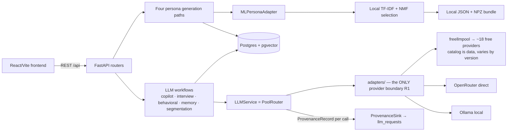

# BebshaX Architecture

How a request becomes an answer, and which package owns each step. Companion docs: [FAILOVER.md](FAILOVER.md) (routing details), [MODEL_REGISTRY.md](MODEL_REGISTRY.md), [PERSONA_ENGINE.md](PERSONA_ENGINE.md), [ROUTING.md](ROUTING.md), [API_CONTRACT.md](API_CONTRACT.md).

## System shape

Two rules shape everything (RULES.md R1/R3): provider SDKs are imported **only** inside `apps/backend/bebshax/llm/adapters/` (test-enforced by `tests/llm/test_boundary.py::test_provider_sdk_imports_only_inside_adapters`), and every LLM call goes through `LLMService.complete(LLMRequest)` with an explicit `TaskType`, producing a full `ProvenanceRecord` — success or failure.

## Backend packages (`apps/backend/bebshax/`)

| Package                                   | Role                                                                                                                                                  | Key classes                                                   |
| ----------------------------------------- | ----------------------------------------------------------------------------------------------------------------------------------------------------- | ------------------------------------------------------------- |
| `llm/`                                    | Provider-agnostic LLM abstraction: task types, failure taxonomy, pools, routing, quota, provenance                                                    | `LLMService`, `PoolRouter`, `QuotaLedger`, `ProvenanceRecord` |
| `llm/adapters/`                           | The single provider boundary: freellmpool, OpenRouter, Ollama, deterministic `FakeAdapter` for chaos tests, embeddings                                | `ProviderAdapter`, `RouteCandidate`, `HashEmbedding`          |
| `persona/`                                | Business persona schema/persistence; runtime ML selection, with explicit LLM-only compatibility pipeline retained | `PersonaEngine`, `EvidenceStore`                              |
| `personas/`                               | Shared ML adapter and study-scoped synthetic lifecycle; existing provenance JSON, quotas, tenancy, active-source exclusions | `MLPersonaAdapter`, `PersonaGenerationService`                |
| `memory/`                                 | pgvector memory stream; retrieval = 0.6·cosine + 0.25·recency + 0.15·importance; reflection summarization                                             | `MemoryService`                                               |
| `interview/`                              | Multi-turn interviews; identity card composed per turn, never regenerated; full history or explicit `ContextWindowExceeded` (R2)                      | `InterviewEngine`, `Conversations`                            |
| `behavioral/`                             | Persona decision simulation (pricing/features/copy) with prompt-injection defense                                                                     | `BehavioralSimulationEngine`                                  |
| `evaluation/`                             | Persona metrics and routing chaos/replay scaffolding; withdrawn replay results are not benchmarks, and ML evaluation lives separately | `PersonaEvaluator`, `RoutingChaosSimulator` |
| `research/`, `segmentation/`, `datasets/` | Evidence & research engine (claims, 384-dim embeddings), market segmentation, dataset grounding services                                              | `SegmentationEngineService`                                   |
| `db/`                                     | Async SQLAlchemy engine, ORM models, provenance sink, cooldown persistence, demo seed                                                                 | `ProvenanceSink`, `CooldownStore`                             |
| `auth/`, `api/`                           | JWT auth + the mounted REST routers                                                                                                                   | —                                                             |

### Isolated Persona ML (2026-09-09)

The independent [ml_persona package](../ml_persona/README.md) owns normalization,
identity-disjoint splits, CPU training, artifact validation, generation, and
offline evaluation. The four runtime callers are business `PersonaEngine`,
study/segment generation, copilot role generation, and dataset generation;
[the ML architecture](../ml_persona/ARCHITECTURE.md) maps each to its source.
All adapt complete synthetic source prototypes to existing `GeneratedPersona`,
`PersonaProfile`, or `GeneratedPersonaDraft` contracts. Training membership is
not observed evidence: claims are `SYNTHETIC`, citations are empty, and
grounding/confidence remain zero or unset. Model scores are retrieval similarity.

This path uses no LLM, API key, GPU, or PyTorch. Role/location are soft relevance
hints; explicit age bounds are hard. Source occupations/locations are retained,
not rewritten to match a student or Bangladesh target. Unavailable artifacts
produce 503 and unsupported contexts/exhaustion produce 422, with no LLM
fallback. Explicit LLM compatibility code is not that fallback.

Legacy, study, and dataset callers exclude owner-scoped active source IDs/names;
study counts include all active personas. Role generation keeps its existing
cohort archiving and `failed_roles` partial-success contract. Exclusion reads
do not provide transactional uniqueness across overlapping independent requests.
The [model card](../ml_persona/MODEL_CARD.md) records limitations, including
lower retrieval MRR than lexical TF-IDF. Recorded 2026-09-09 checks exercised
local PostgreSQL persistence/pgvector, seven real Freellmpool responses for
copilot/roles/interviews, and Linux loading of the Windows-trained artifact
with networking disabled. They do not establish provider reliability, real
customer fit, or full Compose readiness. Desktop passed; mobile persona-header
clipping remains. See [verification scope](../ml_persona/IMPLEMENTATION_REPORT.md).

## Startup (lifespan in `main.py`)

1. **Migration drift guard** — dev/local, non-demo, `localhost` database only: hard `SystemExit(1)` if the database is behind `alembic head` (loud failure instead of mysterious 500s). Cloud URLs and demo mode skip it; the compose `full` profile instead runs `alembic upgrade head` in the `app` container before uvicorn (see [SETUP.md](SETUP.md) § Deployment stories).
2. `build_default_adapters()` → engine + sessionmaker → `ProvenanceSink.start()`.
3. `QuotaLedger` re-seeded from today's `llm_requests`; `CooldownStore.load_active()` restores router cooldowns across restarts; freellmpool fast-routing metrics warmed from recent route observations (fail-soft).
4. `PoolRouter(adapters, on_provenance, ranker=quota_aware_ranker, initial_cooldowns, on_cooldown_change)` attached to `app.state` as both `llm_router` and `llm_service`.
5. Engines wired: `persona_engine`, `memory_service`, `interview_engine`, `behavioral_engine`, plus the shared `persona_ml` adapter. ML artifact loading is lazy, not a startup download/train operation. `warn_if_local_tier_down` logs when Ollama is unreachable (the offline drill depends on it).
6. `init_database(seed=settings.demo_mode)` — shared tenant users always ensured; demo entities seeded only when `BEBSHAX_DEMO_MODE=true` and the DB is empty (see [DEMO.md](DEMO.md)).

`FREELLMPOOL_CONFIG` is pointed at the repo's `providers.toml` before the library is imported — provider inventory is config, not code (no hard-coded provider lists).

## API surface

All routers mount under `/api`: health, routes (provenance/status), personas, interviews, behavioral, copilot, studies, evaluation, datasets, evidence, segmentation, auth (`/api/auth`), OpenRouter health (`/api/health/openrouter`), and the Judge Lab (`/api/demo-lab`, dev/demo only — scripted `FakeAdapter` scenarios run through the real `PoolRouter`, every payload `simulated: true`). Shapes are frozen in [API_CONTRACT.md](API_CONTRACT.md). Middleware: slowapi rate limiting + explicit-origin CORS. In the compose `full` profile nginx fronts everything (SPA + `/api` proxy) and adds the browser security headers/CSP (`deploy/nginx.conf`).

## Frontend (`apps/frontend/`)

React 18 + Vite 5 + TypeScript single app: landing (cinematic, self-contained scroll engine), auth, and the research console (studies workflow, persona library, interviews, behavioral testing, evidence lab, segmentation, model-router provenance view). Styling is a semantic token system in `src/index.css` with light/dark themes (`scripts/codemod-theme-tokens.mjs` is the drift gate); motion is GSAP (`src/motion/`) + a small CSS layer; `VITE_MOCK=1` keeps every view navigable without a backend.

## Data stores

Postgres 16 + pgvector (Docker service `db`, host port **5433**; native PG16 typically owns 5432 and lacks pgvector). Tables live with their owning feature package (`<feature>/orm.py`) on the shared `Base`, migrated by hand-written Alembic revisions. `llm_requests` holds one row per LLM call (the provenance log); `memory_items` carries `Vector(384)` embeddings with an HNSW cosine index.

ML bundles are local, Git-ignored JSON/NPZ files, defaulting to
`data/processed/ml_persona/model`; `BEBSHAX_ML_PERSONA_ARTIFACT_DIR` overrides the
derived processed-data path. The loader checks exact numerical runtime versions
and integrity, with `allow_pickle=False`; hashes are not signatures. The
[constraints](../ml_persona/constraints.txt) pin NumPy 2.5.2, SciPy 1.18.1, and
scikit-learn 1.9.0 for local and Docker installation. Fresh checkouts/images
contain the package, not a trained bundle: prepare/train or stage a trusted
compatible artifact. Loading is cached, so restart after replacement. Existing
persona JSON fields store source/model provenance and full normalized source
documents, not a fabricated LLM provenance request. No DB migration, frontend,
provider, or separate persona schema was added for this path.
