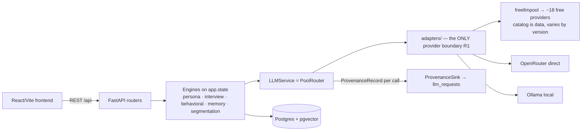

# BebshaX Architecture

How a request becomes an answer, and which package owns each step. Companion docs: [FAILOVER.md](FAILOVER.md) (routing details), [MODEL_REGISTRY.md](MODEL_REGISTRY.md), [PERSONA_ENGINE.md](PERSONA_ENGINE.md), [ROUTING.md](ROUTING.md), [API_CONTRACT.md](API_CONTRACT.md).

## System shape

Two rules shape everything (RULES.md R1/R3): provider SDKs are imported **only** inside `apps/backend/bebshax/llm/adapters/` (test-enforced by `tests/llm/test_boundary.py::test_provider_sdk_imports_only_inside_adapters`), and every LLM call goes through `LLMService.complete(LLMRequest)` with an explicit `TaskType`, producing a full `ProvenanceRecord` — success or failure.

## Backend packages (`apps/backend/bebshax/`)

| Package | Role | Key classes |
| --- | --- | --- |
| `llm/` | Provider-agnostic LLM abstraction: task types, failure taxonomy, pools, routing, quota, provenance | `LLMService`, `PoolRouter`, `QuotaLedger`, `ProvenanceRecord` |
| `llm/adapters/` | The single provider boundary: freellmpool, OpenRouter, Ollama, deterministic `FakeAdapter` for chaos tests, embeddings | `ProviderAdapter`, `RouteCandidate`, `HashEmbedding` |
| `persona/` | Evidence-grounded persona pipeline: evidence retrieval → generation → provenance coercion → deterministic consistency rules → optional critic → store | `PersonaEngine`, `EvidenceStore` |
| `personas/` | Study-scoped synthetic persona lifecycle with grounding scores and tenancy | `PersonaGenerationService` |
| `memory/` | pgvector memory stream; retrieval = 0.6·cosine + 0.25·recency + 0.15·importance; reflection summarization | `MemoryService` |
| `interview/` | Multi-turn interviews; identity card composed per turn, never regenerated; full history or explicit `ContextWindowExceeded` (R2) | `InterviewEngine`, `Conversations` |
| `behavioral/` | Persona decision simulation (pricing/features/copy) with prompt-injection defense | `BehavioralSimulationEngine` |
| `evaluation/` | Persona quality metrics + routing-strategy chaos/offline benchmarks | `PersonaEvaluator`, `RoutingChaosSimulator` |
| `research/`, `segmentation/`, `datasets/` | Evidence & research engine (claims, 384-dim embeddings), market segmentation, dataset grounding services | `SegmentationEngineService` |
| `db/` | Async SQLAlchemy engine, ORM models, provenance sink, cooldown persistence, demo seed | `ProvenanceSink`, `CooldownStore` |
| `auth/`, `api/` | JWT auth + the mounted REST routers | — |

## Startup (lifespan in `main.py`)

1. **Migration drift guard** — dev/local, non-demo: hard `SystemExit(1)` if the database is behind `alembic head` (loud failure instead of mysterious 500s).
2. `build_default_adapters()` → engine + sessionmaker → `ProvenanceSink.start()`.
3. `QuotaLedger` re-seeded from today's `llm_requests`; `CooldownStore.load_active()` restores router cooldowns across restarts; freellmpool fast-routing metrics warmed from recent route observations (fail-soft).
4. `PoolRouter(adapters, on_provenance, ranker=quota_aware_ranker, initial_cooldowns, on_cooldown_change)` attached to `app.state` as both `llm_router` and `llm_service`.
5. Engines wired: `persona_engine`, `memory_service`, `interview_engine`, `behavioral_engine`; `warn_if_local_tier_down` logs when Ollama is unreachable (the offline drill depends on it).
6. `init_database(seed=settings.demo_mode)` — shared tenant users always ensured; demo entities seeded only when `BEBSHAX_DEMO_MODE=true` and the DB is empty (see [DEMO.md](DEMO.md)).

`FREELLMPOOL_CONFIG` is pointed at the repo's `providers.toml` before the library is imported — provider inventory is config, not code (no hard-coded provider lists).

## API surface

All routers mount under `/api`: health, routes (provenance/status), personas, interviews, behavioral, copilot, studies, evaluation, datasets, evidence, segmentation, auth (`/api/auth`), OpenRouter health (`/api/health/openrouter`). Shapes are frozen in [API_CONTRACT.md](API_CONTRACT.md). Middleware: slowapi rate limiting + explicit-origin CORS.

## Frontend (`apps/frontend/`)

React 18 + Vite 5 + TypeScript single app: landing (cinematic, self-contained scroll engine), auth, and the research console (studies workflow, persona library, interviews, behavioral testing, evidence lab, segmentation, model-router provenance view). Styling is a semantic token system in `src/index.css` with light/dark themes (`scripts/codemod-theme-tokens.mjs` is the drift gate); motion is GSAP (`src/motion/`) + a small CSS layer; `VITE_MOCK=1` keeps every view navigable without a backend.

## Data stores

Postgres 16 + pgvector (Docker service `db`, host port **5433**; native PG16 typically owns 5432 and lacks pgvector). Tables live with their owning feature package (`<feature>/orm.py`) on the shared `Base`, migrated by hand-written Alembic revisions. `llm_requests` holds one row per LLM call (the provenance log); `memory_items` carries `Vector(384)` embeddings with an HNSW cosine index.
