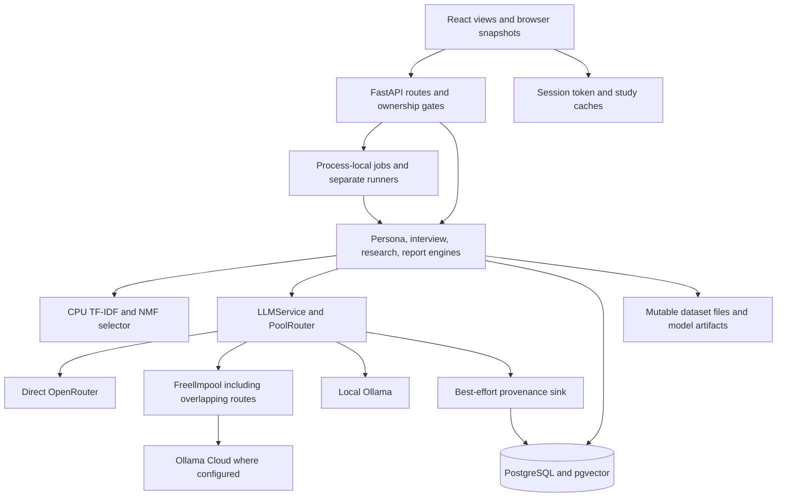
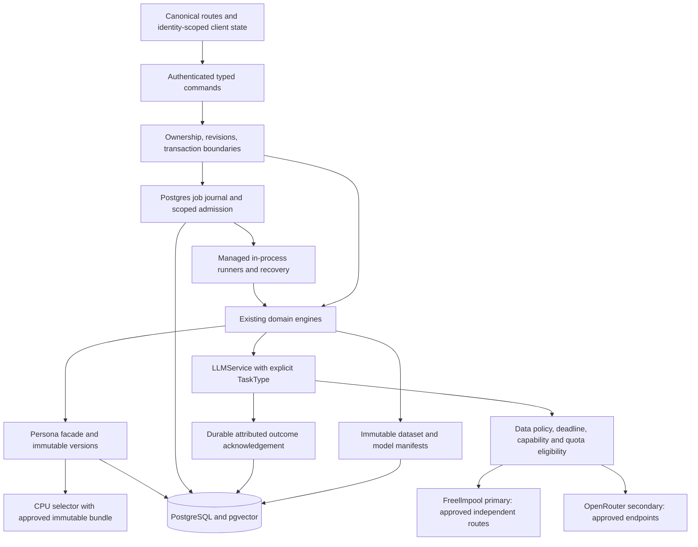

# BebshaX Post-Presentation Roadmap

Prepared: 2026-09-09. Status: **OWNER-APPROVED; IMPLEMENTATION IN PROGRESS; NOT A RELEASE.**

The owner explicitly approved end-to-end implementation with multi-agent orchestration on 2026-09-09, including the quality-preserving latency contract. This closes the planning checkpoint. This document remains the source map; actual changes, verification and unresolved gates are tracked in [MODERNIZATION_EXECUTION.md](MODERNIZATION_EXECUTION.md). Approval authorizes implementation, not an unsupported production-readiness claim.

## Executive Decision And No-Go

**Keep the modular monolith.** Retain React/Vite, FastAPI, SQLAlchemy/Alembic, PostgreSQL 16/pgvector, and the independent CPU persona package. No evidence justifies a full rewrite, new database family, custom gateway, broker, or microservice split.

**Target a tenant-private synthetic research-rehearsal product first.** It helps prepare interviews, explore hypotheses, and organize research; synthetic responses are not observed customers, representative populations, demand validation, or purchase probabilities.

**Owner addition: near-instant navigation without sacrificing AI quality.**
Responsiveness is a requirement across every page and implementation wave,
not a final cosmetic pass. Page rendering and access to existing results must
not wait for new AI generation. Optimize avoidable client, network, database,
queue and provider overhead without shortening persona/history/evidence,
silently substituting weaker models or cached answers, or skipping validation.
Page readiness, first genuine AI output and durably saved completion are
separate measurements; a skeleton or progress indicator is not a loaded page
or an AI answer. Performance budgets below are targets, not achieved results.

| Decision              | Conservative Default                                                                                                                                                                                                 |
| --------------------- | -------------------------------------------------------------------------------------------------------------------------------------------------------------------------------------------------------------------- |
| LLM destinations      | Remove local Ollama and Ollama Cloud from every executable route. Freellmpool is the primary tier; an independent OpenRouter adapter is secondary. Exclude OpenRouter from the primary pool's inner provider set.    |
| Routing meaning       | Priority applies among policy-approved, capable, context-fitting, quota-eligible, non-cooling candidates. It does not mean trying Freellmpool on literally every request. Exhaustion produces an explicit error.     |
| Private content       | Do not send private tenant data, real PII, or unclassified user content to unapproved free providers. Initially allow only approved synthetic, non-PII payloads with a recorded processing policy.                   |
| Payments              | Disabled until recovery, checkout, subscription reconciliation, portal, entitlements, and replay/order handling are complete and independently verified. Remove unsupported commercial promises before any charging. |
| Accounts              | Keep the existing local password authority until a separately approved migration; recovery must reset that authority. Use server-revocable sessions, not local browser deletion as logout.                           |
| Data and identity     | Tenant-private by default; public demo records explicitly classified and read-only. Preserve immutable source identities, historical versions, evidence, and provenance. No new organization model is assumed.       |
| ML                    | Preserve the current artifact while evaluating a true lexical challenger. No automatic model promotion, blind weight downloads, old-test tuning, private-data training, or LLM fine-tuning.                          |
| Availability and cost | Cloud-only inference can fail during outages or free-quota exhaustion. Cached demos and CPU selection are separate capabilities, not offline chat. CPU/free LLM operation does not imply free production hosting.    |

**No-go for an internet-facing paid or privacy-sensitive release:** tenant-memory isolation, anonymous private writes, egress policy, session/recovery integrity, upload admission, verified DB TLS, durable execution/provenance, deployment recovery, and the external gates below remain unresolved or unverified at this evidence scope.

The plan provides testable risk reduction, not exhaustive proof that no errors exist and not a blind production warranty. Existing historical phase dates and audit/provenance records must remain intact.

## Scope And Evidence

The source snapshot is the current code inspected by the seven auditors, not a claim that all findings are old or already fixed. The initial worktree contained a user-owned edit to the [implementation log](IMPLEMENTATION_PLAN.md); existing work is preserved. This delivery changes planning documentation only. Production code, tests, configuration, model artifacts, installed dependencies, database contents, and running application services are unchanged.

| Label | Meaning And Limit                                                                                                                                                                                   |
| ----- | --------------------------------------------------------------------------------------------------------------------------------------------------------------------------------------------------- |
| P     | Requested policy or proposed engineering decision; not existing behavior.                                                                                                                           |
| S     | Static source, configuration, installed metadata, saved artifact, or inspected-test evidence. A source-confirmed defect is not a deployed reproduction.                                             |
| R     | Isolated reproduced component behavior using extracted functions, fake collaborators, framework components, or in-memory SQLite/multipart storage. Not a deployed exploit or full application test. |
| H     | Hypothesis, inferred race/performance consequence, or proposed experiment. Requires a discriminating measurement.                                                                                   |
| U     | External, deployment-specific, human-review, or otherwise unverified gate.                                                                                                                          |

Priorities in the register are **Block** (release/privacy/resource boundary), **High** (correctness and recoverability), and **Follow-up** (bounded optimization or optional product work). Priority is engineering judgment; evidence labels describe what is actually known. Compound labels separate an observed mechanism from an unmeasured consequence.

### Current Baseline

| Check                                                                                      | Status For This Roadmap                                                                                                                                                                                                                                                                                                                     |
| ------------------------------------------------------------------------------------------ | ------------------------------------------------------------------------------------------------------------------------------------------------------------------------------------------------------------------------------------------------------------------------------------------------------------------------------------------- |
| Frontend TypeScript and Vite build                                                         | **PASS**, recovered completed build log: Vite 5.4.21, 2,393 modules, 16.57 seconds, existing large-chunk warning.                                                                                                                                                                                                                           |
| Backend unit suite                                                                         | **1,723 passed, 2 failed, 3 integration deselected**, 653.94 seconds. Both failures were induced by the verifier's process-local upload-directory override; see the disambiguation below. The full suite has not been rerun with that correction.                                                                                           |
| Backend coverage                                                                           | **83.004851%**, above the actual configured **68%** CI floor. This is coverage from the run with two fixture-environment failures, not proof of behavioral completeness.                                                                                                                                                                    |
| Frontend unit suite                                                                        | **347 passed, 8 failed**, 42 of 44 files passing, 81.20 seconds, exit 1. The failures reproduce current interview-workspace defects. Thirty React `act(...)` warnings were recorded; frontend coverage was not configured.                                                                                                                  |
| ML unit suite                                                                              | **298 of 298 passed** in completed JUnit, 37.758 seconds. The launcher exit code and warning count were not recovered; the test report is complete, but process-exit success is not asserted.                                                                                                                                               |
| Bug-tier Ruff / theme-token gate                                                           | **PASS / PASS**; zero lint errors and zero files needing tokenization at the executed scope.                                                                                                                                                                                                                                                |
| Installed dependency consistency / Compose parse                                           | `pip check`: **PASS**, no broken requirements. Default and full-profile `docker compose config --quiet`: **PASS**. This neither scans all vulnerabilities nor starts the containers.                                                                                                                                                        |
| Python CLI type checking                                                                   | **Not run:** Pyright/mypy were not installed; no dependency was installed for this audit. Preliminary editor configuration diagnostics do not substitute for a type-check result.                                                                                                                                                           |
| Current editor diagnostics                                                                 | One existing [TypeScript configuration](../apps/frontend/tsconfig.json#L20) diagnostic: `baseUrl` is deprecated and stops functioning in TypeScript 7. The installed TypeScript build passed; reconcile editor/compiler versions and migrate path configuration in OPS-01 rather than masking the warning.                                  |
| Isolated security probes                                                                   | R: eleven independent component-probe groups reported by the security auditor; their limits are retained in the register.                                                                                                                                                                                                                   |
| Independent challenge review                                                               | R: shared-persona cross-tenant memory, TLS verification downgrade, broken native vector comparator, overlapping legacy business selection, soft deadlines, and URL-token session replacement confirmed with isolated probes. Frontend lifecycle scope independently reproduced 1 pass / 7 failures; it overlaps the full frontend failures. |
| PostgreSQL multi-process behavior, authenticated browser journeys, deployed infrastructure | U: not established by this map or by static/SQLite checks.                                                                                                                                                                                                                                                                                  |
| Saved ML evaluation                                                                        | S: historical saved metrics inspected by the ML auditor, not recomputed here and not business-validity measurements.                                                                                                                                                                                                                        |
| Dependency advisories and candidate versions                                               | S/U: targeted official/public-source lookups fetched 2026-09-09; no fresh full dependency audit or deployment scan.                                                                                                                                                                                                                         |

Earlier green counts and readiness language in [PROJECT_CONTEXT.md](../PROJECT_CONTEXT.md) and [SHIP_READINESS_REPORT.md](SHIP_READINESS_REPORT.md) belong to their recorded scopes; they do not supersede these results. Browser layout, provider availability, commit, push, and CI success are not inferred from local checks. No required baseline test process was left running.

### Baseline Failure Disambiguation

The two backend failures are `test_data_dir_env_derives_both_subdirs` and `test_upload_dir_resolved_from_settings_at_call_time` in [test_production_hardening.py](../apps/backend/tests/test_production_hardening.py). The verifier injected `BEBSHAX_UPLOAD_DIR` for isolation, while these tests assume no such override. `_env_file=None` does not ignore process environment. Fresh Python 3.12.9 children reproduced **2 failures with the injected override (1.13 seconds)** and **2 passes with isolated settings (0.04 seconds)**, with zero network/database attempts and no parent-environment changes. Preserve the application's correct explicit-override precedence; fix test/verifier isolation. Do not add the isolated passes to the full-run count or call the full backend suite green.

Eight frontend failures span [AdaptiveInterview.test.tsx](../apps/frontend/tests/AdaptiveInterview.test.tsx) and [ExhibitionInterviewLifecycle.test.tsx](../apps/frontend/tests/ExhibitionInterviewLifecycle.test.tsx):

| Root Cause                            | Failing Cases                                                                                                                                                  | Required Repair                                                                                                                                                                          |
| ------------------------------------- | -------------------------------------------------------------------------------------------------------------------------------------------------------------- | ---------------------------------------------------------------------------------------------------------------------------------------------------------------------------------------- |
| Missing stream cancellation ownership | Four cases: transport's missing fifth signal argument; stale stream done/deltas; stale missing-route/deltas; unmount followed by late blocking fallback.       | Pass a request-owned AbortSignal, abort on departure, and reject abandoned callbacks/fallbacks. Some later assertions were not reached because the missing-signal assertion fails first. |
| Unguarded stale asynchronous state    | Three cases: A-to-B-to-A detail response, previous persona enrichment, and abandoned synthesis. Saved failure DOM shows old content replacing current content. | Use a navigation/request generation for data, errors, and finalizers, including revisits to the same ID.                                                                                 |
| Incomplete synthesis lock             | One case: composer remains enabled while synthesis is deliberately pending.                                                                                    | Disable textarea, Enter, suggestions, and send; guard the handler and preserve draft recovery.                                                                                           |

Generated raw evidence is retained locally under the ignored `.tmp/postshowcase-baseline-20260909-191413-2e3cb5ea/.pytest_cache/`: `backend-unit.log`, `backend-junit.xml`, `backend-coverage.json`, `ml-native-junit.xml`, `frontend-vitest-direct.json`, `frontend-vitest-direct-result.json`, `frontend-build-native.log`, and `ancillary-results.json`. These are local run artifacts, not portable release assets or committed evidence. Commands and relevant counts are summarized here; no credentials are part of the roadmap.

### Conflict Resolution

- [AGENTS.md](../AGENTS.md), [RULES.md](../RULES.md), [PHASES.md](PHASES.md), and [TEAM_ASSIGNMENTS.md](TEAM_ASSIGNMENTS.md) remain the repository contract. The requested remote-only target is a proposed policy transition from current local-fallback documentation, not a rewrite of historical phases.
- Study, dataset, and persisted-role generation have cooperating parent locks. **Legacy business generation has a distinct read-exclusions / close-session / infer / save gap and does not acquire a parent lock.** An isolated overlapping-endpoint probe reproduced duplicate selection; this remains distinct from an unperformed live PostgreSQL multi-process test.
- Preserve existing report study-row locking with atomic version/findings persistence, interview compare-and-swap, scoped turn uniqueness, and child-first study deletion. Do not reopen their older fixed races as current unfixed defects.
- Hash embeddings are not Ollama. The current `local` embedding default is hashing; `auto` can reach Ollama. Removing Ollama does not require removing hashing, relabeling old vectors, or inventing semantic quality for hashing.
- Auditors sometimes used "confirmed" for static traces. This roadmap normalizes those to S and reserves R for the explicitly isolated component probes.

## Architecture Before And After

### Before: Inspected Source

This is a source architecture, not a diagram of a verified deployment. Ordinary pools are presently OpenRouter-first; the emergency path is local-first. CPU persona selection does not call the conversation router.

### After: Proposed Target

No new broker is implied by the journal: it records admission, state, leases, checkpoints, and outcomes for existing runners. Cancellation, timeout, idempotent command acceptance, and provider execution are different contracts; no exactly-once provider promise is made.

| Owning Surface                                                                                                                                       | Keep / Change                                                                                                                       |
| ---------------------------------------------------------------------------------------------------------------------------------------------------- | ----------------------------------------------------------------------------------------------------------------------------------- |
| [main.py](../apps/backend/bebshax/main.py)                                                                                                           | Keep composition; add explicit resource ownership, migration/readiness checks, task drain, and client closure.                      |
| [studies.py](../apps/backend/bebshax/api/studies.py), [StudyWorkflowView.tsx](../apps/frontend/src/components/dashboard/views/StudyWorkflowView.tsx) | Browser issues revision-checked commands; server owns records, counts, membership, derived workflow state, and canonical hydration. |
| [jobs.py](../apps/backend/bebshax/api/jobs.py), [behavioral engine](../apps/backend/bebshax/behavioral/engine.py)                                    | One durable execution contract and bounded managed runners, not unrelated task registries.                                          |
| [persona store](../apps/backend/bebshax/persona/store.py), [persona service](../apps/backend/bebshax/personas/service.py)                            | One persistence facade over rich/normalized projections, with explicit version and transaction rules.                               |
| [LLM service](../apps/backend/bebshax/llm/service.py), [router](../apps/backend/bebshax/llm/router.py)                                               | Keep data-driven pools, adapter boundary, closed failure policies, full context, and explicit provenance.                           |
| [ML model](../ml_persona/src/bebshax_persona_ml/model.py), [ML adapter](../apps/backend/bebshax/personas/ml_adapter.py)                              | Keep isolated CPU selection; compare new strategies without hidden serving fallback.                                                |

## Product Boundaries

| Surface                                                       | Initial Product Boundary                                                                                                                                                                                               |
| ------------------------------------------------------------- | ---------------------------------------------------------------------------------------------------------------------------------------------------------------------------------------------------------------------- |
| Study context, copilot, personas, script, interviews, reports | Complete the existing rehearsal workflow with tenant privacy, resumable work, honest errors, and versioned outputs.                                                                                                    |
| Synthetic identities and evidence                             | Retain `SYNTHETIC` attribution; do not imply source profiles are observed demand or that simulated replies validate markets. Keep observed/inferred/synthetic distinctions in exports.                                 |
| Geography, role, age, income, personality                     | Existing explicit age/source exclusions are hard; role/location remain advisory until a tested policy changes all callers. Unsupported geography/student requests can be rejected; unknown income/OCEAN stays unknown. |
| Research uploads and evidence                                 | Private storage does not authorize remote processing or training. Classify/consent before approved synthetic-only egress; reject prohibited input without silently editing persona/evidence.                           |
| Dataset/candidate management and saved audiences              | Existing API-only capabilities are not complete UI features. Defer a new management UI until core workflow reliability; do not advertise an unavailable journey.                                                       |
| Routing, provenance, capacity                                 | Developer-role surfaces, not end-user provider pickers. Distinguish configuration, eligibility, quota estimates, observed outcomes, and unknown status.                                                                |
| Billing and collaboration                                     | Disabled/deferred until backend entitlements, lifecycle and UI exist. No priority-capacity, unlimited-persona, or collaboration guarantees from current pricing copy.                                                  |
| Demo mode                                                     | Explicit read-only public examples and labeled cached results; no anonymous private workspace and no silent cached substitute for failed live research.                                                                |
| Deployment                                                    | Single-process assumption until shared admission, session throttling, cooldown, and restart tests pass. Persistent storage, HTTPS, monitoring, and backup costs need a budget.                                         |

## Prioritized Error, Fix, Benefit, And Test Register

Each row is an implementation unit or a closely coupled invariant, not evidence of completed remediation. Cross-references avoid counting the same root cause twice; migration IDs and waves below supply rollout order.

### Security

| ID / Priority / Evidence          | Error Or Gap                                                                                                                                                                                                                                                               | Fix And Benefit                                                                                                                                                                             | Discriminating Test                                                                                                                                                                |
| --------------------------------- | -------------------------------------------------------------------------------------------------------------------------------------------------------------------------------------------------------------------------------------------------------------------------- | ------------------------------------------------------------------------------------------------------------------------------------------------------------------------------------------- | ---------------------------------------------------------------------------------------------------------------------------------------------------------------------------------- |
| SEC-01 / Block / R                | Shared legacy personas without a study let memory retrieval mix tenants' private conversations; an in-memory SQLite probe returned mixed text. [Memory service](../apps/backend/bebshax/memory/service.py), [interview API](../apps/backend/bebshax/api/interviews.py).    | Carry verified tenant ownership through storage, retrieval, deduplication and reflection, independently of persona visibility. Prevent cross-tenant prompts and responses.                  | Two owners share one persona; neither retrieval, reflection, prompt construction nor returned payload includes the other's memory. Include deletion and legacy null-owner records. |
| SEC-02 / Block / R                | Missing/rejected auth can create studies in a shared anonymous identity; missing-ID PATCH creates without POST's limit. Handler probes confirmed both. [Study API](../apps/backend/bebshax/api/studies.py).                                                                | Require auth for private writes, reject invalid credentials, remove implicit update-as-create, classify public demos explicitly.                                                            | Anonymous/expired-token create and missing-ID update fail; no other anonymous visitor can list submitted private content; all creation paths share admission limits.               |
| SEC-03 / Block / R + P            | A fake-LLM probe received unclassified user/research context without a consent/approved-destination boundary. [Copilot](../apps/backend/bebshax/api/copilot.py), [report service](../apps/backend/bebshax/research/report_service.py).                                     | Enforce synthetic/non-PII classification, processing consent and approved providers before every attempt, including inner fallback. Private uploads are not automatically synthetic.        | Prohibited fixtures never reach an adapter, diagnostics, retries or fallback; an empty approved set fails closed without truncating content.                                       |
| SEC-04 / Block / S                | Local signup/sign-in and Neon-only reset target different credential authorities; OTP purpose is ignored in the frontend flow. [API client](../apps/frontend/src/services/api.ts), [auth service](../apps/backend/bebshax/auth/service.py).                                | Make recovery update the existing local authority and invalidate old credentials/sessions; migrate authorities only under a separate approved plan.                                         | Purpose-correct OTP, expiry/reuse, successful reset, old-password rejection and old-session rejection; real mail/Neon behavior remains U.                                          |
| SEC-05 / Block / S                | Logout clears browser/Neon state but leaves an app bearer refreshable; tokens persist in localStorage. [Auth API](../apps/backend/bebshax/api/auth.py), [API client](../apps/frontend/src/services/api.ts).                                                                | Add individual server revocation, bounded lifetimes and rotating refresh credentials. Prefer HttpOnly/Secure/SameSite browser sessions with appropriate CSRF/Origin checks for cookie auth. | Replay captured access/refresh credentials after logout, reset, rotation and expiry; duplicate refresh races cannot extend revoked sessions.                                       |
| SEC-06 / Block / R                | TLS normalization downgrades `verify-ca`/`verify-full` to `require`; the normalization probe confirmed the change, not a network exploit. [DB engine](../apps/backend/bebshax/db/engine.py).                                                                               | Preserve requested verification or use an explicit validating SSL context for API and migrations.                                                                                           | Assert mode preservation; isolated real TLS tests reject wrong hostname and untrusted CA. Actual deployed TLS is an external gate.                                                 |
| SEC-07 / Block / R                | Multipart writes occur before auth/handler size checks on upload paths; memory-only probe saw spooling before 401. [Error middleware](../apps/backend/bebshax/api/errors.py), [dataset API](../apps/backend/bebshax/api/datasets.py).                                      | Apply received-byte/admission limits before multipart parsing, cap files/parts, and match every ingress path.                                                                               | Unauthorized, chunked, oversized and many-part requests terminate before complete spooling, both through proxy and direct API.                                                     |
| SEC-08 / Block / R + S            | Sparse input expands beyond byte limits: 1,196 bytes/64 supplied cells became 4,096 cells in a small probe. Separate caps permit a calculated 102.4 million cells, not stress-tested. [Parser](../apps/backend/bebshax/datasets/parser.py).                                | Bound total cells, normalized size and nested complexity before materialization; enforce worker CPU/RAM admission.                                                                          | Sparse amplification and nested fixtures fail cheaply; resource use remains within a declared test budget.                                                                         |
| SEC-09 / Block / R + S            | Unlinked/deleted-persona provenance can become anonymous-visible; SQLite deletion probe increased visibility. Operational capacity lacks developer authorization. [Routes API](../apps/backend/bebshax/api/routes.py).                                                     | Persist immutable tenant attribution independent of entity existence; deny ambiguous ownership and restrict diagnostics by role. Preserve intentional no-persona-FK logging.                | Unlinked, orphaned and deleted private requests stay private; ordinary users cannot read fleet diagnostics; authorized tenant audit access still works.                            |
| SEC-10 / High / R                 | URL bearer acceptance replaces a browser session with an attacker's valid account; isolated callback probe confirmed replacement, not token forgery. [Auth context](../apps/frontend/src/context/AuthContext.tsx).                                                         | Remove URL bearer login; use a state-bound, one-use code flow with verified OAuth state/PKCE semantics.                                                                                     | Attacker-token links cannot switch an existing session; replayed/wrong-state callbacks fail; no bearer remains in history/referrers.                                               |
| SEC-11 / Block before billing / R | Stubbed-signature-verifier probe showed delayed checkout replay restoring paid status after cancellation; creation has no idempotency key. Signature rejection itself exists. [Payments service](../apps/backend/bebshax/payments/service.py).                             | Keep payments disabled; persist event IDs, reconcile authoritative subscriptions and idempotently create checkout.                                                                          | Duplicate/out-of-order events, cancellation then old checkout, retries and portal return cannot grant stale entitlements; verify real signed sandbox delivery separately.          |
| SEC-12 / High / R                 | Both CSV exporters preserve formula prefixes; persona export also mishandles quotes. [Persona library](../apps/frontend/src/components/dashboard/views/PersonaLibraryView.tsx), [segmentation view](../apps/frontend/src/components/dashboard/views/SegmentationView.tsx). | Use shared structured CSV serialization with formula neutralization in text cells. Preserve values as inert data.                                                                           | Prefixes including control characters, quotes, commas and multiline text remain safe and round-trip predictably.                                                                   |
| SEC-13 / High / R                 | Validation errors retain Pydantic `input`; DB exception logs retain bound parameters. Synthetic-sentinel probes confirmed both. [Error handling](../apps/backend/bebshax/api/errors.py).                                                                                   | Allowlist public error fields, hide SQL parameters and sanitize captured exceptions with restricted log retention.                                                                          | Sensitive sentinels never appear in responses or logs across validation, DB failure and nested exception paths.                                                                    |
| SEC-14 / High / S                 | Study row deletion bypasses standalone dataset file cleanup; browser caches outlive logout. Relational cascade is present, but not full erasure. [Studies](../apps/backend/bebshax/api/studies.py), [datasets](../apps/backend/bebshax/datasets/service.py).               | Journal blob cleanup/retries, purge identity-scoped caches and define tenant/account retention including backups/processors.                                                                | Delete study/account with failed blob removal, retry/restart and shared references; retain no unauthorized cache while respecting approved audit retention.                        |
| SEC-15 / High / S                 | OTP counters and default limiter are process-local; sign-in is IP-limited without account failure budgets. [Auth API](../apps/backend/bebshax/api/auth.py), [limiter](../apps/backend/bebshax/api/limiter.py).                                                             | Persist transactional account/IP attempt budgets and OTP lockouts; configure trusted proxies explicitly.                                                                                    | Distributed-IP attempts, worker changes, restart and spoofed forwarding headers do not reset or bypass budgets.                                                                    |

Existing email-bound OTP, local credential-change revocation, Stripe signature/origin checks, study/child ownership gates, and DNS-pinned fetch/redirect refusal remain protections to preserve. No blanket CSRF bypass or deployed exploitation is asserted.

### Routing

| ID / Priority / Evidence | Error Or Gap                                                                                                                                                                                                                                                                                                                                                   | Fix And Benefit                                                                                                                                                   | Discriminating Test                                                                                                                                                                                 |
| ------------------------ | -------------------------------------------------------------------------------------------------------------------------------------------------------------------------------------------------------------------------------------------------------------------------------------------------------------------------------------------------------------- | ----------------------------------------------------------------------------------------------------------------------------------------------------------------- | --------------------------------------------------------------------------------------------------------------------------------------------------------------------------------------------------- |
| RT-01 / Block / P + S    | Current pool/ranker policy does not implement independent Freellmpool-primary/OpenRouter-secondary remote-only service. [Pools](../apps/backend/bebshax/llm/pools.py), [factory](../apps/backend/bebshax/llm/adapters/factory.py).                                                                                                                             | Change data tables, effective provider allowlists and ranking together; remove local/cloud Ollama and nested OpenRouter.                                          | All 18 task mappings remain valid; primary preference holds after ranking only among eligible routes; legacy settings cannot restore excluded providers; no approved route yields explicit failure. |
| RT-02 / High / S         | Total budget begins after admission/discovery and is checked only after failures; late success can exceed it. [Service](../apps/backend/bebshax/llm/service.py), [deadline tests](../apps/backend/tests/llm/test_routing_hardening_deadline.py).                                                                                                               | One deadline covers queueing, discovery, completion/stream and cleanup; pass remaining time down.                                                                 | Queue stall, discovery stall, late success and chained slow failures finish within the declared budget; the inspected permissive three-failure test must change.                                    |
| RT-03 / High / S         | Freellmpool outer cancellation loses active-target failure attribution because installed AsyncPool handles `Exception`, not cancellation finalization. [Adapter](../apps/backend/bebshax/llm/adapters/freellmpool_adapter.py).                                                                                                                                 | Review released library behavior and preserve cancelled target/outcome without fabricating a provider fault or latency sample.                                    | Inject a stalled `apost` into the actual reviewed AsyncPool; cancellation releases resources and records the active target/unknown consumption, not a misleading healthy fast target.               |
| RT-04 / High / S         | Installed AsyncPool emits bare exhaustion with no actionable client status and appends cooling targets as preferences. [Adapter](../apps/backend/bebshax/llm/adapters/freellmpool_adapter.py).                                                                                                                                                                 | Preserve inner classified errors and enforce cooldown exclusion through supported library/configuration behavior, without editing installed package files.        | Real-library synthetic all-429/all-401/all-cooling cases produce correct policy and no forbidden attempt; stubs supplying missing status are insufficient.                                          |
| RT-05 / High / S         | JSON is advertised but not requested/validated in Freellmpool; OpenRouter drops format constraints after non-context 400 and accepts prose. [Freellmpool adapter](../apps/backend/bebshax/llm/adapters/freellmpool_adapter.py), [OpenRouter adapter](../apps/backend/bebshax/llm/adapters/openrouter_adapter.py).                                              | Enforce requested structured output and validate completion; do not silently downgrade the contract. Keep semantic quality outside infrastructure taxonomy.       | JSON-mode prose, malformed JSON, unsupported format and unrelated 400 fail/classify honestly; valid structured output succeeds.                                                                     |
| RT-06 / High / S         | Global four-model OpenRouter shortlist omits a fitting 1M plain-chat route before request eligibility. Virtual 1M/assumed pinned 128K windows and chars-based estimation cannot prove fit. [OpenRouter adapter](../apps/backend/bebshax/llm/adapters/openrouter_adapter.py), [catalog test](../apps/backend/tests/llm/test_openrouter_catalogue_discovery.py). | Retain request-aware catalog eligibility and verified capabilities/context metadata; unknowns fail conservatively.                                                | Large non-JSON fixture can select the omitted eligible model; malformed/stale catalog and unknown pinned limits never authorize silent truncation.                                                  |
| RT-07 / High / S         | Direct OpenRouter and Freellmpool share one credential but independent cooldown/accounting paths. [Provider overrides](../providers.toml).                                                                                                                                                                                                                     | Give the direct secondary exclusive OpenRouter dispatch; account-scoped quota/cooldown ownership must remain consistent across legitimate sibling routes.         | A cooling/exhausted account cannot be retried through an alias or nested primary route; no claimed quota multiplication.                                                                            |
| RT-08 / High / S         | Retry hints omit HTTP-date/header-only resets; shorter updates overwrite longer cooldowns and half-open probes can violate hinted route cooldowns. [Router](../apps/backend/bebshax/llm/router.py), [OpenRouter adapter](../apps/backend/bebshax/llm/adapters/openrouter_adapter.py).                                                                          | Parse supported headers/body timestamps, use monotonic maximum deadlines and explicit probe eligibility; persist atomically across workers.                       | 3,600-second then 60-second hints do not shorten recovery; date/reset headers, out-of-order persistence, restart and hinted half-open paths respect deadlines.                                      |
| RT-09 / High / S         | Diagnostic completion bypasses `LLMService`, TaskType and provenance; HTTP 200 `{}` can be declared healthy. [Diagnostic API](../apps/backend/bebshax/api/openrouter_health.py), [diagnostic service](../apps/backend/bebshax/llm/openrouter_service.py).                                                                                                      | Govern inference with shared ownership/policy and typed validation; keep non-inference configuration inspection distinct.                                         | Diagnostic calls produce governed provenance and respect denied egress/cooldowns; empty completion bodies cannot count as successful inference.                                                     |
| RT-10 / High / S         | Freellmpool equates token count with truncation, ignoring finish reason; thinking-model handling can raise output limits. [Adapter](../apps/backend/bebshax/llm/adapters/freellmpool_adapter.py).                                                                                                                                                              | Validate termination using actual finish semantics, requested limits and explicit unknowns; reject genuine truncation without rejecting valid exact-budget stops. | Same usage with `stop` versus length termination behaves correctly, including missing usage/budget and thinking-token expansion.                                                                    |
| RT-11 / High / S         | Quota ledger counts cached successes but not failed/rejected consumption; exhaustion demotes instead of necessarily blocking. Startup replay repeats success-only accounting. [Quota](../apps/backend/bebshax/llm/quota.py), [capacity state](../apps/backend/bebshax/db/capacity_state.py).                                                                   | Track attempted/success/cached/aborted/unknown consumption separately; enforce documented account limits and shared admission.                                    | Cached reply consumes no new upstream request; rejected generated output and cancelled calls retain unknown/known consumption accurately across restart/workers.                                    |
| RT-12 / High / S         | Candidate presence means "healthy"; timeout-only generation can imply 100% schema validity; Ollama Cloud shares a local-looking provider identifier. [Routes](../apps/backend/bebshax/api/routes.py), [evaluation](../apps/backend/bebshax/api/evaluation.py).                                                                                                 | Separate configured, eligible, recent-success, unavailable and unknown states; use valid denominators and explicit route-kind attribution.                        | All-cooled/virtual-only/timeout-only fixtures do not claim health or validity; old ambiguous local/cloud provenance is labeled unknown rather than rewritten.                                       |
| RT-13 / High / S         | Post-commit `AttemptFailed` becomes generic SSE `internal_error` at the API boundary. [Interview API](../apps/backend/bebshax/api/interviews.py).                                                                                                                                                                                                              | Preserve classified committed failure, canonical completion/persistence and no post-text fallback.                                                                | Pre-text failures may fall back; nonempty text commits; empty deltas do not; committed server errors retain classification with no mixed-provider reply.                                            |
| RT-14 / High / S + P     | Only Ollama has native incremental streaming; remote base adapters buffer then emit one delta. [Adapter base](../apps/backend/bebshax/llm/adapters/base.py).                                                                                                                                                                                                   | Either implement verified remote streaming within the contract or accurately present buffered delivery after removal.                                             | First-token/terminal behavior matches declared mode; idle/disconnect/abort cannot fabricate completion or replay a committed turn.                                                                  |
| RT-15 / High / S         | Requested aliases can be reported as actual models, inner attempts become a count, and whole-adapter time is attributed to the winner. [Adapter](../apps/backend/bebshax/llm/adapters/freellmpool_adapter.py), [capacity state](../apps/backend/bebshax/db/capacity_state.py).                                                                                 | Preserve requested/reported/unknown identities, per-attempt observations and unattributed time separately.                                                        | Alias/internal-retry fixtures never invent an underlying provider or contaminate endpoint latency with previous attempts.                                                                           |
| RT-16 / High / S + U     | `LLMRequest` has a tools-required boolean but no tool schemas/results contract; account privacy settings and paid-model entitlement were not inspected. [Types](../apps/backend/bebshax/llm/types.py), [OpenRouter adapter](../apps/backend/bebshax/llm/adapters/openrouter_adapter.py).                                                                       | Keep tool execution unavailable; explicit free-model/spending and processing-policy allowlists include pinned and diagnostic models.                              | Tools-required without a supported contract fails; arbitrary paid IDs and unapproved retention endpoints are denied before dispatch.                                                                |

### Database

| ID / Priority / Evidence | Error Or Gap                                                                                                                                                                                                                                                                                                      | Fix And Benefit                                                                                                                                                               | Discriminating Test                                                                                                                              |
| ------------------------ | ----------------------------------------------------------------------------------------------------------------------------------------------------------------------------------------------------------------------------------------------------------------------------------------------------------------- | ----------------------------------------------------------------------------------------------------------------------------------------------------------------------------- | ------------------------------------------------------------------------------------------------------------------------------------------------ |
| DB-01 / Block / S        | `create_all()` plus head stamp can omit migration-only HNSW indexes; hosted startup skips the development revision guard. [DB engine](../apps/backend/bebshax/db/engine.py), [Alembic environment](../apps/backend/alembic/env.py).                                                                               | Make Alembic authoritative, repair parity additively, fail closed on incompatible hosted schema (M1).                                                                         | Fresh-install and upgraded PG catalogs agree on head, indexes, defaults and constraints; a mere version-table row is insufficient.               |
| DB-02 / High / S         | Regeneration overwrites identity while incrementing version; conversation version numbers cannot reconstruct old profiles. [Persona service](../apps/backend/bebshax/personas/service.py), [interview ORM](../apps/backend/bebshax/interview/orm.py).                                                             | Immutable persona versions and version-pinned conversation/result/report inputs (M3).                                                                                         | Old transcripts recover their exact prior snapshot after regeneration; unreconstructible legacy versions remain explicitly unknown.              |
| DB-03 / High / S         | Dataset refresh overwrites a file before committing new hash/profile/stats. [Dataset service](../apps/backend/bebshax/datasets/service.py).                                                                                                                                                                       | Immutable dataset versions/artifacts and atomic pointer changes (M3); preserve previous content through failures.                                                             | File publication, DB commit failure and crash injection never pair old metadata with new mutable contents.                                       |
| DB-04 / High / S         | Missing parent FKs and overloaded generation/segment IDs permit inconsistent lineage; corrupt-row prevalence is unknown. [Shared models](../apps/backend/bebshax/db/models.py).                                                                                                                                   | Audit orphans/owners first, add contextual FKs and typed origins (M2/M4), represent legitimate sharing explicitly.                                                            | Cross-study references and invalid origins fail; legitimate legacy/business and shared-dataset records remain representable.                     |
| DB-05 / High / R + S     | Independent SQLAlchemy 2.0.52/pgvector 0.5.0 probe confirmed the JSON-first variant compiles to `VECTOR(384)` but `cosine_distance` raises before SQL executes, selecting logged Python fallback. [Vector search](../apps/backend/bebshax/research/vector_search.py).                                             | Vector-first type with SQLite JSON variant; narrow failure reporting and verify native SQL (M1/M9).                                                                           | Live PG executes cosine/vector SQL without fallback and uses suitable plans; SQLite success or an HNSW index alone is insufficient.              |
| DB-06 / High / S         | Segmentation failure handler commits an already-aborted session without rollback. [Segmentation service](../apps/backend/bebshax/segmentation/service.py).                                                                                                                                                        | Roll back before persisting terminal failure in a valid short transaction.                                                                                                    | Inject flush and commit failures; preserve original error and durable failed state without `PendingRollbackError` masking.                       |
| DB-07 / High / S         | Behavioral retries rebuild aggregates but discard new insights; reads can return old insight rows. [Behavioral engine](../apps/backend/bebshax/behavioral/engine.py).                                                                                                                                             | Atomically rebuild aggregates and insights for a defined input/result version (M7).                                                                                           | Retry changes results, aggregates and insights together; injected failure preserves the prior consistent version.                                |
| DB-08 / High / S         | Legacy memory hashes are nullable/unbackfilled and independent writers lack a unique guard. [Memory ORM](../apps/backend/bebshax/memory/orm.py), [memory service](../apps/backend/bebshax/memory/service.py).                                                                                                     | Backfill canonical hashes after tenant attribution; reconcile duplicates and enforce tenant-scoped deduplication (M2/M7).                                                     | Legacy replay and concurrent same-owner writes deduplicate; identical private text belonging to different tenants does not share storage/access. |
| DB-09 / High / S + H     | Memory scores all vectors in Python, legacy profiles load per persona, and several lists are unbounded; capacity impact is unmeasured. [Memory service](../apps/backend/bebshax/memory/service.py), [persona store](../apps/backend/bebshax/persona/store.py), [studies](../apps/backend/bebshax/api/studies.py). | W5 measures query counts, batches projections and bounds list payloads to meet the latency contract; move exact weighted scoring into SQL where measurements justify it (M9). | Query-count budgets and realistic PG plans; exact ranking parity; ANN only after recall tests. Pagination never truncates research context.      |

### Workflow And Execution

| ID / Priority / Evidence | Error Or Gap                                                                                                                                                                                                                                                                                                                                                                                                           | Fix And Benefit                                                                                                                                                                                        | Discriminating Test                                                                                                                                                                                                 |
| ------------------------ | ---------------------------------------------------------------------------------------------------------------------------------------------------------------------------------------------------------------------------------------------------------------------------------------------------------------------------------------------------------------------------------------------------------------------- | ------------------------------------------------------------------------------------------------------------------------------------------------------------------------------------------------------ | ------------------------------------------------------------------------------------------------------------------------------------------------------------------------------------------------------------------- |
| WF-01 / High / S + H     | Jobs/admission live in one app instance; behavioral runners bypass the shared registry. Restart/multi-worker consequences are unexecuted. [Jobs](../apps/backend/bebshax/api/jobs.py), [behavioral API](../apps/backend/bebshax/api/behavioral.py).                                                                                                                                                                    | Scoped PostgreSQL journal, admission, fenced leases, item checkpoints and retained outcomes (M8).                                                                                                      | Independent processes submit/poll/restart; accepted work is scoped and recoverable without duplicate admission.                                                                                                     |
| WF-02 / High / S         | Behavioral cancellation can leave persisted `running`; shutdown closes resources without draining these tasks. [Behavioral engine](../apps/backend/bebshax/behavioral/engine.py), [main](../apps/backend/bebshax/main.py).                                                                                                                                                                                             | Persist cancellation/timeout/interruption distinctly, stop admission, drain/cancel runners, flush acknowledged provenance and close owned clients in order.                                            | Cancel at every await; shutdown during running work leaves a recoverable terminal/interrupted state and no resource use after close.                                                                                |
| WF-03 / High / S         | "Background" research trigger awaits the entire pipeline. [Studies](../apps/backend/bebshax/api/studies.py).                                                                                                                                                                                                                                                                                                           | Use the same durable execution command; commit stage outputs and progress together.                                                                                                                    | Restart between stages, failed import and partial provider output recover explicitly; never blindly replay a chargeable or non-idempotent step.                                                                     |
| WF-04 / High / S         | Rich/normalized persona writes diverge; helpers commit caller-owned sessions. [Persona store](../apps/backend/bebshax/persona/store.py), [persona service](../apps/backend/bebshax/personas/service.py).                                                                                                                                                                                                               | One facade and projection rules; application commands own tenant context/transactions, helpers return/flush.                                                                                           | Business/study/role/dataset generation, regenerate/archive/delete/restore preserve identity and attribute provenance in both projections.                                                                           |
| WF-05 / High / S + H     | Browser full snapshots and generic updates independently write counts, IDs, payloads and findings without revision checks. [Study API](../apps/backend/bebshax/api/studies.py), [workflow](../apps/frontend/src/components/dashboard/views/StudyWorkflowView.tsx).                                                                                                                                                     | Separate draft/navigation preferences from server-derived state; revision-CAS commands and canonical hydration (M6).                                                                                   | Two stale tabs, delayed hydration and out-of-order saves cannot overwrite newer canonical membership or silently lose messages.                                                                                     |
| WF-06 / Block / S        | Sink drops DB-failed batches; queue overflow and DB loss counters differ, and the named overflow test does not fill the queue. [Sink](../apps/backend/bebshax/db/sink.py), [sink tests](../apps/backend/tests/db/test_sink.py).                                                                                                                                                                                        | Require durable attributed provenance acknowledgement before completed artifact acknowledgement; expose persistence failure separately from LLM failure and report all loss categories.                | Fill the queue, break DB writes and crash before/after acknowledgement; no false completed artifact or invisible loss. Document the residual unacknowledged-attempt crash window.                                   |
| WF-07 / High / S         | Behavioral reads hold transactions across LLM work; memory embedding can occur inside finalization. Thread-backed cancellation can release an async lock before the worker stops. [Behavioral engine](../apps/backend/bebshax/behavioral/engine.py), [embeddings](../apps/backend/bebshax/llm/adapters/embeddings.py).                                                                                                 | Materialize immutable context, release DB connections, then finalize briefly; retain admission until threaded work really ends. Default hashing is local, so remote-embedding pressure is conditional. | Slow calls, cancellation and competing requests do not occupy unnecessary DB transactions or exceed inference concurrency. Preserve existing report short-lock behavior.                                            |
| WF-08 / High / S         | Hand-shaped API responses/manual client contracts drift. [Studies](../apps/backend/bebshax/api/studies.py), [API contract](API_CONTRACT.md).                                                                                                                                                                                                                                                                           | Typed response models, compatible error envelopes and OpenAPI/DTO checks, migrating one endpoint family at a time.                                                                                     | Contract fixtures reject missing/wrong-shaped success payloads and preserve compatible consumers; review any generator dependency first.                                                                            |
| WF-09 / High / R + S     | Legacy business generation reads exclusions, closes its session, infers, then saves without a source recheck. The lookup is plain `session.get`, not a released `FOR UPDATE` lock. Overlapping extracted endpoint bodies with a synthetic generator persisted different IDs with the same source. [Persona API](../apps/backend/bebshax/api/personas.py), [generation](../apps/backend/bebshax/persona/generation.py). | Acquire an authorized business-parent lock through selection/persistence and add scoped source-selection constraints (M5). Do not claim other paths lack their existing locks.                         | Two independent PG processes generate for one business; rollback, exhaustion and regeneration do not accept duplicate active sources. The isolated endpoint reproduction is not a live PostgreSQL concurrency test. |

### Frontend

| ID / Priority / Evidence | Error Or Gap                                                                                                                                                                                                                                                                                                                                                      | Fix And Benefit                                                                                                                                                                                                        | Discriminating Test                                                                                                                                                                                                                             |
| ------------------------ | ----------------------------------------------------------------------------------------------------------------------------------------------------------------------------------------------------------------------------------------------------------------------------------------------------------------------------------------------------------------- | ---------------------------------------------------------------------------------------------------------------------------------------------------------------------------------------------------------------------- | ----------------------------------------------------------------------------------------------------------------------------------------------------------------------------------------------------------------------------------------------- |
| FE-01 / High / S + H     | Auth state initializes once while headers read shared token storage; late profile results and other tabs can diverge. [Auth context](../apps/frontend/src/context/AuthContext.tsx), [API client](../apps/frontend/src/services/api.ts).                                                                                                                           | Session epochs, cross-tab invalidation and identity-scoped cache lifecycle, coordinated with SEC-05.                                                                                                                   | Account switch/logout in tab A and late `/me` in B update identity, credentials, cached data and permitted actions together; not a claim of server-auth bypass.                                                                                 |
| FE-02 / High / S         | Rejected persona-library `allSettled` requests retain the previous study's rows. [Persona library](../apps/frontend/src/components/dashboard/views/PersonaLibraryView.tsx).                                                                                                                                                                                       | Clear/partition by owner-study key; commit only current request outcomes and expose partial errors.                                                                                                                    | A loads, B fails partially: B never shows/exports A's personas.                                                                                                                                                                                 |
| FE-03 / High / S         | Navigation drops query strings, including comparison `run_ids`; same-study Back/Forward does not resync workflow steps. [Navigation](../apps/frontend/src/context/NavigationContext.tsx), [dashboard](../apps/frontend/src/components/dashboard/DashboardLayout.tsx).                                                                                             | One pathname/search/alias model; URL-owned steps/filters and auth return intent.                                                                                                                                       | Comparison refresh, step 2 to 3 then Back, explicit step1 versus unspecified step, exact aliases and sign-in return all restore correctly.                                                                                                      |
| FE-04 / High / S         | Interview caller omits abort signal; late 404/405 can trigger fallback after departure; composer ignores synthesis state. [Workspace](../apps/frontend/src/components/interview/InterviewWorkspace.tsx).                                                                                                                                                          | Thread caller cancellation through transport/fallback and disable every send path while completing.                                                                                                                    | Unmount then 405 causes no POST; Enter, suggestions and send remain disabled during synthesis; compare intended [lifecycle tests](../apps/frontend/tests/ExhibitionInterviewLifecycle.test.tsx) with current source before claiming protection. |
| FE-05 / High / S + H     | Full-history PATCH failures are swallowed and snapshots can finish out of order. [Workflow](../apps/frontend/src/components/dashboard/views/StudyWorkflowView.tsx).                                                                                                                                                                                               | Ordered revision-aware saves, draft preservation and visible unsaved/conflict state; backend canonical authority is WF-05.                                                                                             | Save failure/reload, older response arriving last and late hydration preserve the draft or surface conflict, never silent success.                                                                                                              |
| FE-06 / High / S + H     | Evidence/segmentation loaders and router refresh lack consistent latest-request ownership. [Evidence view](../apps/frontend/src/components/dashboard/views/EvidenceLaboratoryView.tsx), [segmentation](../apps/frontend/src/components/dashboard/views/SegmentationView.tsx), [router view](../apps/frontend/src/components/dashboard/views/ModelRouterView.tsx). | Shared request epoch/cancellation rules cover success, error and finalizer paths.                                                                                                                                      | Resolve A after B in each branch; stale data and finalizers cannot overwrite B or clear B's loading state.                                                                                                                                      |
| FE-07 / High / S         | Report errors become `[]`, plan errors `null`, and unknown coverage displays `0%`. [API](../apps/frontend/src/services/api.ts), [research API](../apps/frontend/src/services/researchApi.ts), [evidence view](../apps/frontend/src/components/dashboard/views/EvidenceLaboratoryView.tsx).                                                                        | Explicit pending/empty/error/unauthorized/known-value states.                                                                                                                                                          | Independent 401/404/500 and valid-empty results preserve truth; unavailable reports are not nonexistent and unmeasured coverage is not zero.                                                                                                    |
| FE-08 / High / S + H     | Batch polling retries indefinitely, behavioral async intervals can overlap, and generic polling lacks caller cancellation. [Workflow](../apps/frontend/src/components/dashboard/views/StudyWorkflowView.tsx), [behavioral detail](../apps/frontend/src/components/dashboard/views/BehavioralTestDetailView.tsx).                                                  | Cancellable serial polling with overall/idle bounds, resumable job ID and honest background state.                                                                                                                     | Fake-clock slow polls, perpetual running, 401/503, unmount and hidden-tab resume produce no overlap or endless waiting.                                                                                                                         |
| FE-09 / High / S         | Off-screen mobile drawer remains focusable; interview cards are click-only and filters unlabeled. [Dashboard](../apps/frontend/src/components/dashboard/DashboardLayout.tsx), [interviews](../apps/frontend/src/components/dashboard/views/InterviewsView.tsx).                                                                                                   | Use existing dialog/focus primitives, inert closed navigation, semantic links/buttons and associated labels.                                                                                                           | Keyboard-only open/close/navigation/filtering, focus containment/restoration and screen-reader announcements at mobile widths.                                                                                                                  |
| FE-10 / High / S         | Truthy malformed SSE `done` may count as success; nested declared interview detail differs from flat consumers hidden by `any`. [API](../apps/frontend/src/services/api.ts), [interview types](../apps/frontend/src/types/interview.ts).                                                                                                                          | Shared validated JSON/SSE decoding, typed domain DTOs and bounded frame buffers; preserve drafts on protocol errors.                                                                                                   | `{}`, wrong-shaped delta/done, invalid JSON, oversized unterminated frame, split UTF-8, CRLF, duplicate terminal and EOF fail or complete exactly as specified.                                                                                 |
| FE-11 / High / S + P     | Router/pricing copy overstates health, LLM persona generation, offline availability and paid features. [Router view](../apps/frontend/src/components/dashboard/views/ModelRouterView.tsx), [pricing](../apps/frontend/src/components/landing/Pricing.tsx).                                                                                                        | Align claims with CPU selection, observed routing evidence and disabled billing; preserve intended destination through auth.                                                                                           | Configured but unavailable routes are not "healthy"; no-LLM persona generation is accurately labeled; checkout query parameters never grant entitlements.                                                                                       |
| FE-12 / High / S         | Markdown reports omit limitations/evidence fields; CSV issues are SEC-12. [Workflow](../apps/frontend/src/components/dashboard/views/StudyWorkflowView.tsx), [study types](../apps/frontend/src/types/study.ts).                                                                                                                                                  | Version-aware faithful exports retain synthetic status, citations, limitations and source identity.                                                                                                                    | Compare stored report fields with rendered/downloaded content, including multiline text, old versions and unavailable citations.                                                                                                                |
| FE-13 / High / S + H     | Large dashboard/client modules and eager views may impede performance; historical chunk warning is not a current benchmark. [Dashboard](../apps/frontend/src/components/dashboard/DashboardLayout.tsx), [API](../apps/frontend/src/services/api.ts).                                                                                                              | W6 enforces per-route latency budgets; apply measured feature splitting, bounded intent-prefetch and version-aware caching without delaying controls. Measure before memoization, virtualization or adding frameworks. | Compare built-network/load/interaction/heap evidence on every route group. A shell or skeleton is not primary content; jsdom cannot establish layout or browser latency.                                                                        |

### ML

| ID / Priority / Evidence  | Error Or Gap                                                                                                                                                                                                                                                                                        | Fix And Benefit                                                                                                                                     | Discriminating Test                                                                                                                                           |
| ------------------------- | --------------------------------------------------------------------------------------------------------------------------------------------------------------------------------------------------------------------------------------------------------------------------------------------------- | --------------------------------------------------------------------------------------------------------------------------------------------------- | ------------------------------------------------------------------------------------------------------------------------------------------------------------- |
| ML-01 / High / S          | The stronger lexical baseline cannot win: grid excludes weight 1.0 and tests reject pure lexical selection. [Pipeline](../ml_persona/src/bebshax_persona_ml/pipeline.py), [pipeline tests](../ml_persona/tests/test_ml_pipeline.py).                                                                | Add a genuine lexical strategy that skips NMF training and inference/transforms; include it in validation-only champion selection.                  | A lexical-winning fixture selects lexical with no NMF calls/artifacts; serialize/load/serve correctly. A zero topic weight alone is insufficient.             |
| ML-02 / High / S + U      | Cross-view identity retrieval and structural generation probes do not measure business-relevant returned cohorts. [Evaluation](../ml_persona/src/bebshax_persona_ml/evaluation.py).                                                                                                                 | Obtain fresh judged business queries and evaluate actual cohort output against equally constrained baselines.                                       | Retrieval and final-cohort metrics, unsupported requests, abstention and diversity are separately reported; no proxy-to-demand inference.                     |
| ML-03 / High / S + H      | Train-only fitting and identity grouping exist, but paraphrase/template duplicates and residual cues are unmeasured. [Data](../ml_persona/src/bebshax_persona_ml/data.py).                                                                                                                          | Audit near-duplicates/templates/protected cues and group splits without modifying the already-inspected test for tuning.                            | Disjoint IDs/names/near-duplicate groups; held-out templates/translations; leakage ablations show uncertainty rather than asserting causality.                |
| ML-04 / Follow-up / S + H | USA-only corpus, mandatory regex-derived pain points and repeated feature text may concentrate selection. The exposure observation alone is not proof of overrepresentation. [Data](../ml_persona/src/bebshax_persona_ml/data.py), [model](../ml_persona/src/bebshax_persona_ml/model.py).          | Audit rejection reasons, eligible-catalog exposure and feature duplication; expand only reviewed synthetic profile data for measured gaps.          | Compare selection with eligible denominators and ablate filtering/field weights independently; unsupported populations remain unsupported.                    |
| ML-05 / High / S          | No relevance floor beyond vocabulary/eligibility; zero-score records can be sampled. Soft role/geography and raw scores can be mistaken for hard fit/confidence. [Model](../ml_persona/src/bebshax_persona_ml/model.py), [adapter](../apps/backend/bebshax/personas/ml_adapter.py).                 | Relevance eligibility before diversity; calibrated abstention only with approved labels; preserve unknown attributes and explicit 422/503 outcomes. | Semantic mismatch, zero overlap/score, exclusions and too few relevant distinct records abstain; score is never purchase probability or attribute confidence. |
| ML-06 / High / S          | Loader integrity checks are defensive but not publisher authentication; artifact identity lacks training-code digest. Caching/thread admission is not a process-wide CPU budget. [Model](../ml_persona/src/bebshax_persona_ml/model.py), [adapter](../apps/backend/bebshax/personas/ml_adapter.py). | Trusted immutable manifests covering code/tokenizer/data/runtime/license/chunking, controlled cache replacement and process/BLAS admission.         | Tampering, incompatible runtime, cancellation, simultaneous cold load and replacement fail safely; retain no-pickle/shape/dtype/hash validation.              |
| ML-07 / Follow-up / S + H | Saved warm inference timing excludes cold load, RSS, queue, DB and API latency; disk size is not RAM. [Model card](../ml_persona/MODEL_CARD.md), [experiments](../ml_persona/EXPERIMENTS.md).                                                                                                       | Benchmark each stage and concurrency on declared hardware before adopting dense/reranking candidates.                                               | Cold/warm p95, RSS, threads, queue and persistence are reported separately; larger weights have no presumed 4 GB feasibility.                                 |
| ML-08 / High / S + U      | Backend/CLI provenance does not independently carry complete license/creator/change notices; data permissions do not cover all public corpora. [ML adapter](../apps/backend/bebshax/personas/ml_adapter.py), [manifest](../scripts/dataset_manifest.py).                                            | Ship attribution/license/subset/change manifests with redistributed records and bundles; approve every data/model/dependency use under R8/R9.       | Export/bundle contains required source revision, attribution and notices; disallowed profiles never enter training.                                           |

The legacy business selection race belongs to WF-09; it is not evidence that the protected study/dataset/role paths are all unlocked. No ML candidate or new label set has been installed, trained, or evaluated by this roadmap.

### Operations

| ID / Priority / Evidence | Error Or Gap                                                                                                                                                                                                                                                                                                                                                                                                      | Fix And Benefit                                                                                                                                                                                   | Discriminating Test                                                                                                                                                                                   |
| ------------------------ | ----------------------------------------------------------------------------------------------------------------------------------------------------------------------------------------------------------------------------------------------------------------------------------------------------------------------------------------------------------------------------------------------------------------- | ------------------------------------------------------------------------------------------------------------------------------------------------------------------------------------------------- | ----------------------------------------------------------------------------------------------------------------------------------------------------------------------------------------------------- |
| OPS-01 / Block / S + U   | Network-listening Vite 5.4.21 has matching public advisories; Vitest/esbuild also have targeted matches. Exposure conditions are not deployed exploit evidence. [Vite config](../apps/frontend/vite.config.ts), [frontend lock](../apps/frontend/package-lock.json).                                                                                                                                              | Restrict dev-server exposure and migrate supported tooling as one reviewed compatible set; do not serve production through the dev launcher.                                                      | Verify resolved graph, advisory applicability, Windows behavior, build/tests and no unintended network development server.                                                                            |
| OPS-02 / High / S        | Python snapshot lock differs from installed cramjam and omits declared/ML/dev closure; Docker/setup/CI resolve inconsistent open ranges. [Lock](../apps/backend/requirements.lock), [manifest](../apps/backend/pyproject.toml), [Dockerfile](../apps/backend/Dockerfile).                                                                                                                                         | One reviewed complete hashed release dependency graph/wheelhouse per supported platform, including build/ML/dev needs; preserve artifact numerical compatibility.                                 | Clean offline install, `pip check`, audited closure and Windows/Linux tests reproduce the approved versions.                                                                                          |
| OPS-03 / High / S        | Root/frontend npm locks resolve different Rollup/neonctl versions; Docker uses the frontend lock, workspace commands may not. [Root lock](../package-lock.json), [frontend lock](../apps/frontend/package-lock.json), [web Dockerfile](../deploy/web.Dockerfile).                                                                                                                                                 | Choose one graph, preferably the declared root workspace, and make CI/build images consume it consistently with pinned Node/npm.                                                                  | Clean CI and Docker resolution produce the same graph/build; no assumption that nested `npm ci` selects the same lock.                                                                                |
| OPS-04 / Block / S       | Readiness only runs `SELECT 1`; lazy/missing model and stale schema can pass. Outer health deadlines are 3 seconds versus an 8-second DB probe. [Health](../apps/backend/bebshax/api/health.py), [main](../apps/backend/bebshax/main.py).                                                                                                                                                                         | Separate liveness, schema/model readiness and provider capability; align nested deadlines and validate required artifacts before readiness.                                                       | Missing/corrupt model, stale head, cold DB and unavailable providers produce truthful scoped readiness, not false ready/down.                                                                         |
| OPS-05 / Block / S + U   | Recovery needs DB plus uploads/model/metadata; mutable filesystem paths/mounts can break cross-host restore. No scheduled backup/restore rehearsal is established. [Dataset service](../apps/backend/bebshax/datasets/service.py), [Compose](../docker-compose.yml), [readiness record](PRODUCTION_READINESS.md).                                                                                                 | Version artifact references, portable storage keys, scheduled backups and an isolated different-host restore with declared RPO/RTO.                                                               | Restore DB, blobs and manifests together; verify content hashes, transcript/version references and Windows/Linux path compatibility.                                                                  |
| OPS-06 / High / S + R    | CI makes Python audit/Pyright advisory, uses a 68% coverage floor and mutable action tags; lacks npm/container/SBOM/browser/recovery gates. Two path-default tests inherit runner environment, reproduced failing with an injected override and passing without it. [CI](../.github/workflows/ci.yml), [Pyright config](../pyrightconfig.json), [path tests](../apps/backend/tests/test_production_hardening.py). | Make risk-relevant checks enforceable after baseline reconciliation; isolate tests without changing application override semantics; pin actions, least-privilege tokens and add release evidence. | Failing security/contract checks actually block; tests pass with unrelated inherited settings; retain existing gitleaks, migration-from-zero/single-head, PG integration, frontend and Compose gates. |
| OPS-07 / High / S        | API is non-root, but web has no USER override; images are mutable, DB is not loopback-restricted, demo defaults remain, and resource/log/restart policies are incomplete. [Compose](../docker-compose.yml), [web Dockerfile](../deploy/web.Dockerfile).                                                                                                                                                           | Reviewed production settings, private DB networking, verified non-root runtime/write permissions, image digests and bounded resources/logs/restarts.                                              | Inspect built image UID/digest and exposed ports; cold restart and disk/log limits work; production cannot silently enable demo writes.                                                               |
| OPS-08 / High / S + U    | nginx `connect-src 'self'` conflicts with direct configured Neon sign-in; deployment CORS/CSP/HTTPS remain unverified. [nginx](../deploy/nginx.conf), [Neon auth client](../apps/frontend/src/services/neonAuth.ts).                                                                                                                                                                                              | Consistent exact-origin CSP/CORS across nginx/Vercel, least-permissive auth endpoints and real HTTPS verification.                                                                                | Built app signs in through intended host without policy bypass; wrong origins denied; callback/session controls verified externally.                                                                  |
| OPS-09 / High / S        | Proxy permits 300-second idle SSE reads but endpoint has no heartbeat; caller deadline/abort is incomplete. [nginx](../deploy/nginx.conf), [interview API](../apps/backend/bebshax/api/interviews.py).                                                                                                                                                                                                            | Align heartbeat, idle, total and shutdown budgets across proxy/API/client, preserving RT-13/14 and FE-04.                                                                                         | Actual proxy tests cover buffering, stall, disconnect and graceful shutdown with canonical persisted state.                                                                                           |
| OPS-10 / High / S + H    | Async dataset methods perform synchronous parse/profile/file work; previews read entire files. XLSX needs an undeclared/uninstalled engine and its inspected test only covers ZIP-bomb rejection. [Parser](../apps/backend/bebshax/datasets/parser.py), [dataset service](../apps/backend/bebshax/datasets/service.py).                                                                                           | Bounded processing/admission and paginated previews; keep unsupported XLSX disabled or review/install/test a mature engine explicitly.                                                            | Valid XLSX plus malformed/amplified fixtures, slow concurrent uploads and preview bounds; measure event-loop/CPU/RSS impact.                                                                          |
| OPS-11 / High / S + U    | Vercel deploys the SPA, not API/storage/model delivery; missing API base points to the viewer's loopback. [Vercel config](../vercel.json), [API client](../apps/frontend/src/services/api.ts), [root scripts](../package.json).                                                                                                                                                                                   | One explicit production release path with public build settings, hosted API, persistent artifacts, migrations and budget; root start/dev is not a supervisor.                                     | Fresh deployed browser never calls its own localhost; deep links, origin controls and authenticated API/model readiness work.                                                                         |
| OPS-12 / High / S + U    | Non-commercial datasets and GSAP restrictions make blanket commercial-use wording unsafe; product licensing is not established by dependency licenses. [Dataset manifest](../scripts/dataset_manifest.py), [final report](../FINAL_IMPLEMENTATION_REPORT.md).                                                                                                                                                     | Review distributable profiles, notices and commercial plan terms; correct active claims only during authorized implementation.                                                                    | Release inventory includes approved data/model/dependency licenses and exclusions; human legal/product acceptance where needed.                                                                       |

## Complete Ollama Removal Map

This is a future cutover checklist, not permission to edit these files now. Removal must fail closed under stale configuration, library catalog refresh and application restart; historical evidence is retained.

| Surface                   | Required Change And Compatibility Gate                                                                                                                                                                                                                                                                                                                                                                                                             |
| ------------------------- | -------------------------------------------------------------------------------------------------------------------------------------------------------------------------------------------------------------------------------------------------------------------------------------------------------------------------------------------------------------------------------------------------------------------------------------------------- |
| Adapter composition       | Retire executable [Ollama adapter](../apps/backend/bebshax/llm/adapters/ollama_adapter.py) and its [factory](../apps/backend/bebshax/llm/adapters/factory.py) import/registration together with every [pool](../apps/backend/bebshax/llm/pools.py). No dangling construction dependency.                                                                                                                                                           |
| Inner provider catalog    | Application-owned [providers.toml](../providers.toml)/adapter policy must exclude packaged Ollama Cloud, local overrides and nested OpenRouter. Never patch site-packages; empty/unknown allowlists fail closed. Review released Freellmpool rather than assuming upstream main matches installed 0.11.4.                                                                                                                                          |
| Task and emergency policy | Remove unused `local` pool, not rename remote service "local". Retain `EMERGENCY_FALLBACK` compatibility with an explicit remote-only chain. Keep all 18 [TaskType](../apps/backend/bebshax/llm/types.py) mappings and policy tables exhaustive.                                                                                                                                                                                                   |
| Embedding configuration   | Preserve hash-based `local`; remove `OllamaEmbedding`, `AutoEmbedding`, probes/constants and `auto` option in [embeddings](../apps/backend/bebshax/llm/adapters/embeddings.py) and [config](../apps/backend/bebshax/config.py). Reject stale `auto` explicitly; retain httpx because other paths need it.                                                                                                                                          |
| Existing vector spaces    | Inventory memory/evidence space tags; re-embed affected complete texts with versioned model/revision/normalization, preserving IDs/links/source metadata. Never relabel vectors or compare mixed spaces. Current memory dedup blocks ordinary replay migration; use explicit backfill. Retain 384 dimensions unless a separate schema change is approved.                                                                                          |
| Capacity and history      | Remove active local-tier ranking/exclusion logic in [quota](../apps/backend/bebshax/llm/quota.py) and [capacity state](../apps/backend/bebshax/db/capacity_state.py). Retain historical Ollama requests, registry records and artifacts as inactive/history; disambiguate cloud/local only when evidence permits. Registry metadata is not currently the eligibility authority.                                                                    |
| Startup and diagnostics   | Remove [main](../apps/backend/bebshax/main.py) local probes/state and obsolete [health](../apps/backend/bebshax/api/health.py) fields; govern/close diagnostic clients. Role-model diagnostic settings are not production task routing controls.                                                                                                                                                                                                   |
| Configuration/deployment  | Remove executable Ollama URL/settings from [Compose](../docker-compose.yml) and [.env.example](../.env.example); remove host-gateway wiring only if otherwise unused. Align production, smoke and capacity configuration. No secret values belong in the map or logs.                                                                                                                                                                              |
| Operational tools         | Retire executable [benchmark](../scripts/benchmark_ollama.py), [smoke](../scripts/smoke_ollama.py), [local interview judge](../scripts/judge_local_interview.py); replace mandatory local checks in [preflight](../scripts/demo_preflight.py) and defaults in [cross-route evaluation](../scripts/run_cross_route_eval.py). Align [Freellmpool smoke](../scripts/smoke_freellmpool.py) and [capacity measurement](../scripts/measure_capacity.py). |
| Simulation and demo       | Revise [Judge Lab](../apps/backend/bebshax/api/demo_lab.py), [routing simulator](../apps/backend/bebshax/evaluation/routing_simulator.py), [offline evaluator](../apps/backend/bebshax/evaluation/offline_evaluator.py), [cross-route consistency](../apps/backend/bebshax/evaluation/cross_route_consistency.py). Offline cached examples remain labeled; live offline chat does not.                                                             |
| Frontend active claims    | Update router/fixtures and landing Comparison, FAQ, FeatureGrid, HeroDashboardPreview, InteractiveDemo, TrustMetrics and UseCases surfaces. Rebuild assets through the build, never hand-edit bundles; RT-12/14 and FE-11 define truthful wording.                                                                                                                                                                                                 |
| Tests and docs            | Replace local-first expectations in [pool tests](../apps/backend/tests/llm/test_pools.py), [router tests](../apps/backend/tests/llm/test_pool_router.py), embedding/wiring/stream/demo fixtures and [backend conftest](../apps/backend/tests/conftest.py). Later sync active routing, failover, registry, architecture, API, setup, demo and summaries; preserve original phase dates/audits.                                                      |

## Table And Domain Migration Map

**S inventory:** 32 application-table declarations across six model files and 30 Alembic revisions; declared head [a9c2e7b6d410](../apps/backend/alembic/versions/a9c2e7b6d410_auth_session_version.py). These are source counts, not a connected database catalog. Live owners, orphans, duplicates, indexes, head, worker count and isolation settings are U.

| Domain / Existing Tables                                                                                                                | Current Integrity And Planned Ownership                                                                                                                                                                                              |
| --------------------------------------------------------------------------------------------------------------------------------------- | ------------------------------------------------------------------------------------------------------------------------------------------------------------------------------------------------------------------------------------ |
| Accounts/context: `users`, `email_verification_tokens`, `businesses`, `studies`                                                         | [Auth models](../apps/backend/bebshax/auth/models.py), [shared models](../apps/backend/bebshax/db/models.py). Token cascade and business-owner RESTRICT exist; study owner is nullable string. M2 reconciles and enforces ownership. |
| Personas/library: `personas`, `persona_details`, `persona_attributes`, `persona_evidence`, `persona_generation_runs`, `saved_audiences` | [Persona ORM](../apps/backend/bebshax/persona/orm.py), shared models. Legacy child FKs exist; rich attributes/audiences also use JSON. Repeated attribute keys are legitimate. M3-M6 preserve projections and lineage.               |
| Datasets: `dataset_sources`, `dataset_persona_runs`                                                                                     | Shared models. Mutable file/hash/profile and missing run parent FK; M2-M4 add immutable scoped inputs.                                                                                                                               |
| Research/evidence: `research_runs`, `research_plans`, `dataset_candidates`, `evidence_sources`, `evidence_chunks`, `evidence_claims`    | Shared models. Many run/study/source links unenforced, citations in JSON ID arrays. M2/M6/M7 add contextual and typed citation integrity.                                                                                            |
| Segmentation: `segmentation_runs`, `market_segments`                                                                                    | Shared models. Run links unenforced; JSON config/input snapshots. M4 distinguishes market segments from dataset JSON segments.                                                                                                       |
| Interviews/memory: `conversations`, `conversation_turns`, `interview_insights`, `memory_items`                                          | [Interview ORM](../apps/backend/bebshax/interview/orm.py), [memory ORM](../apps/backend/bebshax/memory/orm.py). Persona/conversation FKs and turn uniqueness exist; M2/M3/M7 add tenant-private memory and version lineage.          |
| Simulation: `behavioral_tests`, `behavioral_test_scenarios`, `behavioral_test_runs`, `behavioral_test_results`, `behavioral_insights`   | [Behavioral ORM](../apps/backend/bebshax/behavioral/orm.py). Containment FKs exist; contextual links and `(run, persona)` result uniqueness need backstops.                                                                          |
| Reporting: `study_reports`                                                                                                              | Shared models. Study lock/atomic allocation already protects the write path; M3/M7 add immutable inputs and DB-level `(study_id, version)` uniqueness.                                                                               |
| LLM infrastructure: `llm_requests`, `model_registry`                                                                                    | Shared models. Request PK/provider-model uniqueness exist; no persona/conversation FK is intentional. Add independent tenant attribution/retention and durable observation, not deletion-triggered exposure.                         |

### Additive Migration Sequence

Preserve existing entity-ID types, use explicit constraint names and timezone-aware timestamps. New tables belong to the owning feature's shared-Base ORM and a hand-written Alembic revision, registered in [alembic/env.py](../apps/backend/alembic/env.py). Proposed new job module: `apps/backend/bebshax/jobs/orm.py` **(new, not yet present)**. Other new tables' precise feature files and revision filenames are chosen by the data owner during approved implementation, not fabricated as existing links.

| ID                          | Expand, Reconcile, Enforce                                                                                                                                                                                                                                                                                             | Gate And Reversal                                                                                                                                                                                    |
| --------------------------- | ---------------------------------------------------------------------------------------------------------------------------------------------------------------------------------------------------------------------------------------------------------------------------------------------------------------------- | ---------------------------------------------------------------------------------------------------------------------------------------------------------------------------------------------------- |
| M1 Schema parity            | Repair/reassert both named HNSW indexes and audited default/constraint drift; align ORM vector type/index declarations; use Alembic for fresh/hosted schema.                                                                                                                                                           | Compare empty-install and legacy-upgrade PG catalogs; keep additive repairs, roll back only to a schema-compatible app. Never claim `create_all` stamp equals executed migrations.                   |
| M2 Tenant/parent integrity  | Audit orphan/null/mismatched owners; backfill only demonstrable links. Add parent composite keys and contextual FKs, e.g. persona `(study_id, owner_id)` to study `(id, user_id)` and chunk `(source_id, study_id)` to source `(id, study_id)`. Explicitly model legitimate shared datasets.                           | Quarantine ambiguity rather than invent owners. Validate FKs before tightening nullability; cascade disposable children, restrict/archive historical inputs; preserve provenance without persona FK. |
| M3 Immutable lineage        | New `persona_versions` PK `(persona_id, version)`; `dataset_versions` unique `(dataset_id, content_hash)` with artifact hashes; `dataset_segments` unique `(dataset_version_id, source_key)`. Pin conversations/results/report input manifests.                                                                        | Publish immutable files, atomically switch pointers, preserve prior pointers and unreconstructible-version labels. Shadow-compare old reads; no destructive downgrade.                               |
| M4 Typed origins            | Split study-generation/dataset-generation and market-segment/dataset-segment links. At-most-one origin per pair; allow legitimate origin-less legacy/business rows.                                                                                                                                                    | Backfill from actual referenced rows/provenance, not ID prefixes. Retain ambiguous aliases until all callers migrate; compare lineage before reader switch.                                          |
| M5 Scoped source selections | New `persona_source_selections` references persona versions; non-null tenant/source namespace/record ID, exactly one study/business/dataset scope, and `released_at`. Partial unique index per scope on active owner/parent/source identity.                                                                           | Existing parent-lock order plus repaired legacy business lock; acquire/release within persistence. No global source uniqueness; old constraints remain until compatible writers deployed.            |
| M6 Canonical workflow       | New ordered `study_messages` unique `(study_id, sequence)` plus client-message idempotency; `audience_members` pins versions; typed supporting/contradicting claim-source/chunk links. Derive counts/membership and revision-CAS mutable state.                                                                        | Dual-compatible writers and shadow reads preserve JSON snapshots as immutable labeled history; stale revisions conflict. Reader rollback retains new records.                                        |
| M7 Constraint backstops     | After audits: unique report `(study_id, version)`, result `(test_run_id, persona_id)`, chunk `(source_id, chunk_index)`, memory `(owner_id, persona_id, content_hash)` after canonical hashing. Add positive versions/turns, nonnegative counters, bounded probability/confidence and valid memory source/kind checks. | Reconcile duplicates before uniqueness; do not prohibit repeated persona attribute keys. Pair with rollback-safe segmentation and atomic behavioral insights.                                        |
| M8 Job journal              | New scoped jobs/item checkpoints with owner/study, kind, status, input revision, idempotency key, attempts, fenced lease token/holder/expiry, timestamps and result references. Short transactional admission/claims.                                                                                                  | Unique scoped command key, cross-process admission, worker death and lease expiry. Stop admission/drain on rollback; retain journal, never blindly replay provider calls.                            |
| M9 Query/transaction shape  | Candidate tenant/study time-order, claim-confidence, memory-filter and job-lease indexes; remove equivalent provenance indexes only after usage review. Batch profiles, paginate summaries and exact SQL memory scoring; shorten LLM-spanning transactions.                                                            | Realistic `EXPLAIN (ANALYZE, BUFFERS)`, query counts and parity; ANN needs recall evidence. Drop unhelpful new indexes forward, not historical data.                                                 |

Use bounded resumable backfills and retain original hashes/repair mappings. Add FK/CHECK constraints `NOT VALID`, then validate separately; build uniqueness only after duplicate reconciliation. Concurrent index builds require a separate autocommit operation. Rehearse on disposable PG16/pgvector with synthetic legacy fixtures. Keep compatible old reads through expand/backfill/validate/cutover; remove mirrors only in a later release.

Use a direct migration connection and a separately tested application pooling policy. Current defaults are 5 pooled plus 5 overflow connections per process; budget every process and reserve provenance/background capacity. Do not blindly disable prepared statements: [Neon pooling guidance](https://neon.com/docs/connect/connection-pooling.md) supports protocol-level statements. SQLite FK fixtures and compiled `FOR UPDATE` do not prove PostgreSQL contention behavior.

## Stack: Keep, Upgrade, Defer

Candidate versions below were verified against public sources by the operations/routing auditors on **2026-09-09**, not fetched again here. They are review targets, not installed upgrades, universally latest releases, or compatibility guarantees. R8 review must state purpose/replacement, license, activity and necessity before installation.

| Layer                         | Decision / Audited Baseline And Candidate                                                                                                                 | Source / Required Check                                                                                                                                                                                                                                                                                                                   |
| ----------------------------- | --------------------------------------------------------------------------------------------------------------------------------------------------------- | ----------------------------------------------------------------------------------------------------------------------------------------------------------------------------------------------------------------------------------------------------------------------------------------------------------------------------------------- |
| Frontend framework            | Keep React 18/Vite app and existing visual system; defer React/Tailwind rewrites and new state/router dependencies.                                       | [Frontend manifest](../apps/frontend/package.json). Fix request/state ownership first; retain existing primitives and GSAP policy.                                                                                                                                                                                                        |
| Vite/Vitest                   | Installed/locked Vite 5.4.21 and Vitest 2.1.9; review compatible target **Vite 7.3.5 + Vitest 4.1.11**, including plugin/Node/TypeScript migration.       | [Vite support](https://vite.dev/releases), [Vite metadata](https://registry.npmjs.org/vite/7.3.5), [Vitest metadata](https://registry.npmjs.org/vitest/4.1.11). Run migration regressions, not an automatic major-version sweep.                                                                                                          |
| JavaScript runtime/web server | Review **Node 24.21.0 LTS** and **nginx 1.30.4 stable**, replacing audited Node 24.11/nginx 1.28 image baselines.                                         | [Node checksums](https://nodejs.org/dist/latest-v24.x/SHASUMS256.txt), [nginx releases](https://nginx.org/en/download.html). Docker tag availability/digests/image CVEs remain U.                                                                                                                                                         |
| API runtime                   | Keep Python 3.12 family, FastAPI, SQLAlchemy/Alembic and asyncpg; no framework rewrite.                                                                   | [Python support](https://devguide.python.org/versions/): 3.12 security support through October 2028. Freeze a tested dependency closure, not unsupported assumptions about latest packages.                                                                                                                                               |
| Database                      | Keep PostgreSQL 16/pgvector; verified 16-series candidate **16.15**, support through November 2028.                                                       | [PostgreSQL policy](https://www.postgresql.org/support/versioning/). Verify actual deployed server/extension/image; no move to MongoDB/separate vector DB without measured unmet need.                                                                                                                                                    |
| LLM library                   | Audited installed Freellmpool **0.11.4** versus official reported **0.13.0**; evaluate/pin a released artifact, reconcile overrides and adapter behavior. | [Official docs](https://0xzr.github.io/freellmpool/), [changelog](https://raw.githubusercontent.com/0xzr/freellmpool/main/CHANGELOG.md), [catalog](https://raw.githubusercontent.com/0xzr/freellmpool/main/src/freellmpool/providers.toml). Main/catalog claims are not deployment availability; inspect cancellation/cooldown contracts. |
| Frozen numerical runtime      | Preserve NumPy **2.5.2**, SciPy **1.18.1**, scikit-learn **1.9.0** with the reference bundle until a separately validated artifact release.               | [Constraints](../ml_persona/constraints.txt), [ML manifest](../ml_persona/pyproject.toml). Loader checks exact numerical compatibility; checksums are integrity, not trusted publisher authentication.                                                                                                                                    |
| Embeddings/retrieval          | Keep hashing as benchmark/test/current compatibility baseline; frozen small encoders are optional experiments.                                            | No Ollama dependency is required. Version vector spaces; no blind large weights, new vector infrastructure, or encoder tuning.                                                                                                                                                                                                            |
| Infrastructure                | Keep one modular API and managed runners; optionally use managed PostgreSQL and persistent storage without changing the domain model.                     | No Kubernetes, Redis cluster, message broker, custom gateway, request-path ML router or premature horizontal-scaling promise.                                                                                                                                                                                                             |
| Commercial dependencies/data  | Review GSAP, every dataset/model and hosting plan, not just package labels.                                                                               | [GSAP terms](https://gsap.com/standard-license/) include competitive-product restrictions; "free for all uses" is overbroad. Product licensing needs its own decision.                                                                                                                                                                    |

### Targeted Advisory And Lock Evidence

- [Vite advisory lookup](https://api.github.com/advisories?ecosystem=npm&affects=vite%405.4.21&per_page=100): three matching advisories, including high-severity **CVE-2026-53571** Windows file disclosure. Network listening is S; filesystem-specific exploit conditions were not tested.
- [Vitest lookup](https://api.github.com/advisories?ecosystem=npm&affects=vitest%402.1.9&per_page=100): two matches, one critical UI/API and one moderate mocker advisory. `vitest run`/jsdom does not prove those servers are exposed.
- [esbuild GHSA-67mh-4wv8-2f99](https://api.osv.dev/v1/vulns/GHSA-67mh-4wv8-2f99): moderate `serve` advisory affecting 0.21.5, fixed in 0.25.0; use of that feature is unestablished. These counts are targeted matches, not npm-audit totals.
- [Targeted Python lookup](https://api.github.com/advisories?ecosystem=pip&affects=fastapi%400.141.1%2Cstarlette%401.6.0%2Cpython-multipart%400.0.32%2Cuvicorn%400.52.4%2Crequests%402.34.2%2Curllib3%402.7.0&per_page=100) returned no advisories for those six queried installed versions. It does not clear the full tree. Installed pip-audit 2.10.1 was not run by the auditors.
- Python lock cramjam 2.11.0 versus installed 2.12.0 and incomplete multipart/Stripe/ML/dev closure require reconciliation. Root/frontend locks differ at Rollup 4.63.1/4.62.5 and neonctl 4.14.3/4.13.0. These are reproducibility gaps, not proof of runtime incompatibility.

## ML Comparisons, Candidates, And Protocol

### Recorded Baseline, Not Business Validation

Saved splits are **2,516 train / 539 validation / 539 test**, with 8,000 features/32 topics. Selected blend: 0.7 lexical/0.3 topics, diversity penalty 0.25, temperature 0.03, seed 42. The audit read saved experiment/evaluation artifacts; none were regenerated here. [Model card](../ml_persona/MODEL_CARD.md), [experiments](../ml_persona/EXPERIMENTS.md), [evaluation source](../ml_persona/src/bebshax_persona_ml/evaluation.py).

| Method              | Validation MRR | Test MRR | Test Recall@1 | Recall@5 | Recall@10 |
| ------------------- | -------------- | -------- | ------------- | -------- | --------- |
| Selected TF-IDF/NMF | 0.418117       | 0.432654 | 0.341373      | 0.530612 | 0.614100  |
| Lexical TF-IDF      | 0.716645       | 0.751621 | 0.660482      | 0.871985 | 0.929499  |

Saved expected-random test MRR is 0.012742; training-occupation-frequency MRR is 0.011943. This task matches complementary views of held-out identities, not business/customer fit. Actual serving samples complete training records under constraints/diversity; a proxy win alone does not authorize replacing the frozen serving bundle.

The bounded USA source selected 6,000 rows; 4,694 normalized, 1,078 lacked required extracted pain points and 22 duplicate identities were removed. A generation probe selected `not_in_workforce` 72/160 times. Filtering/template/hobby-query effects are H, not proven causal bias. A multilingual encoder cannot create missing Bangladesh/student/population coverage.

Recorded warm five-profile calls: 32 runs, mean 32.97 ms, p95 34.30 ms with two numerical threads. Bundle 32.54 MiB is disk size. Cold readiness, peak RSS, queue, persistence and API cost are excluded; previous Windows/Linux compatibility depended on matching numerical versions. Full normalized allowlisted narratives are retained, not every deliberately excluded upstream field.

### Frozen Candidate Ladder

Default experiments: true lexical top-k and diversity-aware lexical; field-aware TF-IDF; reviewed [BM25S](https://github.com/xhluca/bm25s); frozen MiniLM/BGE-small/multilingual-E5-small; then lexical+dense reciprocal-rank fusion and a small reranker only if labels justify them. Start exact search at this catalog size. Candidate licenses below come from primary cards fetched during the audit; local quality, speed and RAM remain unmeasured.

| Candidate / Primary Source                                                                                                                    | License / Commercial Caveat                                                   | Shape / Full-Input Constraint                                                                             | Decision                                                                                                                |
| --------------------------------------------------------------------------------------------------------------------------------------------- | ----------------------------------------------------------------------------- | --------------------------------------------------------------------------------------------------------- | ----------------------------------------------------------------------------------------------------------------------- |
| [all-MiniLM-L6-v2](https://huggingface.co/sentence-transformers/all-MiniLM-L6-v2)                                                             | Apache-2.0                                                                    | 22.7M parameters, 384 dimensions, 256 wordpieces default; mean pooling.                                   | First inexpensive frozen English CPU control; full-record chunking required.                                            |
| [bge-small-en-v1.5](https://huggingface.co/BAAI/bge-small-en-v1.5)                                                                            | MIT                                                                           | 33.4M, 384 dimensions, 512 tokens; documented query instruction, CLS pooling/normalization.               | First retrieval-focused English comparator.                                                                             |
| [multilingual-e5-small](https://huggingface.co/intfloat/multilingual-e5-small) / [base](https://huggingface.co/intfloat/multilingual-e5-base) | MIT                                                                           | About 118M/278M, 384/768 dimensions, 512 tokens; `query:` / `passage:` prefixes including non-English.    | Small first; base deferred pending resources. Bengali business quality is U.                                            |
| [BGE-M3](https://huggingface.co/BAAI/bge-m3)                                                                                                  | MIT                                                                           | 1024 dimensions, 8192 tokens; dense/sparse/multi-vector.                                                  | Deferred heavier comparator, dense-only first; no full-window 4 GB claim.                                               |
| [ms-marco-MiniLM-L6-v2](https://huggingface.co/cross-encoder/ms-marco-MiniLM-L6-v2)                                                           | Apache-2.0                                                                    | Scalar, 512 joint query/document positions; reserve both inputs and special tokens.                       | Small English shortlist reranker. Published GPU throughput is not this CPU's performance.                               |
| [bge-reranker-v2-m3](https://huggingface.co/BAAI/bge-reranker-v2-m3)                                                                          | Apache-2.0                                                                    | Scalar; card examples 512, config 8194 position slots; effective pair/tokenizer limit needs verification. | Deferred multilingual reranker. Sigmoid score is not business-calibrated probability.                                   |
| [Qwen3-Embedding-0.6B](https://huggingface.co/Qwen/Qwen3-Embedding-0.6B)                                                                      | Apache-2.0                                                                    | Up to 1024 dimensions, 32K tokens; instruction-aware.                                                     | Frozen-only later comparator after boundary/resource review; no decoder-derived fine-tuning approval or 4 GB guarantee. |
| [EmbeddingGemma-300M](https://huggingface.co/google/embeddinggemma-300m)                                                                      | Custom gated [Gemma terms](https://ai.google.dev/gemma/terms), not Apache-2.0 | 768 reducible to 128 dimensions, 2048 tokens; activations do not support FP16.                            | Deferred pending custom restrictions/notices acceptance and resource testing.                                           |

FP32 weight-only sizing is inference: roughly 91 MB MiniLM, 134 MB BGE-small, 0.47/1.11 GB E5 small/base and 2.4 GB Qwen 0.6B, excluding runtime/activations/indexes/copies. Prefer CPU; review [ONNX/INT8 deployment](https://www.sbert.net/docs/sentence_transformer/usage/efficiency.html) later with pooling/normalization and float32-quality parity. No model weights are approved for blind acquisition.

### Evaluation And Promotion Protocol

1. **True lexical implementation:** skip NMF fit and transform at training and inference; compare deterministic top-k and the existing sampler against frozen NMF on validation only. Keep the old bundle deployable and never hide a fallback strategy.
2. **Fresh labels (U):** two independent domain reviewers plus adjudication, rights-cleared business briefs and approved synthetic records, graded relevance 0-3, separate eligibility/unknown/unsupported labels and supporting spans. About 200 sealed test briefs plus separate development/calibration material is a proposal, not an acquired dataset.
3. **Holdouts:** keep the already-inspected 539-identity test historical. Group business/product/template/translation and persona near-duplicates before splitting. Distinguish unseen queries over a fixed catalog from unseen-persona/source generalization. Freeze preprocessing, revisions, fusion, thresholds, reranker, diversity and seeds before opening the fresh test.
4. **Full-record coverage:** preserve canonical records/digests. Tokenize field/sentence-aware chunks covering every approved feature and the whole business query; reserve instruction/special-token/pair overhead. Assert tail coverage with no tokenizer truncation, summarization or dropped fields. Aggregate scores, not spliced identities, and return the complete source bundle.
5. **Aggregation/ablations:** compare max, length-normalized mean and field-weighted record scores while controlling chunk-count/length advantage. Ablate repeated text, field weights, tokenization, sampling and diversity separately; relevance eligibility precedes diversity.
6. **Metrics:** candidate retrieval and final five-persona cohorts need graded nDCG@5, precision@5, judged-relevant recall@50, unsupported acceptance, constraint compliance, diversity, exposure and seed variability. Candidate pooling plus random audits produces pooled recall unless relevance is exhaustive. Include abstentions/failures and per-query ranks/IDs/timings.
7. **Calibration:** approved independent calibration data must match the deployed shortlist. Compare sigmoid with isotonic only when supported; report reliability, Brier/log loss and risk-coverage ([guidance](https://scikit-learn.org/stable/modules/calibration.html)). Require enough relevant distinct records or abstain. Relevance is not attribute confidence or purchase probability.
8. **Proposed quality gates, not achievements:** complex dense/hybrid/reranking challengers target at least +0.05 absolute nDCG@5 over the strongest lexical comparator with a positive paired business-group bootstrap 95% CI. A lexical challenger instead needs a positive paired improvement over the deployed NMF system on fresh judged cohort relevance; it is not required to outperform itself. Predeclare subgroup non-inferiority margins and require source/constraint/resource preservation for either promotion. Historical proxy superiority alone is insufficient. Target 100% hard-constraint/document fidelity and zero prohibited source reuse within scope. Proposed abstention point: at least 90% accepted relevance, at most 5% unsupported acceptance, at least 70% supported-query coverage; report uncertainty.
9. **Proposed resources, not achievements:** documented CPU/two numerical threads, 2,516 cached records/five outputs/short-query fixtures: warm retrieval-selection p95 at most 250 ms, shortlist rerank-selection p95 at most 2 s, cold readiness at most 5 s, incremental ML RSS at most 2 GiB. Optional GPU target at most 3 GiB. Measure long contexts without truncation and API concurrency 1/4/8 with queue/DB time separate.
10. **Release:** trusted model/tokenizer/code/data/chunking/runtime/license manifests, Windows/Linux parity, serialization/tamper/cancellation checks, real PG overlapping selection and rollback, reproducible resource evidence and tested artifact rollback. Fresh labels and candidate wins remain external/unverified gates; otherwise keep the frozen baseline.

More data is permitted only through the reviewed `ml_persona` manifest/profile and [setup pipeline](../scripts/setup_datasets.py), not arbitrary public downloads. The pinned [NVIDIA USA source card](https://huggingface.co/datasets/nvidia/Nemotron-Personas-USA/blob/5b4cd35ab46490c1da1bd2b5a2324d6f871be180/README.md) declares [CC-BY-4.0](https://creativecommons.org/licenses/by/4.0/): preserve NVIDIA attribution, source/revision, license and subset/normalization/change notices. It gives no privacy or endorsement guarantee.

PersonaHub remains non-commercial/share-alike and ML-training-disallowed; Synthetic-Persona-Chat is not approved for this ML path; real-person UCI restaurant data conflicts with R9. Additional shards, new hard constraints, label-based calibration/training and non-generative encoder tuning need explicit review. A regularized relevance/fusion head may be tested later with approved adjudicated hard negatives; never treat unjudged profiles as negatives or fine-tune an LLM.

## Latency And Quality Contract

Owner requirement added 2026-09-09: every page should feel near-instant and
premium while AI output and quality remain intact. This is mandatory throughout
the modernization, not an optional polish task. These acceptance requirements
extend the existing 82 change items; they are not additional measured defects.
No new latency benchmark or application optimization was executed for this
addendum.

### Initial Performance Budgets

These are **proposed engineering targets, not current results or provider SLAs**.
Primary-content readiness means actual saved content or a usable form has been
painted and its required controls work. A shell, spinner, skeleton, toast or
progress animation does not count. Genuine empty, denied and error states are
tested separately and cannot stand in for populated-route measurements.

| Measurement                          | Initial Target                                    | Boundary                                                                                                                                                                                        |
| ------------------------------------ | ------------------------------------------------- | ----------------------------------------------------------------------------------------------------------------------------------------------------------------------------------------------- |
| Interaction to visible feedback      | p95 <= 100 ms                                     | Click, navigation or send receives real acknowledgement; this is not inference or persistence success.                                                                                          |
| Valid cached-page navigation         | p95 <= 200 ms                                     | Intent to correct, authorization-valid primary content and usable controls; record cache/version state.                                                                                         |
| Fresh ordinary view                  | p95 <= 1 second                                   | Intent to required bounded non-AI data and usable controls with a warm service; never await generation or optional metrics to render existing content.                                          |
| Cold browser, warm service           | p95 <= 3 seconds                                  | Direct entry to primary content including session verification and required assets/data, without previously cached modules or responses.                                                        |
| Bounded CRUD on server               | p95 <= 300 ms                                     | Server ingress through authorization, pool wait, query, serialization and response. Excludes network transit, inference and bulk work, not security checks.                                     |
| Web Vitals                           | p75 LCP <= 2.5 seconds; INP <= 200 ms; CLS <= 0.1 | Report mobile and desktop separately. Field distributions, when available, are distinct from laboratory results.                                                                                |
| Warm pre-provider overhead           | p95 <= 500 ms                                     | Interactive admission, full prompt/context assembly, DB waits and cached discovery; time provider execution separately.                                                                         |
| Genuine first visible AI text        | Aspirational p95 <= 2 seconds                     | User submission to answer text, for the declared warm interactive workload. Heartbeats, whitespace and hidden reasoning do not qualify. Free-provider queues can miss this target.              |
| Ordinary-turn mandatory finalization | Warm p95 <= 500 ms                                | Last provider output through local validation, atomic turn/memory writes and durable provenance acknowledgement. Mandatory additional inference gets its own measured span, never gets skipped. |
| Complete AI result                   | Task/input/output-specific p50/p95/p99            | Measure submission through validated, durably saved completion. Establish task deadlines from evidence, not a universal short-answer cap.                                                       |

Initial lab profile: production build, recorded/pinned browser version and
hardware; desktop 1440x900 and mobile 390x844 with 4x CPU throttling; 20 Mbps
download, 5 Mbps upload and 40 ms round-trip latency. Use synthetic populated
50-row list pages and full detail fixtures, with warm API/database pools.
Test cold/hot browser, valid cache hit/miss and cold/warm service separately.
Interactive AI timing starts with <=8K input-token fixtures and concurrency
1 and 4; also test larger complete inputs and overload in separate buckets.
These are measurement groups, never input truncation or silent admission rules.
Record fixture sizes, hardware, deployment region, sample counts and error
counts. At least 100 measured warm samples per route/profile after a declared
warm-up are required for initial lab p95; retain raw samples and uncertainty.
Small live canary sets remain descriptive, not credible fleet-wide p95/p99.

Errors, timeouts, cancellations and quota exhaustion remain in the appropriate
failure and target-attainment reports; successful-only latency cannot hide
them. Record whether cancellation was user-initiated. Unshaped localhost,
mock-provider, lab and real-provider results must never be pooled. Degraded
mobile/network and service-cold-start runs must retain usability and full
quality even when their separately reported latency exceeds the warm targets.

### Changes That Remove Avoidable Waiting

| Existing Anchor                                                                                                                                   | Planned Change And Benefit                                                                                                                                                                                                      | Proof                                                                                                                                                                              |
| ------------------------------------------------------------------------------------------------------------------------------------------------- | ------------------------------------------------------------------------------------------------------------------------------------------------------------------------------------------------------------------------------- | ---------------------------------------------------------------------------------------------------------------------------------------------------------------------------------- |
| [App loading boundary](../apps/frontend/src/App.tsx#L116), [dashboard imports](../apps/frontend/src/components/dashboard/DashboardLayout.tsx#L39) | Overlap public module loading with session verification; split heavy feature code and prefetch only likely modules on navigation intent. Use local fonts, appropriately sized assets, compression and immutable static caching. | Chunk/request traces show less serial blocking and unused startup transfer. Private data is never rendered before authorization; prefetch does not trigger inference or mutations. |
| [Study reads/cache](../apps/frontend/src/services/api.ts#L1143), DB-09/M9                                                                         | Preserve existing account-keyed coalescing and mutation guards; bound list projections, batch queries and make resource freshness/version rules explicit. Fetch complete records when needed.                                   | Smaller query/transfer/storage costs, correct invalidation and no truncated inference context. Profile before adding caches, indexes or virtualization.                            |
| [Interview list](../apps/frontend/src/components/dashboard/views/InterviewsView.tsx#L60), FE-06/07                                                | Keep independent reads concurrent and optional metrics/enrichment independently loadable; avoid refetching study-wide metrics on every list-filter change.                                                                      | Populated primary content becomes usable without waiting for optional panels; delayed/failed metrics cannot blank the page.                                                        |
| RT-02/14, [adapter base](../apps/backend/bebshax/llm/adapters/base.py#L56), WF-07                                                                 | Reuse provider clients and bounded capability/discovery caches; release unnecessary DB transactions during inference; implement native remote streaming only when the reviewed adapter supports its full contract.              | Trace admission/discovery/connection/first-text costs. Remote buffered mode remains accurately labeled until genuine incremental delivery is verified.                             |
| [Interview finalization](../apps/backend/bebshax/interview/engine.py#L1113), WF-01/06                                                             | Keep optional suggestions off the primary completion path using bounded revision-owned work. Existing saved-result reads, refresh and polling perform zero inference; restore jobs rather than regenerate on navigation.        | Slow optional work does not block primary success, while mandatory validation, turn/memory persistence and durable provenance still complete before acknowledgement.               |

Static findings above are hypotheses about latency impact, not measured
savings. Health already loads independently, and optional persona-rail
enrichment does not block the saved transcript; preserve those good paths.
Use the existing React/Vite utilities before adding another state framework.
Motion must not delay visibility or interaction of required controls, impose
minimum spinner durations, block navigation transitions or override reduced
motion. Fast incorrect content is a regression, not premium responsiveness.

### Non-Negotiable Quality And Cache Rules

- Preserve complete persona identity, history, selected memories and evidence,
  requested/effective generation parameters and output limits. No prompt
  shortening, skipped validation, smaller-answer cap or silent weaker-model
  substitution solely for speed. Existing research-quality improvements still
  require their independent evaluation; speed alone cannot promote them.
- Keep Freellmpool primary and independent OpenRouter secondary. Latency
  ranking may choose only within quality-approved, privacy-approved,
  capable, context-fitting, quota-eligible candidates in each tier. No
  fastest-response-wins hedging or parallel speculative LLM spending.
- An absolute task deadline covers admission, assembly, retries, streaming
  and finalization with bounded cleanup. Expiry is explicit failure or an
  honestly unresolved persistence outcome, never truncated success or false
  `done`. Do not relabel application congestion as a provider fault. Once
  genuine answer text is visible, no cross-provider splice or blind replay.
- Streamed text is provisional until canonical validation and persistence;
  structured output is not accepted before validation. Measure genuine first
  text separately from full completion; reducing visible wait alone does not
  establish faster generation or improved quality.
- Default to no cross-request AI answer cache, including hidden SDK answer
  caches. Coalesce only the same authenticated logical command, with exact
  owner, persona/conversation, idempotency key, revision, input and parameter
  identity. Different payloads conflict; unrelated questions never merge.
  Supported provider prefix caching is optional, requires approved retention,
  and must keep full input and persona boundaries unchanged.
- Data cache keys include principal/tenant, resource, relevant revision,
  filters and page. Invalidate on mutations, logout, account/tenant/permission
  changes and cross-tab transitions. Never place private responses in shared
  CDN caches. Stale data must be identifiable, authorization-safe and not
  counted as fresh; authorization-uncertain entries are not usable cache hits.
- Deterministic optimizations must preserve full requests, source selections
  under fixed seeds, canonical fixture output and provenance. Nondeterministic
  LLM changes need repeated paired quality checks with predeclared
  non-inferiority margins and uncertainty for completeness, consistency and
  grounding, not byte-equal answers. Hard schema/context/identity invariants
  allow no regressions. Failed quality gates block the speed change.

### Every-Page Acceptance And Early Gates

Required route groups are the public page; all auth/verification/recovery
forms; dashboard and creation; both study-route aliases and all five workflow
steps; persona library/profile; interview list/transcript; behavioral
test/run/comparison with query parameters; evidence; segmentation; and
authorized routing/provenance. Include genuine no-study/empty/error states,
deep links, refresh, Back/Forward, long content and both mobile/desktop.
Billing stays disabled; if enabled later, test its return/cancel/subscription
states separately from external checkout latency. Do not invent a dedicated
billing route that does not exist.

For each route record navigation intent, first paint, primary-ready,
authorization wait, critical requests, response sizes, module loads,
render/long-task time and cache disposition. Correlate server request IDs
with pool/DB/assembly/discovery/provider/validation/commit spans using local
monotonic durations, without logging prompts or credentials. Keep samples
and raw distributions, not only averages or a single homepage score.

W0 gains route instrumentation and a latency baseline at implementation
start. W1 measures production assets/proxy, cold starts and API/DB locality;
an always-warm profile needs a costed deployment decision, not paid-plan
assumptions or quota-spending keepalive inference. W2 tests cache/auth isolation.
W3 validates AI timing and quality; W4 admission/transactions/finalization;
W5 DB-09 query/payload budgets; W6 FE-13 and every-route browser budgets; W7
combined ML quality/resource gates. W8 repeats those established gates under
release load instead of starting performance work at the end. Misses require
measured repair or explicit recorded limitations, never weakened quality or
relabeling skeletons as completed pages. Independent performance and quality
reviewers must approve the same candidate change before promotion.

## Dependency-Ordered Implementation Waves

Application implementation waves are **PROPOSED / NOT STARTED**; W0's audit/baseline portion is complete and its planning checkpoint remains open. Main dependency chain: W0 -> W1 -> W2 -> W3 -> W4 -> W5 -> W6 -> W8. Optional W7 model comparisons may run after W2 in isolated approved experiments. Existing-serving artifact trust, attribution, admission and unsupported-selection safeguards are mandatory W1/W5 work even if the current model is retained; only new-model promotion and label-dependent calibration are optional. Urgent containment can disable a capability before its full repair, but cannot bypass privacy or restore Ollama after removal.

| Wave / Owner                                                               | Change Map And Exit                                                                                                                                                                                                                                                                                                                                                     | Rollback / Stop Condition                                                                                                                                                                                                                          |
| -------------------------------------------------------------------------- | ----------------------------------------------------------------------------------------------------------------------------------------------------------------------------------------------------------------------------------------------------------------------------------------------------------------------------------------------------------------------- | -------------------------------------------------------------------------------------------------------------------------------------------------------------------------------------------------------------------------------------------------- |
| W0 Evidence and planning checkpoint / coordinator + independent verifier   | Confirm this map and capture exact source/artifact revisions. Baseline diagnosis is complete: eight frontend failures across three workspace defects; two verifier-induced backend failures pass in isolation; ML JUnit is complete. Freeze contracts and one-editor ownership; implement the diagnosed regressions test-first once the planning checkpoint closes.     | No runtime change in this delivery. Preserve existing log/history. Run a corrected full baseline at convergence; do not turn known failing tests into skips or relaxed assertions.                                                                 |
| W1 Containment and reproducible runtime / security + ops + data integrator | Disable payments/private anonymous writes/unapproved egress and unsafe dev exposure; SEC-06/07/08, OPS-01..04/07 and M1. Review locks/tooling/images, TLS, migration parity and model readiness. Implement current-bundle trust/admission and required attribution repairs from ML-06/08 even without retraining.                                                       | Keep unsafe capabilities disabled; retain compatible pinned artifacts/schema. Do not roll back a privacy/TLS fix into public exposure or waive current-model provenance/license gates.                                                             |
| W2 Tenant and identity contract / security + backend + data                | SEC-01..05/09/10/13..15, M2, WF-09 lock repair; explicit tenant memory/provenance, recovery/revocation, shared throttles, deletion ownership. Agree typed identity/error contracts with frontend.                                                                                                                                                                       | Retain additive attribution and fail-closed access; ambiguous legacy rows quarantined, not guessed. No credential-authority migration without separate approval.                                                                                   |
| W3 Governed remote-only routing / routing owner + ops integrator           | RT-01..16 and full removal checklist; deadline/capability/JSON/recovery/accounting/provenance contracts, approved independent destinations, vector-space inventory/backfill before cutover. Fake-adapter plus reviewed-library checks pass.                                                                                                                             | Disable affected remote/embedding capability or use prior compatible remote-only release. Preserve old vectors/provenance; never restore executable local/cloud Ollama or relabel spaces.                                                          |
| W4 Durable execution / backend + data, security review                     | WF-01..03/06/07, M8; scoped command journal/admission, lease fencing, checkpoints, cancellation/recovery, short transactions and durable artifact/provenance acknowledgement.                                                                                                                                                                                           | Stop admission, drain, retain journal and reconcile interrupted jobs; switch to a compatible reader/runner. No automatic replay of ambiguous provider completion.                                                                                  |
| W5 Canonical lineage / persona + data, ML fidelity review                  | DB-02..08, WF-04/05/08, M3..7; immutable persona/dataset/report inputs, typed origins/citations, source uniqueness, derived-state commands and corrected failure transactions. Enforce ML-05's deterministic unsupported/zero-relevance safeguards without inventing a calibrated threshold; retain unknown attributes and keep unvalidated market-fit claims disabled. | Expand/backfill/shadow-read before cutover; preserve projections and prior dataset pointers. Forward repair/application rollback, not destructive downgrade. No waiver of existing-serving safeguards when W7 experiments are skipped.             |
| W6 Reliable client workflow / frontend + backend contract owner            | FE-01..12, SEC-12/14, active routing/export claims; session/navigation/transport/DTO/polling/save/a11y fixes, canonical restore and faithful reports. Keep optional API-only/billing surfaces deferred.                                                                                                                                                                 | Compatible endpoints/readers remain; disable a new client path without losing drafts/jobs. Current authenticated desktop/mobile journeys must pass before enabling it.                                                                             |
| W7 Evidence-led ML / ML + data-license reviewer + independent evaluator    | ML-01..04/07 plus label-dependent ML-05 and new-model extensions of ML-06/08; genuine skip-NMF baseline, full-record coverage, fresh labels, scored cohorts and resource gates. W1/W5 already own mandatory current-serving repairs. No promotion from old proxy metrics alone.                                                                                         | Keep the old compatible, hardened bundle; no hidden lexical/LLM fallback. Stop experiments without rights, labels, hardware headroom or predeclared criteria. Complex challengers and lexical promotion use their distinct fresh-evaluation gates. |
| W8 Release rehearsal / ops + verifier + domain owners                      | Repeat the latency/quality gates established in W0-W7, including DB-09/M9 in W5 and FE-13 in W6; OPS-05..12, every applicable edge-case/external gate, full suites/build/security scans and actual proxy/restore/load evidence. Publish a scoped acceptance report.                                                                                                     | Feature-disable/application rollback with retained additive schema/artifacts; exercise recovery and record actual RPO/RTO. Missing mandatory external gate means no production sign-off.                                                           |

Independent roadmap review found and corrected the two ML issues above: mandatory existing-serving repairs cannot be hidden in an optional experiment wave, and a lexical champion cannot be required to beat itself. The test-engineering review approved the evidence accounting and risk matrix without claiming the application is ready. The first implementation regression targets already exist; none have been skipped, weakened or repaired in this planning delivery.

### Ownership, TDD, And Review

- Preserve current ownership guidance: Tayeb's routing/domain boundaries, Sazid's data/migration boundaries, Shehab's frontend boundaries, with explicit coordination for present ML maintenance. Historical assignments are not permission for simultaneous edits to shared files.
- One integrator owns composition/config, shared ORM/contracts, dependency manifests/locks, Alembic head integration and cross-feature API changes. Specialists work in disjoint approved files; reviewers/verifier do not silently rewrite another owner's patch.
- For each register ID: source anchor -> smallest failing regression -> demonstrate RED -> minimal GREEN change -> focused validation immediately -> independent correctness/security review -> required full gates once at convergence. Fixtures are shared through conftest; test basenames stay unique; no `from tests...` imports.
- Routing chaos uses `FakeAdapter`; reviewed-library injection is separate from a paid/live network test. DB concurrency uses independent PostgreSQL processes, not SQLite inference. UI failure/cancellation tests accompany backend contract changes; browser tests prove layout/focus, not jsdom.
- Preserve R1/R2/R3/R6: provider imports only in adapters, complete context and provenance, explicit TaskType, quality outside infrastructure failure. Any new failure kind requires enum, policy and tests together. Dependencies require R8 review before acquisition.
- Each approved implementation wave later updates its affected docs and appends maintenance evidence at the top of the existing log without rewriting others' entries. This roadmap task does not make those edits, run implementation, commit, push or install anything.

## Risk-Based Edge-Case Matrix

These are acceptance recipes to name in tests, not executed results or an exhaustive error proof. Use synthetic accounts/fixtures and authorized isolated environments. Record source revision, platform, mode, viewport, mock/live provider status and input/artifact revision with each result.

| Area       | Cases                                                                                       | Required Invariant / Evidence                                                                                         |
| ---------- | ------------------------------------------------------------------------------------------- | --------------------------------------------------------------------------------------------------------------------- |
| Auth       | Missing/expired/invalid bearer, anonymous POST and missing-ID PATCH, public demo write      | Private write fails closed; explicit public read-only classification; no update-as-create bypass.                     |
| Auth       | OTP wrong purpose/email/code, expiry/reuse, distributed attempts and restart                | Correct authority, single-use recovery, durable account/IP budgets and no sensitive response/log values.              |
| Auth       | Logout/reset/refresh rotation, concurrent refresh, copied token, two tabs, late `/me`       | Revoked credentials cannot extend sessions; displayed identity, request identity and caches agree.                    |
| Auth       | Attacker-token URL, state/PKCE mismatch/replay, cookie CSRF/Origin, exact CORS              | No involuntary session switch; tested auth transport defenses without blanket bearer-CSRF claims.                     |
| Tenants    | Shared persona, null owner, other study/source IDs, reflection and dedup                    | Tenant-private memories, prompts, citations and API payloads despite public persona visibility.                       |
| Tenants    | Unlinked provenance, persona/study deletion, restored audience and stale cache              | Immutable owner access; deletion never widens visibility; no foreign export or cached record.                         |
| Tenants    | Shared dataset versus cross-owner reference, orphan backfill                                | Intentional sharing explicit; ambiguous ownership quarantined; scoped relational rejection.                           |
| Jobs       | Double click/Strict Mode/retry, same key with changed input, two processes                  | Idempotent scoped command acceptance and input revision check; no duplicate accepted item.                            |
| Jobs       | Admission limit, independent workers, stale lease token, lease expiry                       | Shared budgets and fenced finalization; expired worker cannot overwrite a newer claim.                                |
| Jobs       | Cancel before admission/during LLM/during commit, timeout versus disconnect                 | Distinct durable outcomes; no permanently running row or impossible provider cancellation claim.                      |
| Jobs       | Worker death after output/before acknowledgement, restart poll, interrupted stage           | Recover result references or explicit ambiguity; resume only idempotent stages; no blind LLM/import replay.           |
| Jobs       | Shutdown with sink full/DB down/embedding thread active                                     | Stop admission, retain worker budget until completion, drain in order, expose loss/unknown outcomes.                  |
| Routing    | All 18 tasks, primary cooling/denied/non-fitting, empty provider set, legacy overrides      | Data-driven eligible priority; independent OpenRouter secondary; no local/cloud Ollama resurrection.                  |
| Routing    | 429 numeric/date/header/body hints, 401/403, model removal, 5xx                             | Classified recovery, monotonic account/route cooldowns and no early hinted probes or duplicate quota path.            |
| Routing    | Queue/discovery stall, late success, nested retry, cancellation                             | One total deadline; real inner target attribution; no unbounded hidden retry.                                         |
| Routing    | Long full persona/evidence, unknown pinned context, omitted catalog route                   | Request-aware verified fit; no tail truncation; explicit `ContextWindowExceeded` when nothing fits.                   |
| Routing    | JSON prose/malformed/valid, format 400, tools without schemas, finish `stop`/length         | Enforced requested contract; no quality-based infra retry or silent capability downgrade.                             |
| Routing    | Cache, rejected output, alias model, failed usage, zero approved/paid route                 | Honest consumed/unknown usage, identities and validity denominators; approved synthetic-only egress.                  |
| Stream     | Empty deltas/pre-text failure versus committed text/server failure                          | Fallback only before commitment; classified post-commit error and one canonical persisted reply.                      |
| Stream     | UTF-8/CRLF splits, duplicate done, `{}` done, huge partial frame, EOF                       | Bounded decoder and typed terminal contract; no blank success, lost draft or duplicate turn.                          |
| Stream     | Unmount then 405, synthesis/send race, idle proxy, heartbeat, disconnect                    | No abandoned fallback; all send paths locked during completion; accurate buffered/native mode.                        |
| Files      | Unauthorized chunked body, size boundary, many multipart files/parts                        | Received-byte/admission rejection before expensive spooling across proxy/direct exposure.                             |
| Files      | Sparse amplification, nested JSON, ZIP bomb, valid/malformed XLSX                           | Cell/normalized-size/CPU/RAM budgets; truthful format support and licensed reviewed parser.                           |
| Files      | Source fetch DNS change, redirect/private address, parser failure                           | Preserve DNS pinning/redirect refusal; no unintended internal fetch or partial published dataset.                     |
| Files      | Refresh commit failure, cross-host paths, deleted blob retry, CSV formulas                  | Immutable pointer consistency, durable cleanup, faithful inert export and no lost prior dataset.                      |
| PostgreSQL | Empty install versus legacy upgrade, stale head, missing vector index                       | Catalog parity and fail-closed readiness; native vector SQL evidenced, not broad fallback.                            |
| PostgreSQL | Concurrent report version, turn/CAS completion, business/study/role/dataset selection       | Preserve existing locks/uniques; close legacy business gap; no global source-identity constraint.                     |
| PostgreSQL | Orphans/duplicates/null hashes, rollback after flush, old insight rows                      | Audited additive constraints; original errors preserved; consistent versioned state after failure.                    |
| PostgreSQL | Realistic weighted retrieval, ANN recall, pool saturation, long LLM await                   | Exact parity/query budgets and measured plans; short transactions; DB connection budget respects process count.       |
| Frontend   | Deep link/alias/search refresh, explicit step1, Back/Forward, auth return                   | Canonical URL/state with no lost comparison runs or overridden explicit route.                                        |
| Frontend   | A-to-B requests reordered, partial failures, stale finalizers, unsaved snapshots            | No stale tenant/study rows; honest pending/empty/error, revision conflicts and preserved drafts.                      |
| Frontend   | Endless/overlapping poll, 401/404/503, hidden-tab return, prior report regeneration failure | Bounded serial polling; recoverable jobs; previous good reports retained and versioned.                               |
| Frontend   | Keyboard/mobile drawer/dialog, 320px, 390x844, 1440x1000, 200-400% zoom                     | No hidden focus targets/overflow/clipping; labeled controls, restored focus, both themes and reduced motion.          |
| ML         | Pure lexical candidate, no NMF calls, artifact round-trip, frozen selection                 | Strongest allowed validation candidate can win without hidden model substitution.                                     |
| ML         | Long records/query tails, chunk aggregation, full canonical bundle                          | Complete approved text coverage and digest/identity fidelity; no silent tokenizer truncation.                         |
| ML         | Hard ages/exclusions, exhausted scope, zero relevance, unsupported language/geography       | Explicit abstention/422 versus unavailable-model 503; soft hints and unknown attributes not invented facts.           |
| ML         | Near-duplicate/templates/translations, fresh labels, judged pool, repeated seeds            | Leakage-aware heldouts and cohort metrics; proposed targets distinguished from achieved evidence.                     |
| ML         | Tamper/runtime mismatch, cold concurrency/cancel, CPU threads, larger candidates            | Trusted compatible immutable bundle and measured resource gates on Windows/Linux.                                     |
| Ops        | Wrong-host/untrusted DB cert, external CSP/CORS, missing model/API base                     | Actual validating TLS and production settings; no localhost SPA fallback or false readiness.                          |
| Ops        | Fresh locked install, image UID/digest, advisory applicability, action permissions          | Reproducible reviewed release and enforceable security gates, not targeted-lookup blanket clearance.                  |
| Ops        | Provider outage/zero quota, 50-turn conversation, live approved canary                      | Honest exhaustion/no offline chat guarantee; full-context/provenance checks with authorized synthetic content.        |
| Ops        | Backup plus blobs/model restore, restart/rollback, disk/log/DB outage                       | Recorded RPO/RTO, preserved references and explicit recoverability; old compatible release available.                 |
| Ops        | Checkout/portal/cancel, duplicate/delayed signed webhook, paid feature access               | Remains disabled until real sandbox reconciliation and entitlements prove correct; success URL alone is insufficient. |
| Ops        | Cold/warm load, uploads/interviews concurrency, health/sink loss, hosting spend             | Agreed workload/SLO targets, measured CPU/RSS/pools/latency/loss and monthly budget; no invented capacity guarantee.  |

## Release Handoff Inventory And External Gates

### Required Handoff

| Artifact / Evidence  | Release Owner Must Supply                                                                                                                                                                                                                                                                                                                         |
| -------------------- | ------------------------------------------------------------------------------------------------------------------------------------------------------------------------------------------------------------------------------------------------------------------------------------------------------------------------------------------------- |
| Approved change set  | Source revision, scoped diff/ownership review, register IDs addressed/deferred, compatibility contracts and explicit accepted residual risk.                                                                                                                                                                                                      |
| Verification ledger  | Actual full-suite/build/lint/type/security results, environments/skips, regressions, PG multi-process and browser evidence. Pending results remain pending.                                                                                                                                                                                       |
| Dependency release   | One selected npm graph, complete Python locks/trusted wheels, Node/npm/runtime pins, image digests, SBOM/advisory scope and license decisions.                                                                                                                                                                                                    |
| Database release     | Direct migration procedure, head/catalog parity, orphan/duplicate audit, bounded backfill logs, validated constraints, version/input mappings and rollback compatibility.                                                                                                                                                                         |
| Artifact delivery    | Authenticated model/data manifests, numerical versions, licenses/notices, immutable blob keys/hashes, embedding-space inventory/backfill and startup readiness evidence.                                                                                                                                                                          |
| Provider policy      | Approved provider/account/model set, free/trial/paid classification, synthetic-data processing/retention approval, excluded Ollama/nested OpenRouter checks, quota/deadline/provenance evidence.                                                                                                                                                  |
| Product contracts    | Supported market/language/constraint scope; synthetic/rehearsal limitations; disabled billing/API-only features; accurate buffered streaming/offline behavior and faithful exports.                                                                                                                                                               |
| Runtime operations   | Production HTTPS/CSP/CORS/secret injection, non-root/persistent-storage settings, direct-vs-pooled DB policy, resource/admission/health/log/retention/alert budgets.                                                                                                                                                                              |
| Recovery and support | Tested stop-admission/drain/reconcile/rollback steps; different-host DB+files restore, measured RPO/RTO, incident ownership and data-erasure responsibilities.                                                                                                                                                                                    |
| Documentation sync   | Later update active [routing](ROUTING.md), [failover](FAILOVER.md), [registry](MODEL_REGISTRY.md), [architecture](ARCHITECTURE.md), [API](API_CONTRACT.md), [setup](SETUP.md), [demo](DEMO.md), [persona](PERSONA_ENGINE.md), ML docs and current summaries. Append authorized maintenance evidence, preserve historical phase dates and records. |

### Verification Commands For Implementers

These are existing manifest/CI-backed entry points, **not executed in this documentation task**. Run from repository root unless noted; installation, migrations, scans and external tests belong to a later authorized environment. The current backend default excludes integration; its ordinary pass cannot stand in for explicit PG tests.

| Scope               | Existing Entry Point / Gate                                                                                                                                                                                                                                              |
| ------------------- | ------------------------------------------------------------------------------------------------------------------------------------------------------------------------------------------------------------------------------------------------------------------------ |
| Backend unit        | `.venv\Scripts\python -m pytest apps/backend/tests -q`; CI additionally uses `--cov=bebshax --cov-fail-under=68`. Reconcile any stronger release target explicitly; do not invent a current 80% CI gate.                                                                 |
| ML unit             | `.venv\Scripts\python -m pytest ml_persona/tests -q`.                                                                                                                                                                                                                    |
| Bug-tier lint       | `.venv\Scripts\python -m ruff check --config apps/backend/pyproject.toml apps/backend/bebshax apps/backend/tests ml_persona/src ml_persona/tests`.                                                                                                                       |
| Frontend build      | `npm --prefix apps/frontend run build` invokes `tsc && vite build` in the [manifest](../apps/frontend/package.json).                                                                                                                                                     |
| Frontend unit/theme | `npm --prefix apps/frontend test -- --run` and `npm --prefix apps/frontend run theme:check`. No dedicated lint script is claimed.                                                                                                                                        |
| Compose parse       | `docker compose config --quiet` and `docker compose --profile full config --quiet`; neither proves runtime readiness.                                                                                                                                                    |
| PG and migration    | In `apps/backend`, authorized disposable DB: `..\..\.venv\Scripts\python -m alembic upgrade head`, then explicit integration selection. Existing CI runs `tests/memory/test_pg_integration.py -q -m integration`; add independent-process regression cases for this map. |
| Dependency checks   | Existing auditors recommend `python -m pip check`, `python -m pip_audit --progress-spinner off --desc off`, and `npm audit --package-lock-only --ignore-scripts` in the intended resolved contexts. No auto-fix; report complete scope and exclusions.                   |

### External And Human Gates

- **U Credential rotation:** verify historical exposed credentials were actually rotated/revoked; do not inspect, quote or claim rotation from old reports alone.
- **U Actual TLS and deployment:** wrong-host/untrusted-CA rejection on the intended database connection, HTTPS/ingress configuration, private DB exposure, image identity, persistent storage and direct migration access require deployed or isolated target-equivalent evidence.
- **U Recovery:** establish scheduled backups and test restoring PostgreSQL plus uploads, processed data/model/metadata on another host. Record RPO/RTO, retention and backup/processor erasure responsibilities; restoring over subsequent writes is not routine rollback.
- **U Identity/billing:** actual OTP delivery, Google/Neon state/PKCE/session behavior, and real signed Stripe sandbox checkout/portal/entitlements are required when enabled. Payments stay disabled until all billing gates pass; no questions are needed to choose that default.
- **U Provider processing:** approve actual free endpoint retention/training/ZDR terms and account/model entitlements before sending synthetic research context. [OpenRouter privacy](https://openrouter.ai/docs/features/privacy-and-logging), [ZDR](https://openrouter.ai/docs/features/zdr), and [provider controls](https://openrouter.ai/docs/guides/routing/provider-selection) differ by upstream; free access alone is no privacy assurance, and plugins are not covered by a blanket ZDR claim.
- **U Provider capacity:** [OpenRouter limits](https://openrouter.ai/docs/api-reference/limits), fetched 2026-09-09, state 20 free requests/minute and 50/day below $10 lifetime purchased credits, 1,000/day at/above it. This is not a purchase recommendation; extra keys/accounts do not multiply entitlement. Record actual allowed limits and bounded approved canaries without claiming an uptime guarantee.
- **U Business labels and rights:** commission fresh human relevance labels, approve markets/languages/eligibility and calibration/training rights; no label source or proposed metric target is an achieved improvement or observed demand.
- **U Load and service targets:** the latency/quality contract above sets initial lab profiles and budgets for every page, ordinary API work and AI stages. Verify them under the declared production workload, geography, concurrency and cold-start behavior; keep real-provider performance separate. Existing health samples and warm ML timings are not a clean production baseline. Free-provider limits remain external; meeting UI targets must never hide inference failures or degrade quality.
- **U Commercial/hosting budget:** review [Render Free](https://render.com/docs/free) ephemeral files/spin-down/SMTP constraints, [Vercel Hobby](https://vercel.com/docs/plans/hobby) non-commercial personal-use restriction, and [Neon pricing](https://neon.com/pricing.md)/[history window](https://neon.com/docs/postgres/backup-restore/history-window.md). Audited Neon Free terms were 100 CU-hours, 0.5 GB storage, 5 GB egress and limited six-hour/1 GB history; verify the actual chosen plan before release. Periodic readiness may inhibit scale-to-zero (H); continuous 0.25 CU would be about 180 CU-hours/30 days, not a measured bill.

No existing document is deleted or restyled by this task. A maintenance entry records the planning delivery in the append-only log. Current local-first/offline claims, broad GSAP/commercial wording, stale locking descriptions and unsupported readiness implications are flagged for later source-grounded sync; the audits do not establish a greater-than-90-day obsolete document for automatic removal.

**Handoff status:** the owner approved implementation after the map and latency addendum. The counts above are the pre-change baseline, not current completion claims. See [MODERNIZATION_EXECUTION.md](MODERNIZATION_EXECUTION.md) for implemented changes, tests and remaining gates. Work is in progress; this is not a production-ready handoff.
